# **I. Record of Changes**

| Date | A\*M, D | In charge | Change Description |
| ----- | ----- | ----- | ----- |
| 2026-06-18 | A | Software Engineering Team | Initial creation of RDS v1.0 — Iteration A: Section I (Record of Changes), Section 1.1 (System Architecture), Section 1.2 (Package Diagram), Section 2 (Database Design — 21 tables). |
| 2026-06-18 | A | Software Engineering Team | Iteration B: Section 3.1 (System Access & Security), Section 3.2 (User Management), Section 3.3 (Menu & Category Management), Section 3.4 (Voucher Management). |
| 2026-06-18 | A | Software Engineering Team | Iteration B cont.: Section 3.5 (Customer & Membership), Section 3.6 (Inventory & Stock), Section 3.7 (POS Transaction), Section 3.8 (Order Management). |
| 2026-06-18 | A | Software Engineering Team | Iteration B cont.: Section 3.9 (Staff Management), Section 3.10 (Reports & Analytics), Section 3.11 (System Configuration & Branch Management). |
| 2026-06-18 | M | Software Engineering Team | Simplified Section 1.2 Package Diagram to follow the core MVC 6-package structure (bean, view, controller, filter, dao, util). |
| 2026-06-18 | M | Software Engineering Team | Rebuilt Section 2 (Database Design) ERD to display full column definitions (PK, FK, types) inside each entity, matching Visual Paradigm format. Restored all 21 SRS entities with exact columns from SRS §3.1.6. |
| 2026-06-18 | M | Software Engineering Team | Split Section 2 Database Design ERD into 2 diagrams (Core Sales & POS, Operations/Staffing/Audit) to prevent cluttering and improve readability. |
| 2026-06-18 | M | Software Engineering Team | Translated Section 2.1 & 2.2 titles/descriptions to English and unified font formatting (monospace inline code blocks) for database tables, columns, PK, FK, enums, data types, and roles. |
| 2026-06-18 | M | Software Engineering Team | Standardized Section 1.2 Package Diagram to UML package diagram conventions (Visual Paradigm style), organizing 18 subsystems into structured tiers with explicit dependency stereotypes (use, import, access). |
| 2026-06-18 | M | Software Engineering Team | Standardized all 4 Statechart diagrams (USER, VOUCHER, SHIFT, ORDER lifecycles) to UML-compliant syntax matching Visual Paradigm layout (Trigger [Guard] / Action format). |
| 2026-06-18 | M | Software Engineering Team | Standardized all 32 Sequence diagrams to UML method signature conventions, converting free-text labels to formal API/event operation calls. |
| 2026-06-27 | M | Software Engineering Team | Reconciliation pass: applied DOCS_RECONCILIATION A1–A59 fixes — UC-ID alignment, BR-ID corrections, variant/topping model, entity field additions across Sections 3.1–3.11. |
| 2026-06-27 | M | Software Engineering Team | Updated DB Design (Section 2) from 21 to 23 tables: added SystemConfig, MenuItemToppingMapping. Updated MenuItem variant fields, User lockout fields, Customer birthDate. |
| 2026-06-27 | M | Software Engineering Team | Rebuilt Section 1.2 Package Diagram to feature-based modular monolith (com.khoga). Updated stack: Spring Boot 4.1.0 / Java 21. |
| 2026-07-02 | M | Software Engineering Team | Fixed Section 1.2.2 Package Diagram: corrected web admin from React/Vite/TypeScript to Thymeleaf (Spring MVC server-side rendered). |\r\n| 2026-07-02 | M | Software Engineering Team | Moved Store Manager from Thymeleaf (web) to Flutter (mobile app) — shared app with Cashier \u0026 Barista (role-based routing). Renamed Flutter app from `khoga_pos_app` to `khoga_cafe_app`. Clarified 2 separate HQ admin roles (Business Admin + System Admin) sharing 1 web portal with CEO Viewer. |\r\n| 2026-07-02 | A | Software Engineering Team | Added Section 1.3 Deployment Diagram (UML notation) with execution environments, artifacts (display names), components, and communication paths. |

\*A – Added   M – Modified   D – Deleted

## **1\. System Design**

### **1.1 System Architecture**

*\[The content of this section includes the overall diagram which includes the sub-systems, the external systems, and the relationship/connection among them. The explanation for each of the diagram components (modules, sub-systems, external systems, etc.) is provided in the component descriptions table below. The system adopts a 4-Tier MVC architecture combined with COMET EBC (Entity–Boundary–Control) design method.\]*

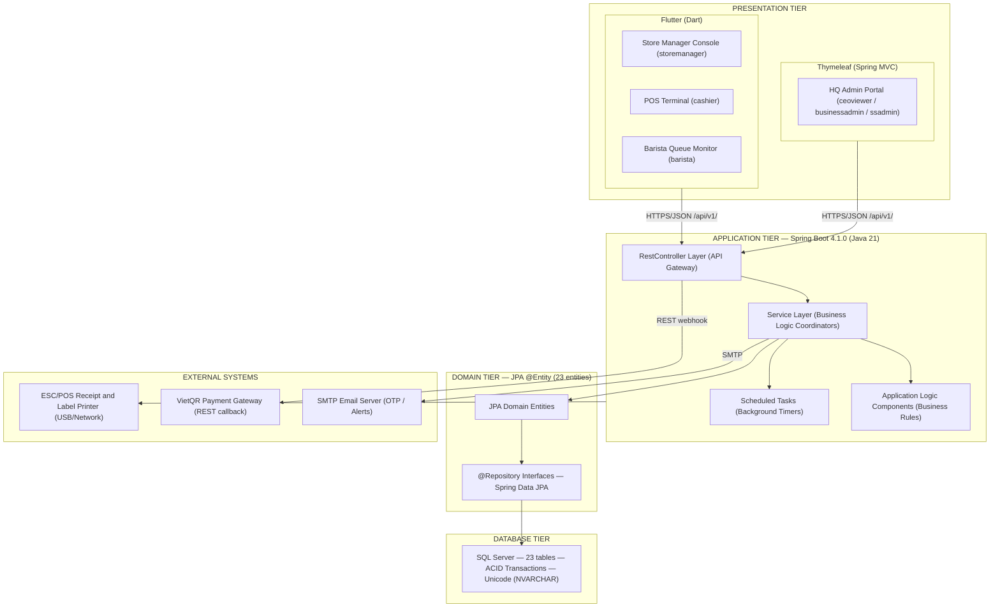
```mermaid
graph TB
    subgraph PRESENTATION["PRESENTATION TIER"]
        direction LR
        subgraph WEB["Thymeleaf (Spring MVC)"]
            HQ["HQ Admin Portal (ceoviewer / businessadmin / ssadmin)"]
        end
        subgraph FLUTTER["Flutter (Dart)"]
            MGR["Store Manager Console (storemanager)"]
            POS["POS Terminal (cashier)"]
            BAR["Barista Queue Monitor (barista)"]
        end
    end

    subgraph APP["APPLICATION TIER — Spring Boot 4.1.0 (Java 21)"]
        direction TB
        CTRL["RestController Layer (API Gateway)"]
        SVC["Service Layer (Business Logic Coordinators)"]
        LOGIC["Application Logic Components (Business Rules)"]
        SCHED["Scheduled Tasks (Background Timers)"]
    end

    subgraph DOMAIN["DOMAIN TIER — JPA @Entity (23 entities)"]
        ENT["JPA Domain Entities"]
        REPO["@Repository Interfaces — Spring Data JPA"]
    end

    subgraph DB["DATABASE TIER"]
        SQLSERVER["SQL Server — 23 tables — ACID Transactions — Unicode (NVARCHAR)"]
    end

    subgraph EXT["EXTERNAL SYSTEMS"]
        VIETQR["VietQR Payment Gateway (REST callback)"]
        EMAIL["SMTP Email Server (OTP / Alerts)"]
        PRINTER["ESC/POS Receipt and Label Printer (USB/Network)"]
    end

    WEB -->|"HTTPS/JSON /api/v1/"| CTRL
    FLUTTER -->|"HTTPS/JSON /api/v1/"| CTRL
    CTRL --> SVC
    SVC --> LOGIC
    SVC --> SCHED
    SVC --> ENT
    ENT --> REPO
    REPO --> SQLSERVER
    CTRL -->|"REST webhook"| VIETQR
    SVC -->|"SMTP"| EMAIL
    APP -->|"ESC/POS"| PRINTER
```

***Diagram Component Descriptions***

| No | Component | COMET Type | Description |
| :---: | ----- | ----- | ----- |
| 01 | Thymeleaf Web Frontend | «boundary» (UI) | Server-side rendered web frontend using Spring Boot Thymeleaf templates for HQ Admin Portal. Serves 3 HQ roles: CEO / Executive Viewer (ceoviewer — read-only reports), Business Admin (businessadmin — catalog, voucher, CRM), and System Admin (ssadmin — user management, branch lifecycle, system config). Role-based menu rendering. |
| 02 | Flutter (Dart) Mobile/Tablet App | «boundary» (UI) | Cross-platform mobile/tablet frontend for in-store operations. Serves 3 roles via role-based routing: Store Manager Console (storemanager — inventory, scheduling, store reports), POS Terminal (cashier — checkout, payment), and Barista Queue Monitor (barista — drink queue, label printing). Always-online; communicates with backend via REST API over HTTPS/JSON. |
| 03 | @RestController Layer | «boundary» (API Gateway) | Spring Boot REST controllers. Receive HTTP requests, validate inputs using Bean Validation, apply JWT authentication, and delegate to @Service layer. All endpoints prefixed `/api/v1/`. |
| 04 | @Service Layer | «control» (Coordinator) | Business logic orchestration. Each service coordinates domain entities, calls application logic components, and manages transactions via @Transactional. |
| 05 | Application Logic Components | «application logic» | Stateless business rule engines: DiscountStackingEngine (BR-70), RecipeDeductionEngine (BR-89), LoyaltyPointCalculator, COGSCalculator, AnomalyDetector, AttendancePhotoManager (PDPA). |
| 06 | @Scheduled Tasks | «timer» | Spring @Scheduled background timers: OrderTimeoutTimer (15 min), ShiftAutoCloseTimer (23:59 cron), LowStockAlertTimer (22:00 cron), PhotoAutoDeleteTimer (02:00 cron — PDPA 90-day purge BR-72), OtpExpiryTimer (10 min). |
| 07 | @Entity / @Repository (Domain Tier) | «entity» | 23 JPA domain entities mapped to SQL Server tables via Spring Data JPA repositories. All PK are UUID VARCHAR(36). |
| 08 | SQL Server | Database | Relational database with ACID transactions, Unicode support (NVARCHAR). 23 tables. |
| 09 | VietQR Payment Gateway | External System | Vietnamese QR payment provider. Integrated via REST webhook callback with idempotency key (orderId) to prevent duplicate charges (BR-84/BR-85). |
| 10 | SMTP Email Server | External System | Email delivery service for: OTP delivery (BR-16), low stock daily alerts (22:00), and welcome email for new staff accounts. |
| 11 | ESC/POS Printer | External System | Receipt and cup label printers connected via USB/Network to POS Terminal (Flutter) and Barista tablets. Triggered by PrinterServiceProxy after order completion. |

***COMET EBC Stereotype → Spring Boot MVC Mapping***

| COMET Stereotype | Spring Boot Implementation | Examples |
| ----- | ----- | ----- |
| «boundary» (UI Screen) | View: Thymeleaf templates (.html), Flutter Widgets | LoginForm, PosCheckoutGrid, BaristaQueueMonitor |
| «boundary» (API Endpoint) | Controller: @RestController | AuthController, OrderController, PosController |
| «boundary» (External Proxy) | Adapter: RestTemplate / WebClient | VietQRClient, EmailService, PrinterService |
| «control» (Coordinator) | Service: @Service (business orchestration) | AuthService, CheckoutService, OrderQueueService |
| «application logic» (Engine) | Component: @Component (pure business rules) | DiscountStackingEngine, RecipeDeductionEngine |
| «entity» (Domain Object) | Model: @Entity + @Repository | User, Order, MenuItem, StockItem, AuditLog |
| «timer» (Scheduled Task) | Scheduler: @Scheduled / @Async | OrderTimeoutScheduler, ShiftAutoCloseScheduler |

---

### **1.3 Deployment Diagram**

*\[The Deployment Diagram shows the physical deployment topology of the system — the execution environments (devices/servers), the software artifacts deployed on each, and the communication paths between them. The diagram follows UML deployment diagram notation with stereotypes: «executionEnvironment», «artifact», «component», «manifest», «deploy», and «cloud».\]*

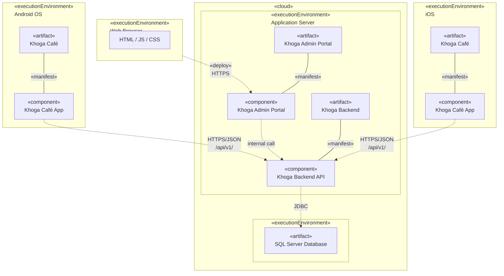
```mermaid
graph TB
    subgraph ANDROID["«executionEnvironment»<br/>Android OS"]
        direction LR
        A_ART["«artifact»<br/>Khoga Café"]
        A_COMP["«component»<br/>Khoga Café App"]
        A_ART ---|"«manifest»"| A_COMP
    end

    subgraph IOS["«executionEnvironment»<br/>iOS"]
        direction LR
        I_ART["«artifact»<br/>Khoga Café"]
        I_COMP["«component»<br/>Khoga Café App"]
        I_ART ---|"«manifest»"| I_COMP
    end

    subgraph BROWSER["«executionEnvironment»<br/>Web Browser"]
        B_CLIENT["HTML / JS / CSS"]
    end

    subgraph CLOUD["«cloud»<br/>Cloud Hosting Service"]
        direction LR
        subgraph APP_SERVER["«executionEnvironment»<br/>Application Server"]
            direction LR
            S_ART["«artifact»<br/>Khoga Admin Portal"]
            S_COMP["«component»<br/>Khoga Admin Portal"]
            S_ART ---|"«manifest»"| S_COMP
            B_ART["«artifact»<br/>Khoga Backend"]
            B_COMP2["«component»<br/>Khoga Backend API"]
            B_ART ---|"«manifest»"| B_COMP2
        end
        subgraph DB_SERVER["«executionEnvironment»<br/>Database Server"]
            DB_ART["«artifact»<br/>SQL Server Database"]
        end
    end

    A_COMP -.->|"HTTPS/JSON<br/>/api/v1/"| B_COMP2
    I_COMP -.->|"HTTPS/JSON<br/>/api/v1/"| B_COMP2
    BROWSER -.->|"«deploy»<br/>HTTPS"| S_COMP
    S_COMP -.->|"internal call"| B_COMP2
    B_COMP2 -.->|"JDBC"| DB_ART
```

***Deployment Diagram Component Descriptions***

| No | Execution Environment | Deployed Artifact | Component | Description |
| :---: | ----- | ----- | ----- | ----- |
| 01 | Android OS | Khoga Café | Khoga Café App | Flutter cross-platform mobile application deployed on Android devices (phone/tablet). Serves 3 in-store roles via role-based routing: Store Manager (inventory, scheduling, store reports), Cashier (POS checkout, payment), and Barista (drink queue, label printing). |
| 02 | iOS | Khoga Café | Khoga Café App | Same Flutter application compiled for iOS. Identical feature set to Android build. |
| 03 | Web Browser | — | HTML / JS / CSS | Client-side browser rendering Thymeleaf server-side pages delivered by the Application Server. Used by HQ roles (CEO Viewer, Business Admin, System Admin). |
| 04 | Application Server (Cloud) | Khoga Admin Portal | Khoga Admin Portal | Spring Boot application serving Thymeleaf-rendered HTML pages for the HQ Admin Portal. Handles role-based menu rendering for 3 HQ roles: ceoviewer (read-only reports), businessadmin (catalog/voucher/CRM), ssadmin (user/branch/config management). |
| 05 | Application Server (Cloud) | Khoga Backend | Khoga Backend API | Spring Boot 4.1.0 (Java 21) REST API backend. Exposes all `/api/v1/` endpoints consumed by both the Flutter mobile app and the Thymeleaf web frontend. Handles JWT authentication, business logic, and transaction management. |
| 06 | Database Server (Cloud) | SQL Server Database | — | Microsoft SQL Server relational database. 23 tables with ACID transactions, Unicode support (NVARCHAR). All primary keys are UUID VARCHAR(36). |

### **1.2 Package Diagram**

#### **1.2.1 Package Diagram - Backend (Spring Boot)**

*\[Backend is organized as a **feature-based modular monolith** — NOT a standard layered architecture. Each feature package contains its own Controller + Service + DTO; Entities and Repositories are grouped together in `common`.]*

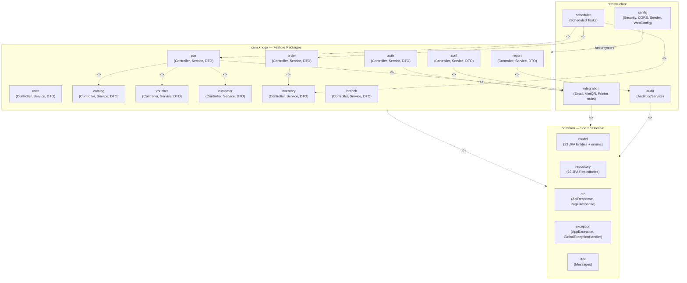
```mermaid
graph TB
    subgraph FEATURES["com.khoga — Feature Packages"]
        AUTH["auth<br/>(Controller, Service, DTO)"]
        USER["user<br/>(Controller, Service, DTO)"]
        CATALOG["catalog<br/>(Controller, Service, DTO)"]
        VOUCHER["voucher<br/>(Controller, Service, DTO)"]
        CUSTOMER["customer<br/>(Controller, Service, DTO)"]
        INVENTORY["inventory<br/>(Controller, Service, DTO)"]
        POS["pos<br/>(Controller, Service, DTO)"]
        ORDER["order<br/>(Controller, Service, DTO)"]
        STAFF["staff<br/>(Controller, Service, DTO)"]
        REPORT["report<br/>(Controller, Service, DTO)"]
        BRANCH["branch<br/>(Controller, Service, DTO)"]
    end

    subgraph INFRA["Infrastructure"]
        CONFIG["config<br/>(Security, CORS, Seeder, WebConfig)"]
        SCHEDULER["scheduler<br/>(Scheduled Tasks)"]
        INTEGRATION["integration<br/>(Email, VietQR, Printer stubs)"]
        AUDIT["audit<br/>(AuditLogService)"]
    end

    subgraph COMMON["common — Shared Domain"]
        MODEL["model<br/>(23 JPA Entities + enums)"]
        REPO["repository<br/>(23 JPA Repositories)"]
        DTO["dto<br/>(ApiResponse, PageResponse)"]
        EXCEPTION["exception<br/>(AppException, GlobalExceptionHandler)"]
        I18N["i18n<br/>(Messages)"]
    end

    %% Feature → Common
    FEATURES -.->|"<<import>>"| COMMON

    %% Feature → Infrastructure
    AUTH -.->|"<<use>>"| INTEGRATION
    POS -.->|"<<use>>"| INTEGRATION
    STAFF -.->|"<<use>>"| INTEGRATION
    REPORT -.->|"<<access>>"| AUDIT

    %% Feature → Feature
    POS -.->|"<<use>>"| CATALOG
    POS -.->|"<<use>>"| VOUCHER
    POS -.->|"<<use>>"| CUSTOMER
    ORDER -.->|"<<use>>"| INVENTORY

    %% Infrastructure → Common
    INTEGRATION -.->|"<<import>>"| COMMON
    AUDIT -.->|"<<import>>"| COMMON
    SCHEDULER -.->|"<<use>>"| POS
    SCHEDULER -.->|"<<use>>"| INVENTORY
    SCHEDULER -.->|"<<use>>"| ORDER

    %% Config cung cấp SecurityFilterChain cho tất cả
    CONFIG -.->|"security/cors"| FEATURES
```

*Figure 1.2.1 Package Diagram - Backend*

##### **Backend Package Descriptions**

| No | Package | Actual Content | Description |
|:---:|---|---|---|
| 01 | `com.khoga.auth` | `AuthController`, `AuthService`, `ProfileController`, `ProfileService`, `JwtTokenProvider`, `JwtAuthenticationFilter`, `OtpStore`, `StrongPasswordValidator`, `SecurityUtil`, `dto/` | JWT Auth, Email OTP MFA, password recovery/change, profile. UC-01→UC-09. |
| 02 | `com.khoga.user` | `UserController`, `UserService`, `UsernameGenerator`, `TemporaryPasswordGenerator`, `UserMapper`, `dto/` | Staff account management (CRUD, deactivate, audit). UC-10→UC-14. |
| 03 | `com.khoga.catalog` | `CategoryController/Service`, `MenuItemController/Service`, `RawMaterialController/Service`, `RecipeService`, `AbbreviationGenerator`, `CatalogMapper`, `dto/` | Menu, category, topping, raw material, and recipe management. UC-15→UC-19, UC-68→UC-74. |
| 04 | `com.khoga.voucher` | `VoucherController`, `VoucherService`, `VoucherValidationService`, `VoucherStatusEngine`, `VoucherMapper`, `dto/` | Voucher CRUD, 3-state status engine, checkout validation. UC-20→UC-23. |
| 05 | `com.khoga.customer` | `CustomerController`, `CustomerService`, `LoyaltyPointCalculator`, `LoyaltyExpiryService`, `CustomerRetentionService`, `CustomerMapper`, `dto/` | Customer CRM, loyalty point accumulation/redemption, PDPA retention. UC-24→UC-27. |
| 06 | `com.khoga.inventory` | `StockController`, `StockService`, `RecipeDeductionEngine`, `CogsCalculator`, `InventoryMapper`, `dto/` | Stock import/export/audit, recipe-based deduction, COGS calculation. UC-31→UC-34, UC-61, UC-62. |
| 07 | `com.khoga.pos` | `CheckoutController`, `CheckoutService`, `ShiftController`, `ShiftService`, `PaymentController`, `DiscountStackingEngine`, `dto/` | Open/close shift, checkout pipeline (BR-70), payment processing, reconciliation. UC-44→UC-53. |
| 08 | `com.khoga.order` | `OrderController`, `OrderService`, `OrderMapper`, `dto/` | Order lifecycle, barista queue, cancel/refund/comp. UC-54→UC-60, UC-73, UC-75. |
| 09 | `com.khoga.staff` | `ScheduleController`, `ScheduleService`, `AttendanceController`, `AttendanceService`, `AttendanceMetricsCalculator`, `StaffMapper`, `dto/` | Shift scheduling, PIN+photo attendance check-in, worked-hours export. UC-35→UC-39, UC-66, UC-67, UC-80. |
| 10 | `com.khoga.report` | `ReportController`, `RevenueReportService`, `CogsReportService`, `ZReportService`, `AnomalyDetector`, `LoyaltyLiabilityService`, `LabourEfficiencyService`, `ChangeHistoryService`, `ReportScopeResolver`, `ReportCsvWriter`, `ReportXlsxWriter`, `ReportPdfWriter`, `dto/` | All reports & BI, CSV/Excel/PDF export. UC-28→UC-29, UC-40→UC-41, UC-76→UC-83. |
| 11 | `com.khoga.branch` | `BranchController`, `BranchService`, `BranchMapper`, `dto/` | Add/update/deactivate branch, MAX_ACTIVE_BRANCHES cap. UC-63→UC-65. |
| 12 | `com.khoga.config` | `SecurityConfig`, `WebConfig`, `JpaConfig`, `OpenApiConfig`, `SchedulingConfig`, `DataSeeder`, `SystemConfigController`, `SystemConfigService`, `dto/` | Security, CORS config, data seeder, SystemConfig management. UC-30, UC-42. |
| 13 | `com.khoga.audit` | `AuditLogService` | Append-only audit logging for prices, vouchers, accounts, and checkouts. BR-68/80/81. |
| 14 | `com.khoga.integration` | `EmailService` + `EmailServiceStub`, `VietQrClient` + `VietQrClientStub`, `PrinterService` + `PrinterServiceStub`, `VietQrPayment` | Interfaces + stubs for external systems (SMTP, VietQR, receipt printer). |
| 15 | `com.khoga.scheduler` | `OrderTimeoutScheduler`, `ShiftAutoCloseScheduler`, `LowStockAlertScheduler`, `OtpExpiryScheduler`, `PhotoAutoDeleteScheduler`, `PdpaScheduler` | 6 background scheduled tasks (cron/fixed-rate). |
| 16 | `com.khoga.common` | `model/` (23 Entity + `BaseEntity` + `enums/`), `repository/` (23 Repository), `dto/` (`ApiResponse`, `PageResponse`), `exception/` (`AppException`, `ResourceNotFoundException`, `GlobalExceptionHandler`), `i18n/` (`Messages`) | Shared layer: all Entities, Repositories, common DTOs, exceptions, i18n. |

---

#### **1.2.2 Package Diagram - Web Admin (Thymeleaf / Spring MVC)**

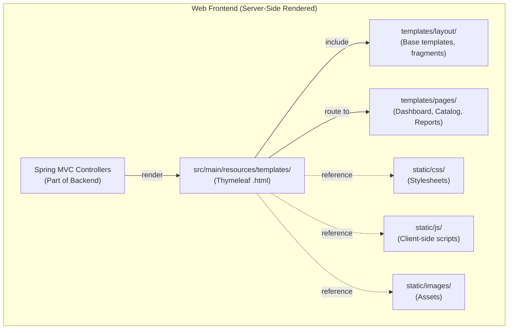
```mermaid
graph TB
    subgraph WEB_ADMIN["Web Frontend (Server-Side Rendered)"]
        CONTROLLERS["Spring MVC Controllers<br/>(Part of Backend)"]
        TEMPLATES["src/main/resources/templates/<br/>(Thymeleaf .html)"]
        LAYOUTS["templates/layout/<br/>(Base templates, fragments)"]
        PAGES["templates/pages/<br/>(Dashboard, Catalog, Reports)"]
        STATIC_CSS["static/css/<br/>(Stylesheets)"]
        STATIC_JS["static/js/<br/>(Client-side scripts)"]
        STATIC_IMG["static/images/<br/>(Assets)"]

        CONTROLLERS -->|render| TEMPLATES
        TEMPLATES -->|include| LAYOUTS
        TEMPLATES -->|route to| PAGES
        TEMPLATES -.->|reference| STATIC_CSS
        TEMPLATES -.->|reference| STATIC_JS
        TEMPLATES -.->|reference| STATIC_IMG
    end
```

*Figure 1.2.2 Package Diagram - Web Admin (Thymeleaf)*

##### **Web Admin Package Descriptions**

| No | Package / Folder | Description |
|:---:|---|---|
| 01 | `Controllers` | Spring MVC Controllers handle routing, prepare Model data, and return view names. |
| 02 | `templates/` | Root directory for Thymeleaf `.html` view files. |
| 03 | `templates/layout/` | Contains base layouts (e.g., `admin_layout.html`), sidebar, and navbar fragments. |
| 04 | `templates/pages/` | Business operation pages (e.g., Dashboard, Branch Management, Catalog, Staff, Reports). |
| 05 | `static/css/` | Custom CSS files and frontend framework stylesheets (e.g., Bootstrap/Tailwind if used). |
| 06 | `static/js/` | Client-side JavaScript for interactivity, form validation, and AJAX calls. |
| 07 | `static/images/` | Static image assets like logos and icons. |

---

#### **1.2.3 Package Diagram - Mobile App (Flutter / Dart)**

*\[Single cross-platform Flutter application shared by 3 in-store roles: Store Manager (storemanager), Cashier (cashier), and Barista (barista). Role-based routing determines which screens each role can access.\]*

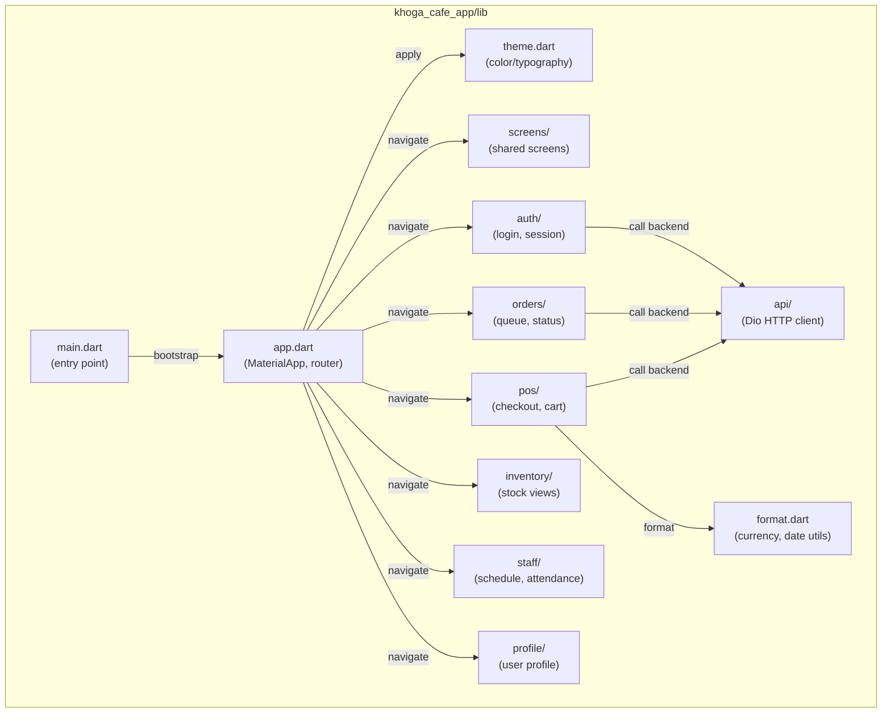
```mermaid
graph TB
    subgraph FLUTTER["khoga_cafe_app/lib"]
        MAIN_F["main.dart<br/>(entry point)"]
        APP_F["app.dart<br/>(MaterialApp, router)"]
        THEME["theme.dart<br/>(color/typography)"]
        SCREENS["screens/<br/>(shared screens)"]
        AUTH_F["auth/<br/>(login, session)"]
        POS_F["pos/<br/>(checkout, cart)"]
        ORDERS_F["orders/<br/>(queue, status)"]
        INVENTORY_F["inventory/<br/>(stock views)"]
        STAFF_F["staff/<br/>(schedule, attendance)"]
        PROFILE_F["profile/<br/>(user profile)"]
        API_F["api/<br/>(Dio HTTP client)"]
        FORMAT["format.dart<br/>(currency, date utils)"]

        MAIN_F -->|bootstrap| APP_F
        APP_F -->|apply| THEME
        APP_F -->|navigate| SCREENS
        APP_F -->|navigate| AUTH_F
        APP_F -->|navigate| POS_F
        APP_F -->|navigate| ORDERS_F
        APP_F -->|navigate| INVENTORY_F
        APP_F -->|navigate| STAFF_F
        APP_F -->|navigate| PROFILE_F
        POS_F -->|call backend| API_F
        ORDERS_F -->|call backend| API_F
        AUTH_F -->|call backend| API_F
        POS_F -->|format| FORMAT
    end
```

*Figure 1.2.3 Package Diagram - Mobile App (Flutter)*

##### **Mobile Package Descriptions**

*\[This app serves 3 roles: Store Manager (inventory logistics, shift scheduling, store revenue reports), Cashier (POS checkout, payment processing), and Barista (queue monitor, label printing). Role-based routing in `app.dart` determines which modules are accessible after login.\]*

| No | Package | Description |
|:---:|---|---|
| 01 | `main.dart` | Flutter entry point, initializes the app and runs `App`. |
| 02 | `app.dart` | `MaterialApp` configuration, router setup, and theme application. |
| 03 | `theme.dart` | Defines color palette, typography, and global app styles. |
| 04 | `screens/` | Shared screens used across modules (e.g., splash screen, home). |
| 05 | `auth/` | Login screen and token session management. |
| 06 | `pos/` | POS Module: cart management, checkout, and payment processing. |
| 07 | `orders/` | Order Module: barista queue and status updates. |
| 08 | `inventory/` | Module for viewing branch stock levels. |
| 09 | `staff/` | Staff Module: scheduling and attendance check-in. |
| 10 | `profile/` | View and edit personal user profile. |
| 11 | `api/` | Dio HTTP client configuration and REST API calls to the backend. |
| 12 | `format.dart` | Utility functions for currency and date formatting. |

## **2\. Database Design**

*\[The database design follows the entity relationships defined in the SRS (§3.1.5 / §3.1.6). The system uses `SQL Server` with ACID transactions and Unicode support (`NVARCHAR`). All primary keys use `UUID` (`VARCHAR(36)`). The diagrams below show the entity relationships with full column definitions, followed by the table descriptions. Every table also carries an `updated_at` column from the shared `BaseEntity` (JPA auditing), omitted from the diagrams for brevity. The live schema is entity-driven (`ddl-auto=update`) — there are **23 tables**; generated names are concatenated-lowercase (e.g. `categorys`, `menuitems`) pending naming normalization under Flyway (P4).\]*

### **2.1. Core Sales & POS ERD**

*\[This diagram focuses on sales flows at the POS terminal, Menu information, Customers, Shift sessions, and Promotions.\]*

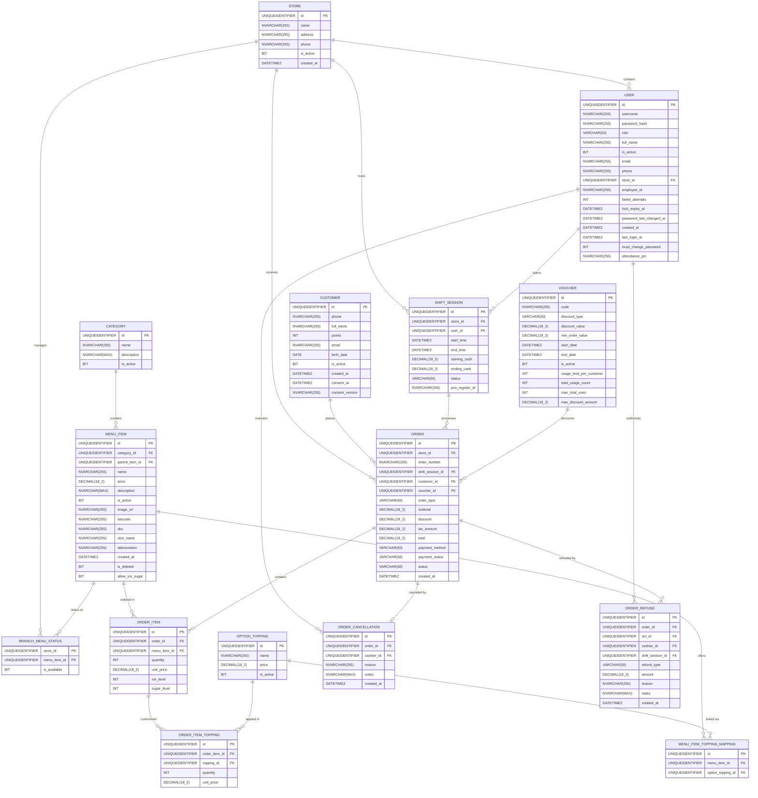
```mermaid
erDiagram
    STORE {
        UNIQUEIDENTIFIER id PK
        NVARCHAR(255) name
        NVARCHAR(255) address
        NVARCHAR(255) phone
        BIT is_active
        DATETIME2 created_at
    }

    USER {
        UNIQUEIDENTIFIER id PK
        NVARCHAR(255) username
        NVARCHAR(255) password_hash
        VARCHAR(50) role
        NVARCHAR(255) full_name
        BIT is_active
        NVARCHAR(255) email
        NVARCHAR(255) phone
        UNIQUEIDENTIFIER store_id FK
        NVARCHAR(255) employee_id
        INT failed_attempts
        DATETIME2 lock_expiry_at
        DATETIME2 password_last_changed_at
        DATETIME2 created_at
        DATETIME2 last_login_at
        BIT must_change_password
        NVARCHAR(255) attendance_pin
    }

    CATEGORY {
        UNIQUEIDENTIFIER id PK
        NVARCHAR(255) name
        NVARCHAR(MAX) description
        BIT is_active
    }

    MENU_ITEM {
        UNIQUEIDENTIFIER id PK
        UNIQUEIDENTIFIER category_id FK
        UNIQUEIDENTIFIER parent_item_id FK
        NVARCHAR(255) name
        DECIMAL(18_2) price
        NVARCHAR(MAX) description
        BIT is_active
        NVARCHAR(255) image_url
        NVARCHAR(255) barcode
        NVARCHAR(255) sku
        NVARCHAR(255) size_name
        NVARCHAR(255) abbreviation
        DATETIME2 created_at
        BIT is_deleted
        BIT allow_ice_sugar
    }

    BRANCH_MENU_STATUS {
        UNIQUEIDENTIFIER store_id PK
        UNIQUEIDENTIFIER menu_item_id PK
        BIT is_available
    }

    OPTION_TOPPING {
        UNIQUEIDENTIFIER id PK
        NVARCHAR(255) name
        DECIMAL(18_2) price
        BIT is_active
    }

    CUSTOMER {
        UNIQUEIDENTIFIER id PK
        NVARCHAR(255) phone
        NVARCHAR(255) full_name
        INT points
        NVARCHAR(255) email
        DATE birth_date
        BIT is_active
        DATETIME2 created_at
        DATETIME2 consent_at
        NVARCHAR(255) consent_version
    }

    MENU_ITEM_TOPPING_MAPPING {
        UNIQUEIDENTIFIER id PK
        UNIQUEIDENTIFIER menu_item_id FK
        UNIQUEIDENTIFIER option_topping_id FK
    }

    SHIFT_SESSION {
        UNIQUEIDENTIFIER id PK
        UNIQUEIDENTIFIER store_id FK
        UNIQUEIDENTIFIER user_id FK
        DATETIME2 start_time
        DATETIME2 end_time
        DECIMAL(18_2) starting_cash
        DECIMAL(18_2) ending_cash
        VARCHAR(50) status
        NVARCHAR(255) pos_register_id
    }

    ORDER {
        UNIQUEIDENTIFIER id PK
        UNIQUEIDENTIFIER store_id FK
        NVARCHAR(255) order_number
        UNIQUEIDENTIFIER shift_session_id FK
        UNIQUEIDENTIFIER customer_id FK
        UNIQUEIDENTIFIER voucher_id FK
        VARCHAR(50) order_type
        DECIMAL(18_2) subtotal
        DECIMAL(18_2) discount
        DECIMAL(18_2) tax_amount
        DECIMAL(18_2) total
        VARCHAR(50) payment_method
        VARCHAR(50) payment_status
        VARCHAR(50) status
        DATETIME2 created_at
    }

    ORDER_ITEM {
        UNIQUEIDENTIFIER id PK
        UNIQUEIDENTIFIER order_id FK
        UNIQUEIDENTIFIER menu_item_id FK
        INT quantity
        DECIMAL(18_2) unit_price
        INT ice_level
        INT sugar_level
    }

    ORDER_ITEM_TOPPING {
        UNIQUEIDENTIFIER id PK
        UNIQUEIDENTIFIER order_item_id FK
        UNIQUEIDENTIFIER topping_id FK
        INT quantity
        DECIMAL(18_2) unit_price
    }

    ORDER_CANCELLATION {
        UNIQUEIDENTIFIER id PK
        UNIQUEIDENTIFIER order_id FK
        UNIQUEIDENTIFIER cashier_id FK
        NVARCHAR(255) reason
        NVARCHAR(MAX) notes
        DATETIME2 created_at
    }

    ORDER_REFUND {
        UNIQUEIDENTIFIER id PK
        UNIQUEIDENTIFIER order_id FK
        UNIQUEIDENTIFIER sm_id FK
        UNIQUEIDENTIFIER cashier_id FK
        UNIQUEIDENTIFIER shift_session_id FK
        VARCHAR(50) refund_type
        DECIMAL(18_2) amount
        NVARCHAR(255) reason
        NVARCHAR(MAX) notes
        DATETIME2 created_at
    }

    VOUCHER {
        UNIQUEIDENTIFIER id PK
        NVARCHAR(255) code
        VARCHAR(50) discount_type
        DECIMAL(18_2) discount_value
        DECIMAL(18_2) min_order_value
        DATETIME2 start_date
        DATETIME2 end_date
        BIT is_active
        INT usage_limit_per_customer
        INT total_usage_count
        INT max_total_uses
        DECIMAL(18_2) max_discount_amount
    }

    %% Relationships
    STORE ||--o{ USER : "contains"
    STORE ||--o{ SHIFT_SESSION : "hosts"
    STORE ||--o{ ORDER : "receives"
    STORE ||--o{ BRANCH_MENU_STATUS : "manages"

    USER ||--o{ SHIFT_SESSION : "opens"
    USER ||--o{ ORDER_CANCELLATION : "executes"
    USER ||--o{ ORDER_REFUND : "authorises"

    CATEGORY ||--o{ MENU_ITEM : "contains"
    MENU_ITEM ||--o{ MENU_ITEM_TOPPING_MAPPING : "offers"
    OPTION_TOPPING ||--o{ MENU_ITEM_TOPPING_MAPPING : "linked via"
    MENU_ITEM ||--o{ ORDER_ITEM : "ordered in"
    MENU_ITEM ||--o{ BRANCH_MENU_STATUS : "status at"

    ORDER ||--o{ ORDER_ITEM : "contains"
    ORDER ||--o| ORDER_CANCELLATION : "cancelled by"
    ORDER ||--o{ ORDER_REFUND : "refunded by"
    ORDER_ITEM ||--o{ ORDER_ITEM_TOPPING : "customized"
    OPTION_TOPPING ||--o{ ORDER_ITEM_TOPPING : "applied in"

    CUSTOMER ||--o{ ORDER : "places"
    SHIFT_SESSION ||--o{ ORDER : "processes"
    VOUCHER ||--o{ ORDER : "discounts"
```

### **2.2. Operations, Staffing & Audit ERD**

*\[This diagram focuses on inventory management, recipe formulation for items/toppings, staff schedules, attendance tracking, and system audit logs.\]*

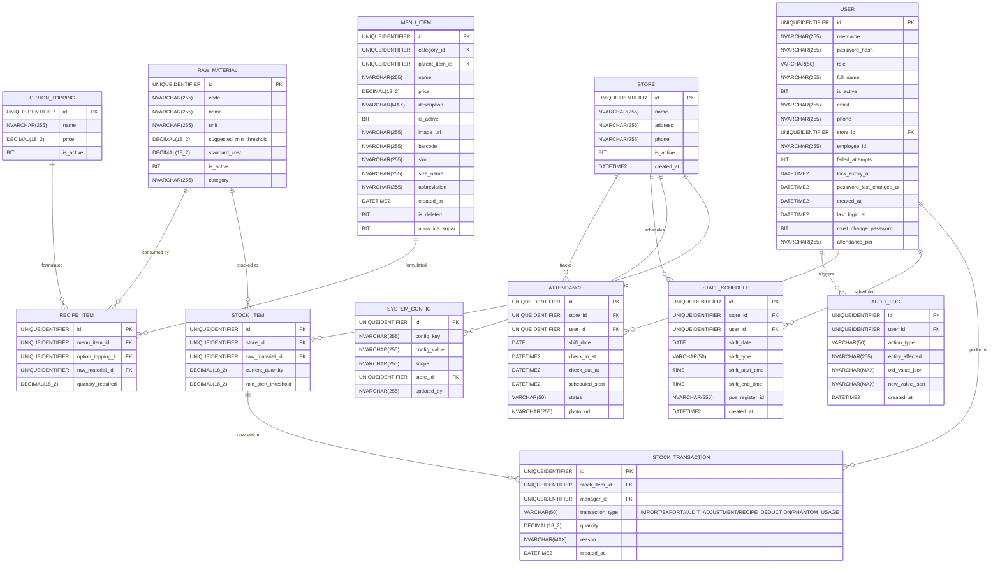
```mermaid
erDiagram
    STORE {
        UNIQUEIDENTIFIER id PK
        NVARCHAR(255) name
        NVARCHAR(255) address
        NVARCHAR(255) phone
        BIT is_active
        DATETIME2 created_at
    }

    USER {
        UNIQUEIDENTIFIER id PK
        NVARCHAR(255) username
        NVARCHAR(255) password_hash
        VARCHAR(50) role
        NVARCHAR(255) full_name
        BIT is_active
        NVARCHAR(255) email
        NVARCHAR(255) phone
        UNIQUEIDENTIFIER store_id FK
        NVARCHAR(255) employee_id
        INT failed_attempts
        DATETIME2 lock_expiry_at
        DATETIME2 password_last_changed_at
        DATETIME2 created_at
        DATETIME2 last_login_at
        BIT must_change_password
        NVARCHAR(255) attendance_pin
    }

    RAW_MATERIAL {
        UNIQUEIDENTIFIER id PK
        NVARCHAR(255) code
        NVARCHAR(255) name
        NVARCHAR(255) unit
        DECIMAL(18_2) suggested_min_threshold
        DECIMAL(18_2) standard_cost
        BIT is_active
        NVARCHAR(255) category
    }

    STOCK_ITEM {
        UNIQUEIDENTIFIER id PK
        UNIQUEIDENTIFIER store_id FK
        UNIQUEIDENTIFIER raw_material_id FK
        DECIMAL(18_2) current_quantity
        DECIMAL(18_2) min_alert_threshold
    }

    STOCK_TRANSACTION {
        UNIQUEIDENTIFIER id PK
        UNIQUEIDENTIFIER stock_item_id FK
        UNIQUEIDENTIFIER manager_id FK
        VARCHAR(50) transaction_type "IMPORT/EXPORT/AUDIT_ADJUSTMENT/RECIPE_DEDUCTION/PHANTOM_USAGE"
        DECIMAL(18_2) quantity
        NVARCHAR(MAX) reason
        DATETIME2 created_at
    }

    RECIPE_ITEM {
        UNIQUEIDENTIFIER id PK
        UNIQUEIDENTIFIER menu_item_id FK
        UNIQUEIDENTIFIER option_topping_id FK
        UNIQUEIDENTIFIER raw_material_id FK
        DECIMAL(18_2) quantity_required
    }

    MENU_ITEM {
        UNIQUEIDENTIFIER id PK
        UNIQUEIDENTIFIER category_id FK
        UNIQUEIDENTIFIER parent_item_id FK
        NVARCHAR(255) name
        DECIMAL(18_2) price
        NVARCHAR(MAX) description
        BIT is_active
        NVARCHAR(255) image_url
        NVARCHAR(255) barcode
        NVARCHAR(255) sku
        NVARCHAR(255) size_name
        NVARCHAR(255) abbreviation
        DATETIME2 created_at
        BIT is_deleted
        BIT allow_ice_sugar
    }

    OPTION_TOPPING {
        UNIQUEIDENTIFIER id PK
        NVARCHAR(255) name
        DECIMAL(18_2) price
        BIT is_active
    }

    STAFF_SCHEDULE {
        UNIQUEIDENTIFIER id PK
        UNIQUEIDENTIFIER store_id FK
        UNIQUEIDENTIFIER user_id FK
        DATE shift_date
        VARCHAR(50) shift_type
        TIME shift_start_time
        TIME shift_end_time
        NVARCHAR(255) pos_register_id
        DATETIME2 created_at
    }

    ATTENDANCE {
        UNIQUEIDENTIFIER id PK
        UNIQUEIDENTIFIER store_id FK
        UNIQUEIDENTIFIER user_id FK
        DATE shift_date
        DATETIME2 check_in_at
        DATETIME2 check_out_at
        DATETIME2 scheduled_start
        VARCHAR(50) status
        NVARCHAR(255) photo_url
    }

    AUDIT_LOG {
        UNIQUEIDENTIFIER id PK
        UNIQUEIDENTIFIER user_id FK
        VARCHAR(50) action_type
        NVARCHAR(255) entity_affected
        NVARCHAR(MAX) old_value_json
        NVARCHAR(MAX) new_value_json
        DATETIME2 created_at
    }

    SYSTEM_CONFIG {
        UNIQUEIDENTIFIER id PK
        NVARCHAR(255) config_key
        NVARCHAR(255) config_value
        NVARCHAR(255) scope
        UNIQUEIDENTIFIER store_id FK
        NVARCHAR(255) updated_by
    }

    %% Relationships
    STORE ||--o{ STOCK_ITEM : "holds"
    STORE ||--o{ SYSTEM_CONFIG : "overrides"
    STORE ||--o{ STAFF_SCHEDULE : "schedules"
    STORE ||--o{ ATTENDANCE : "tracks"

    USER ||--o{ STOCK_TRANSACTION : "performs"
    USER ||--o{ STAFF_SCHEDULE : "scheduled"
    USER ||--o{ ATTENDANCE : "logs"
    USER ||--o{ AUDIT_LOG : "triggers"

    RAW_MATERIAL ||--o{ STOCK_ITEM : "stocked as"
    RAW_MATERIAL ||--o{ RECIPE_ITEM : "consumed by"
    STOCK_ITEM ||--o{ STOCK_TRANSACTION : "recorded in"

    MENU_ITEM ||--o{ RECIPE_ITEM : "formulated"
    OPTION_TOPPING ||--o{ RECIPE_ITEM : "formulated"
```

### **2.3. Table Descriptions**

*\[The table below summarizes the purpose, primary keys, and foreign keys for each of the 23 tables in the database. Every table also inherits an `updated_at DATETIME2` column from `BaseEntity` (JPA auditing).\]*

| No | Table | Description |
|:---:|---|---|
| 01 | **stores** | Physical coffee shop branch locations. - **id**: Primary key (UUID). - **name**: Name of the branch. - **address**: Physical address of the branch. - **phone**: Contact phone number. - **is_active**: Active status flag. - **created_at**: Record creation timestamp. |
| 02 | **users** | Employee accounts with login credentials, RBAC roles, and attendance PIN for check-in/out. - **id**: Primary key (UUID). - **username**: Login username. - **password_hash**: Hashed password. - **role**: User role (e.g., Cashier, Manager). - **full_name**: Full name of the user. - **is_active**: Active status flag. - **email**: Email address. - **phone**: Phone number. - **store_id**: FK to stores. - **employee_id**: Internal employee ID. - **failed_attempts**: Failed login attempts. - **lock_expiry_at**: Account lockout expiry. - **password_last_changed_at**: Last password change time. - **created_at**: Creation timestamp. - **last_login_at**: Last login timestamp. - **must_change_password**: Flag to force password change. - **attendance_pin**: PIN for check-in/out. |
| 03 | **categories** | Main food and beverage product groupings (e.g., Coffee, Tea, Pastry). - **id**: Primary key (UUID). - **name**: Category name. - **description**: Category description. - **is_active**: Active status flag. |
| 04 | **menu_items** | Individual beverage/food catalog entries with pricing, barcodes, and chain-wide status. - **id**: Primary key (UUID). - **category_id**: FK to categories. - **parent_item_id**: FK to parent menu_items. - **name**: Item name. - **price**: Base price. - **description**: Item description. - **is_active**: Active status flag. - **image_url**: Image URL. - **barcode**: Item barcode. - **sku**: Stock Keeping Unit. - **size_name**: Size option (e.g., M, L). - **abbreviation**: Short name. - **created_at**: Creation timestamp. - **is_deleted**: Soft delete flag. - **allow_ice_sugar**: Flag to allow custom ice/sugar levels. |
| 05 | **branch_menu_status** | Per-branch item availability toggle. - **store_id**: PK/FK to stores. - **menu_item_id**: PK/FK to menu_items. - **is_available**: Availability flag at this branch. |
| 06 | **option_toppings** | Global add-ons (e.g., Extra Shot, Oat Milk) shared across menu items. - **id**: Primary key (UUID). - **name**: Topping name. - **price**: Additional price. - **is_active**: Active status flag. |
| 07 | **menu_item_topping_mappings** | Join table linking global option_toppings to menu_items. - **id**: Primary key (UUID). - **menu_item_id**: FK to menu_items. - **option_topping_id**: FK to option_toppings. |
| 08 | **customers** | Loyalty membership registry tracking points balance and PDPA consent. - **id**: Primary key (UUID). - **phone**: Customer phone number. - **full_name**: Customer full name. - **points**: Loyalty points balance. - **email**: Customer email. - **birth_date**: Customer date of birth. - **is_active**: Active status flag. - **created_at**: Creation timestamp. - **consent_at**: PDPA consent timestamp. - **consent_version**: PDPA consent version. |
| 09 | **shift_sessions** | POS cashier work session records. - **id**: Primary key (UUID). - **store_id**: FK to stores. - **user_id**: FK to users (cashier). - **start_time**: Shift start timestamp. - **end_time**: Shift end timestamp. - **starting_cash**: Cash in drawer at start. - **ending_cash**: Cash in drawer at end. - **status**: Shift status. - **pos_register_id**: POS terminal identifier. |
| 10 | **orders** | Sales transaction records following a strict 7-state machine. - **id**: Primary key (UUID). - **store_id**: FK to stores. - **order_number**: Unique order reference. - **shift_session_id**: FK to shift_sessions. - **customer_id**: FK to customers. - **voucher_id**: FK to vouchers. - **order_type**: Dine-in, Takeaway, etc. - **subtotal**: Order subtotal. - **discount**: Total discount applied. - **tax_amount**: Total tax applied. - **total**: Final order total. - **payment_method**: Cash, Card, etc. - **payment_status**: Pending, Paid, etc. - **status**: Order status (state machine). - **created_at**: Creation timestamp. |
| 11 | **order_items** | Line items within each order with snapshot pricing. - **id**: Primary key (UUID). - **order_id**: FK to orders. - **menu_item_id**: FK to menu_items. - **quantity**: Quantity ordered. - **unit_price**: Snapshot price per unit. - **ice_level**: Selected ice percentage. - **sugar_level**: Selected sugar percentage. |
| 12 | **order_item_toppings** | Toppings applied to specific order line items with snapshot pricing. - **id**: Primary key (UUID). - **order_item_id**: FK to order_items. - **topping_id**: FK to option_toppings. - **quantity**: Quantity applied. - **unit_price**: Snapshot price per topping. |
| 13 | **order_cancellations** | Immutable audit log for PENDING-state order cancellations. - **id**: Primary key (UUID). - **order_id**: FK to orders. - **cashier_id**: FK to users (cashier). - **reason**: Reason for cancellation. - **notes**: Additional notes. - **created_at**: Cancellation timestamp. |
| 14 | **order_refunds** | Store-Manager authorized refund/comp audit log for post-PENDING complaints. - **id**: Primary key (UUID). - **order_id**: FK to orders. - **sm_id**: FK to users (store manager). - **cashier_id**: FK to users (cashier). - **shift_session_id**: FK to shift_sessions. - **refund_type**: Type of refund. - **amount**: Refund amount. - **reason**: Reason for refund. - **notes**: Additional notes. - **created_at**: Refund timestamp. |
| 15 | **vouchers** | Promotional discount codes with usage limits. - **id**: Primary key (UUID). - **code**: Voucher code. - **discount_type**: Percentage or Fixed. - **discount_value**: Discount amount/percent. - **min_order_value**: Minimum required subtotal. - **start_date**: Validity start. - **end_date**: Validity end. - **is_active**: Active status flag. - **usage_limit_per_customer**: Max uses per user. - **total_usage_count**: Current usage count. - **max_total_uses**: Global max uses limit. - **max_discount_amount**: Maximum discount cap. |
| 16 | **raw_materials** | Chain-wide master catalog of ingredients/materials. - **id**: Primary key (UUID). - **code**: Material code. - **name**: Material name. - **unit**: Unit of measurement. - **suggested_min_threshold**: Suggested minimum stock. - **standard_cost**: Standard cost. - **is_active**: Active status flag. - **category**: Material category. |
| 17 | **stock_items** | Per-branch on-hand quantity of a master raw material. - **id**: Primary key (UUID). - **store_id**: FK to stores. - **raw_material_id**: FK to raw_materials. - **current_quantity**: Current stock level. - **min_alert_threshold**: Minimum alert threshold. |
| 18 | **stock_transactions** | Immutable historical ledger (append-only) of all stock movements. - **id**: Primary key (UUID). - **stock_item_id**: FK to stock_items. - **manager_id**: FK to users (manager). - **transaction_type**: IMPORT/EXPORT/etc. - **quantity**: Transaction quantity. - **reason**: Reason for transaction. - **created_at**: Transaction timestamp. |
| 19 | **recipe_items** | Ingredient formula defining raw material consumption for items/toppings. - **id**: Primary key (UUID). - **menu_item_id**: FK to menu_items. - **option_topping_id**: FK to option_toppings. - **raw_material_id**: FK to raw_materials. - **quantity_required**: Required quantity per unit. |
| 20 | **staff_schedules** | Assigned employee shift blocks per date and branch. - **id**: Primary key (UUID). - **store_id**: FK to stores. - **user_id**: FK to users (employee). - **shift_date**: Scheduled date. - **shift_type**: Type of shift. - **shift_start_time**: Scheduled start time. - **shift_end_time**: Scheduled end time. - **pos_register_id**: Assigned POS terminal. - **created_at**: Creation timestamp. |
| 21 | **attendance_logs** | Employee clock-in/out records with snapshot scheduling. - **id**: Primary key (UUID). - **store_id**: FK to stores. - **user_id**: FK to users (employee). - **shift_date**: Associated shift date. - **check_in_at**: Clock-in timestamp. - **check_out_at**: Clock-out timestamp. - **scheduled_start**: Snapshot of scheduled start. - **status**: Attendance status. - **photo_url**: Snapshot photo URL. |
| 22 | **audit_logs** | Immutable security event log for configuration and access changes. - **id**: Primary key (UUID). - **user_id**: FK to users. - **action_type**: Type of action. - **entity_affected**: Affected entity name. - **old_value_json**: Previous state. - **new_value_json**: New state. - **created_at**: Event timestamp. |
| 23 | **system_configs** | Central and per-branch runtime configuration. - **id**: Primary key (UUID). - **config_key**: Configuration key. - **config_value**: Configuration value. - **scope**: Scope of config (Global/Branch). - **store_id**: FK to stores. - **updated_by**: User who last updated. |

## **3\. Detailed Design**

### **3.1 System Access & Security**

*\[Provide the detailed design for System Access & Security, covering UC-01→UC-09 (Authentication, MFA, Forgot Password, Force Password Change, Profile Management). Actor: User (all 6 roles). For features with the same class structure, the class diagram is provided once and referenced from related features. The class diagram below covers UC-01→UC-09 collectively; each sequence diagram covers one specific use case flow.\]*

#### ***3.1.1 Class Diagram***

*\[This part presents the class diagram for the System Access & Security feature. COMET stereotypes applied: LoginForm, MfaChallengeForm, ForgotPasswordForm, OtpVerificationForm, SetNewPasswordForm, ForcePasswordChangeForm, ProfileView, EditProfileForm, ChangePasswordForm («boundary»), EmailServiceProxy («boundary» external); AuthenticationCoordinator, ProfileCoordinator («control»); PasswordPolicyValidator («application logic»); OtpExpiryTimer («timer»); User («entity»).\]*

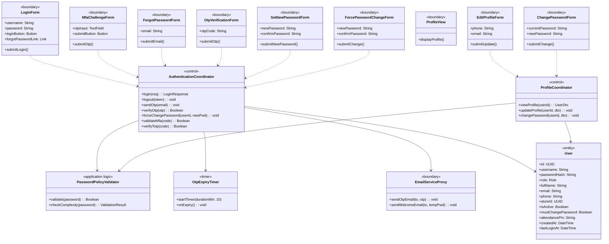
```mermaid
classDiagram
    class LoginForm {
        <<boundary>>
        +username: String
        +password: String
        +loginButton: Button
        +forgotPasswordLink: Link
        +submitLogin()
    }
    class MfaChallengeForm {
        <<boundary>>
        +otpInput: TextField
        +submitButton: Button
        +submitOtp()
    }
    class ForgotPasswordForm {
        <<boundary>>
        +email: String
        +submitEmail()
    }
    class OtpVerificationForm {
        <<boundary>>
        +otpCode: String
        +submitOtp()
    }
    class SetNewPasswordForm {
        <<boundary>>
        +newPassword: String
        +confirmPassword: String
        +submitNewPassword()
    }
    class ForcePasswordChangeForm {
        <<boundary>>
        +newPassword: String
        +confirmPassword: String
        +submitChange()
    }
    class ProfileView {
        <<boundary>>
        +displayProfile()
    }
    class EditProfileForm {
        <<boundary>>
        +phone: String
        +email: String
        +submitUpdate()
    }
    class ChangePasswordForm {
        <<boundary>>
        +currentPassword: String
        +newPassword: String
        +submitChange()
    }
    class AuthenticationCoordinator {
        <<control>>
        +login(req): LoginResponse
        +logout(token): void
        +sendOtp(email): void
        +verifyOtp(otp): Boolean
        +forceChangePassword(userId, newPwd): void
        +validateMfa(code): Boolean
        +verifyTotp(code): Boolean
    }
    class ProfileCoordinator {
        <<control>>
        +viewProfile(userId): UserDto
        +updateProfile(userId, dto): void
        +changePassword(userId, dto): void
    }
    class PasswordPolicyValidator {
        <<application logic>>
        +validate(password): Boolean
        +checkComplexity(password): ValidationResult
    }
    class OtpExpiryTimer {
        <<timer>>
        +startTimer(durationMin: 10)
        +onExpiry(): void
    }
    class EmailServiceProxy {
        <<boundary>>
        +sendOtpEmail(to, otp): void
        +sendWelcomeEmail(to, tempPwd): void
    }
    class User {
        <<entity>>
        +id: UUID
        +username: String
        +passwordHash: String
        +role: Role
        +fullName: String
        +email: String
        +phone: String
        +storeId: UUID
        +isActive: Boolean
        +mustChangePassword: Boolean
        +attendancePin: String
        +createdAt: DateTime
        +lastLoginAt: DateTime
    }

    LoginForm ..> AuthenticationCoordinator
    MfaChallengeForm ..> AuthenticationCoordinator
    ForgotPasswordForm ..> AuthenticationCoordinator
    OtpVerificationForm ..> AuthenticationCoordinator
    SetNewPasswordForm ..> AuthenticationCoordinator
    ForcePasswordChangeForm ..> AuthenticationCoordinator
    EditProfileForm ..> ProfileCoordinator
    ChangePasswordForm ..> ProfileCoordinator
    AuthenticationCoordinator --> PasswordPolicyValidator
    AuthenticationCoordinator --> OtpExpiryTimer
    AuthenticationCoordinator --> EmailServiceProxy
    AuthenticationCoordinator --> User
    ProfileCoordinator --> PasswordPolicyValidator
    ProfileCoordinator --> User
```

#### ***3.1.2 UC-01 Login (including MFA for HQ Roles)***

*\[Describes the login flow. HQ roles (ceoviewer, businessadmin, ssadmin) require MFA after password verification (BR-83). The second factor may be either an **email OTP** or a **TOTP authenticator code** — the user supplies whichever applies, and the coordinator verifies it via the corresponding path (verifyOtp / verifyTotp). **3 consecutive failed MFA attempts trigger a BR-17 lockout** (the account is locked the same way as repeated password failures). TOTP enrollment/verification implementation may be deferred, but the design must show both factors. Branch roles (storemanager, cashier, barista) login with username/password only. After successful login, if must_change_password = true, user is redirected to Force Password Change screen (UC-06).\]*

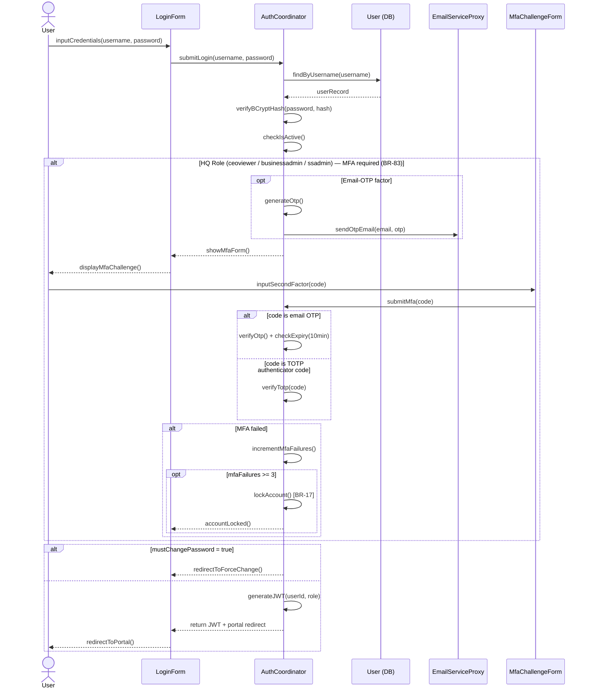
```mermaid
sequenceDiagram
    actor User
    participant LoginForm
    participant AuthCoordinator
    participant UserDB as User (DB)
    participant EmailSvc as EmailServiceProxy
    participant MfaForm as MfaChallengeForm

    User->>LoginForm: inputCredentials(username, password)
    LoginForm->>AuthCoordinator: submitLogin(username, password)
    AuthCoordinator->>UserDB: findByUsername(username)
    UserDB-->>AuthCoordinator: userRecord
    AuthCoordinator->>AuthCoordinator: verifyBCryptHash(password, hash)
    AuthCoordinator->>AuthCoordinator: checkIsActive()

    alt HQ Role (ceoviewer / businessadmin / ssadmin) — MFA required (BR-83)
        opt Email-OTP factor
            AuthCoordinator->>AuthCoordinator: generateOtp()
            AuthCoordinator->>EmailSvc: sendOtpEmail(email, otp)
        end
        AuthCoordinator-->>LoginForm: showMfaForm()
        LoginForm-->>User: displayMfaChallenge()

        User->>MfaForm: inputSecondFactor(code)
        MfaForm->>AuthCoordinator: submitMfa(code)
        alt code is email OTP
            AuthCoordinator->>AuthCoordinator: verifyOtp() + checkExpiry(10min)
        else code is TOTP authenticator code
            AuthCoordinator->>AuthCoordinator: verifyTotp(code)
        end

        alt MFA failed
            AuthCoordinator->>AuthCoordinator: incrementMfaFailures()
            opt mfaFailures >= 3
                AuthCoordinator->>AuthCoordinator: lockAccount() [BR-17]
                AuthCoordinator-->>LoginForm: accountLocked()
            end
        end
    end

    alt mustChangePassword = true
        AuthCoordinator-->>LoginForm: redirectToForceChange()
    else
        AuthCoordinator->>AuthCoordinator: generateJWT(userId, role)
        AuthCoordinator-->>LoginForm: return JWT + portal redirect
        LoginForm-->>User: redirectToPortal()
    end
```

#### ***3.1.3 UC-02 Logout***

*\[The user ends their authenticated session. Logout is stateless (the client discards the JWT), but the system records the logout time on the user record / audit trail (BR-13). Per BR-60, logging out of the web/management session does **not** close any open POS shift session — closing a shift is an explicit, separate cashier action and is unaffected by logout.\]*

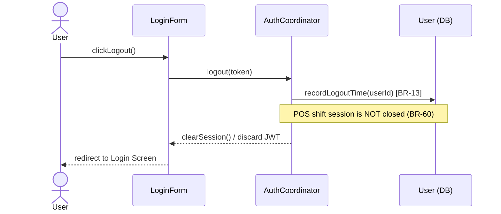
```mermaid
sequenceDiagram
    actor User
    participant LoginForm
    participant AuthCoordinator
    participant UserDB as User (DB)

    User->>LoginForm: clickLogout()
    LoginForm->>AuthCoordinator: logout(token)
    AuthCoordinator->>UserDB: recordLogoutTime(userId) [BR-13]
    note over AuthCoordinator,UserDB: POS shift session is NOT closed (BR-60)
    AuthCoordinator-->>LoginForm: clearSession() / discard JWT
    LoginForm-->>User: redirect to Login Screen
```

#### ***3.1.4 UC-03/04/05 Forgot Password → OTP → Reset Password***

*\[Describes the password recovery flow. User submits registered email → system generates OTP and sends via email → OTP timer set to 10 minutes (BR-16) → user verifies OTP → user sets new password meeting complexity policy.\]*

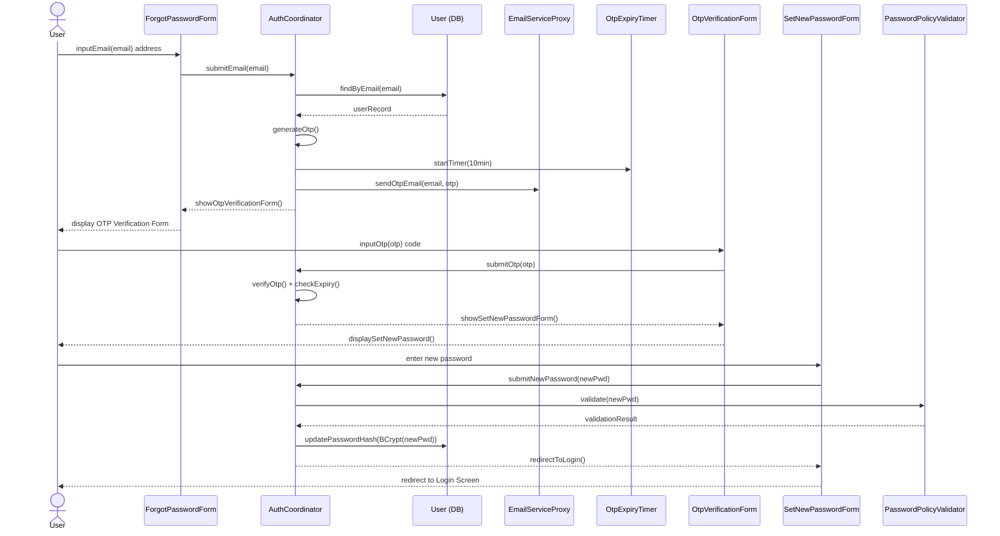
```mermaid
sequenceDiagram
    actor User
    participant ForgotForm as ForgotPasswordForm
    participant AuthCoordinator
    participant UserDB as User (DB)
    participant EmailSvc as EmailServiceProxy
    participant OtpTimer as OtpExpiryTimer
    participant OtpForm as OtpVerificationForm
    participant SetPassForm as SetNewPasswordForm
    participant Validator as PasswordPolicyValidator

    User->>ForgotForm: inputEmail(email) address
    ForgotForm->>AuthCoordinator: submitEmail(email)
    AuthCoordinator->>UserDB: findByEmail(email)
    UserDB-->>AuthCoordinator: userRecord
    AuthCoordinator->>AuthCoordinator: generateOtp()
    AuthCoordinator->>OtpTimer: startTimer(10min)
    AuthCoordinator->>EmailSvc: sendOtpEmail(email, otp)
    AuthCoordinator-->>ForgotForm: showOtpVerificationForm()
    ForgotForm-->>User: display OTP Verification Form

    User->>OtpForm: inputOtp(otp) code
    OtpForm->>AuthCoordinator: submitOtp(otp)
    AuthCoordinator->>AuthCoordinator: verifyOtp() + checkExpiry()
    AuthCoordinator-->>OtpForm: showSetNewPasswordForm()
    OtpForm-->>User: displaySetNewPassword()

    User->>SetPassForm: enter new password
    SetPassForm->>AuthCoordinator: submitNewPassword(newPwd)
    AuthCoordinator->>Validator: validate(newPwd)
    Validator-->>AuthCoordinator: validationResult
    AuthCoordinator->>UserDB: updatePasswordHash(BCrypt(newPwd))
    AuthCoordinator-->>SetPassForm: redirectToLogin()
    SetPassForm-->>User: redirect to Login Screen
```

#### ***3.1.5 UC-06 Force Password Change (First Login)***

*\[When must_change_password = true (set on account creation by ssadmin), the user is redirected to Force Password Change screen immediately after first login. The user cannot access the portal until they complete this step.\]*

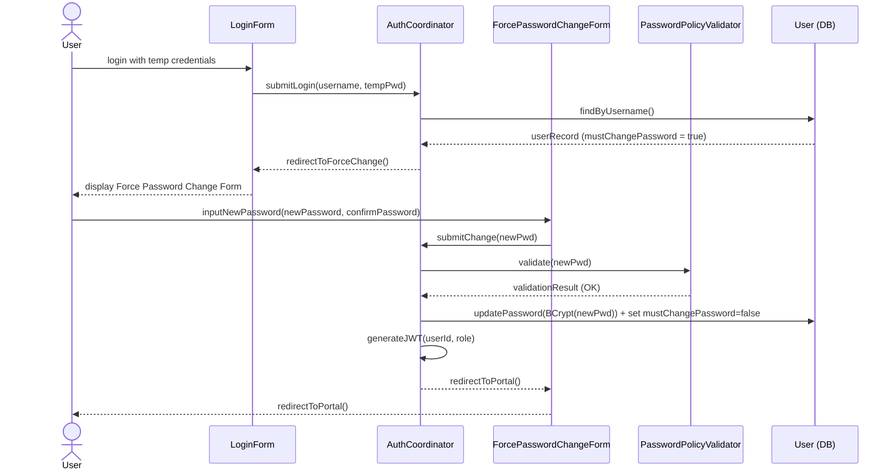
```mermaid
sequenceDiagram
    actor User
    participant LoginForm
    participant AuthCoordinator
    participant ForceChangeForm as ForcePasswordChangeForm
    participant Validator as PasswordPolicyValidator
    participant UserDB as User (DB)

    User->>LoginForm: login with temp credentials
    LoginForm->>AuthCoordinator: submitLogin(username, tempPwd)
    AuthCoordinator->>UserDB: findByUsername()
    UserDB-->>AuthCoordinator: userRecord (mustChangePassword = true)
    AuthCoordinator-->>LoginForm: redirectToForceChange()
    LoginForm-->>User: display Force Password Change Form

    User->>ForceChangeForm: inputNewPassword(newPassword, confirmPassword)
    ForceChangeForm->>AuthCoordinator: submitChange(newPwd)
    AuthCoordinator->>Validator: validate(newPwd)
    Validator-->>AuthCoordinator: validationResult (OK)
    AuthCoordinator->>UserDB: updatePassword(BCrypt(newPwd)) + set mustChangePassword=false
    AuthCoordinator->>AuthCoordinator: generateJWT(userId, role)
    AuthCoordinator-->>ForceChangeForm: redirectToPortal()
    ForceChangeForm-->>User: redirectToPortal()
```

#### ***3.1.6 UC-07/08/09 View Profile / Update Profile / Change Password***

*\[Profile management use cases share the ProfileCoordinator. All roles can view and update their own contact information. Change Password requires the current password for identity verification before allowing the update.\]*

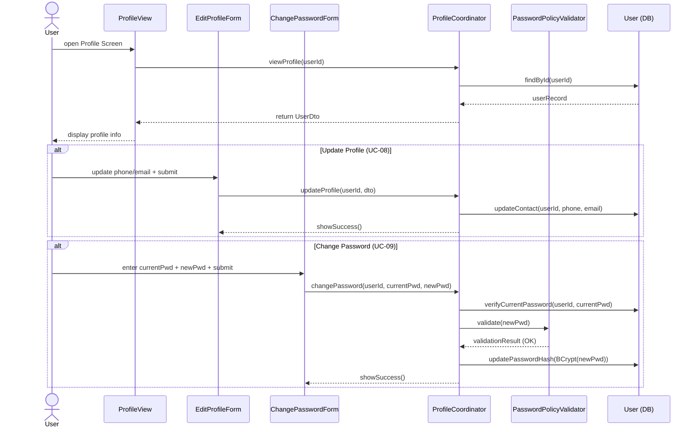
```mermaid
sequenceDiagram
    actor User
    participant ProfileView
    participant EditProfileForm
    participant ChangePassForm as ChangePasswordForm
    participant ProfileCoordinator
    participant Validator as PasswordPolicyValidator
    participant UserDB as User (DB)

    User->>ProfileView: open Profile Screen
    ProfileView->>ProfileCoordinator: viewProfile(userId)
    ProfileCoordinator->>UserDB: findById(userId)
    UserDB-->>ProfileCoordinator: userRecord
    ProfileCoordinator-->>ProfileView: return UserDto
    ProfileView-->>User: display profile info

    alt Update Profile (UC-08)
        User->>EditProfileForm: update phone/email + submit
        EditProfileForm->>ProfileCoordinator: updateProfile(userId, dto)
        ProfileCoordinator->>UserDB: updateContact(userId, phone, email)
        ProfileCoordinator-->>EditProfileForm: showSuccess()
    end

    alt Change Password (UC-09)
        User->>ChangePassForm: enter currentPwd + newPwd + submit
        ChangePassForm->>ProfileCoordinator: changePassword(userId, currentPwd, newPwd)
        ProfileCoordinator->>UserDB: verifyCurrentPassword(userId, currentPwd)
        ProfileCoordinator->>Validator: validate(newPwd)
        Validator-->>ProfileCoordinator: validationResult (OK)
        ProfileCoordinator->>UserDB: updatePasswordHash(BCrypt(newPwd))
        ProfileCoordinator-->>ChangePassForm: showSuccess()
    end
```

#### ***3.1.7 USER Account Statechart***

*\[The User account lifecycle has 4 states. The CREATED state forces a password change on first login. ACTIVE is the normal operational state. LOCKED occurs after 5 consecutive failed login attempts (BR-11, 15-minute lock). A LOCKED account **auto-expires back to ACTIVE after 15 minutes**, and can also be unlocked early by a **Store Manager (for own-branch staff) or an ssadmin**. INACTIVE results from manual deactivation by ssadmin or storemanager (own branch staff only).\]*

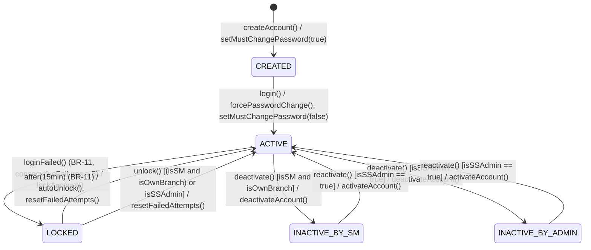
```mermaid
stateDiagram-v2
    [*] --> CREATED : createAccount() / setMustChangePassword(true)

    CREATED --> ACTIVE : login() / forcePasswordChange(), setMustChangePassword(false)

    ACTIVE --> LOCKED : loginFailed() (BR-11, consecutiveFailures ≥ 5) / lockAccount()

    ACTIVE --> INACTIVE_BY_SM : deactivate() [isSM and isOwnBranch] / deactivateAccount()

    ACTIVE --> INACTIVE_BY_ADMIN : deactivate() [isSSAdmin == true] / deactivateAccount()

    LOCKED --> ACTIVE : after(15min) (BR-11) / autoUnlock(), resetFailedAttempts()

    LOCKED --> ACTIVE : unlock() [(isSM and isOwnBranch) or isSSAdmin] / resetFailedAttempts()

    INACTIVE_BY_SM --> ACTIVE : reactivate() [isSSAdmin == true] / activateAccount()

    INACTIVE_BY_ADMIN --> ACTIVE : reactivate() [isSSAdmin == true] / activateAccount()
```

### **3.2 User Account Management**

*\[Provide the detailed design for User Account Management, covering UC-10→UC-14 (View User List, Add User, Update User, View User Detail, Deactivate/Reactivate User) plus UC-83 (User Account Change & Access Review Report). Primary actor: **ssadmin**. In addition, a **Store Manager** may **unlock and view their own branch's staff accounts** (the BR-11 / BR-59 branch-scoped exception); **ceoviewer** has read-only access to the review report (UC-83, BR-81). The class diagram covers all user management use cases. Sequence diagrams cover the Add User and Update/Deactivate User flows.\]*

#### ***3.2.1 Class Diagram***

*\[Class diagram for User Account Management. COMET stereotypes: UserListView, AddUserForm, EditUserForm, UserDetailView («boundary»); UserManagementCoordinator («control»); PasswordPolicyValidator («application logic»); User, Store, AuditLog («entity»); EmailServiceProxy («boundary» external).\]*

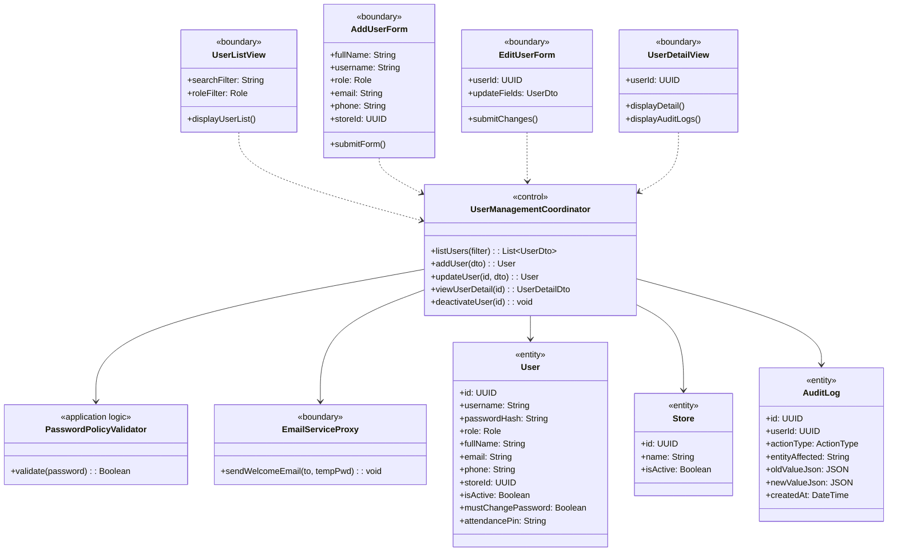
```mermaid
classDiagram
    class UserListView {
        <<boundary>>
        +searchFilter: String
        +roleFilter: Role
        +displayUserList()
    }
    class AddUserForm {
        <<boundary>>
        +fullName: String
        +username: String
        +role: Role
        +email: String
        +phone: String
        +storeId: UUID
        +submitForm()
    }
    class EditUserForm {
        <<boundary>>
        +userId: UUID
        +updateFields: UserDto
        +submitChanges()
    }
    class UserDetailView {
        <<boundary>>
        +userId: UUID
        +displayDetail()
        +displayAuditLogs()
    }
    class UserManagementCoordinator {
        <<control>>
        +listUsers(filter): List~UserDto~
        +addUser(dto): User
        +updateUser(id, dto): User
        +viewUserDetail(id): UserDetailDto
        +deactivateUser(id): void
    }
    class PasswordPolicyValidator {
        <<application logic>>
        +validate(password): Boolean
    }
    class EmailServiceProxy {
        <<boundary>>
        +sendWelcomeEmail(to, tempPwd): void
    }
    class User {
        <<entity>>
        +id: UUID
        +username: String
        +passwordHash: String
        +role: Role
        +fullName: String
        +email: String
        +phone: String
        +storeId: UUID
        +isActive: Boolean
        +mustChangePassword: Boolean
        +attendancePin: String
    }
    class Store {
        <<entity>>
        +id: UUID
        +name: String
        +isActive: Boolean
    }
    class AuditLog {
        <<entity>>
        +id: UUID
        +userId: UUID
        +actionType: ActionType
        +entityAffected: String
        +oldValueJson: JSON
        +newValueJson: JSON
        +createdAt: DateTime
    }

    UserListView ..> UserManagementCoordinator
    AddUserForm ..> UserManagementCoordinator
    EditUserForm ..> UserManagementCoordinator
    UserDetailView ..> UserManagementCoordinator
    UserManagementCoordinator --> PasswordPolicyValidator
    UserManagementCoordinator --> EmailServiceProxy
    UserManagementCoordinator --> User
    UserManagementCoordinator --> Store
    UserManagementCoordinator --> AuditLog
```

*\[**AuditLog note (BR-81):** the entity shape is unchanged — `userId`, `actionType`, `entityAffected`, `oldValueJson`, `newValueJson`, `createdAt`. For account changes, the **actor** is captured by `userId`; the **target** user and the **before/after** role/active-status values are captured inside `oldValueJson` / `newValueJson`. So a single AuditLog row records actor + target + before/after, satisfying BR-81's requirement without adding new columns.\]*

#### ***3.2.2 UC-11 Add User Account***

*\[ssadmin creates a new employee account. Validation: **username must be unique**, the referenced **store must exist**, and the **email and phone must also be unique**. The system **auto-generates the employee id (EMP-id) per BR-57** and **derives the username per BR-58**, auto-generates a temporary password, sends a welcome email with the temporary password, sets mustChangePassword = true, and writes an audit log entry (BR-80).\]*

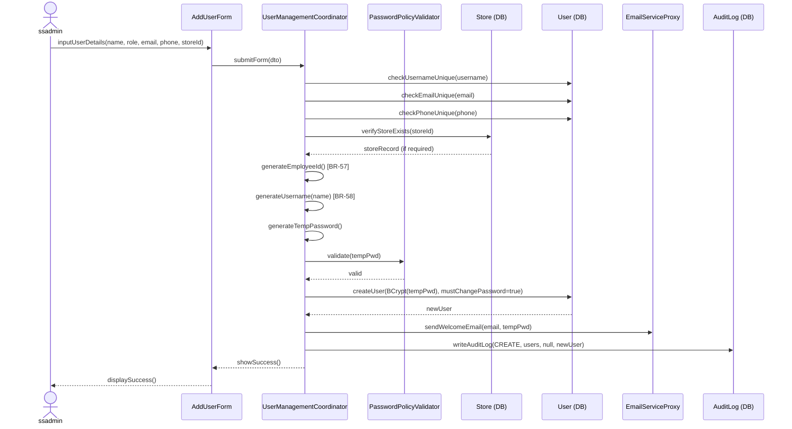
```mermaid
sequenceDiagram
    actor ssadmin
    participant AddForm as AddUserForm
    participant UserMgmtCoord as UserManagementCoordinator
    participant Validator as PasswordPolicyValidator
    participant StoreDB as Store (DB)
    participant UserDB as User (DB)
    participant EmailSvc as EmailServiceProxy
    participant AuditDB as AuditLog (DB)

    ssadmin->>AddForm: inputUserDetails(name, role, email, phone, storeId)
    AddForm->>UserMgmtCoord: submitForm(dto)
    UserMgmtCoord->>UserDB: checkUsernameUnique(username)
    UserMgmtCoord->>UserDB: checkEmailUnique(email)
    UserMgmtCoord->>UserDB: checkPhoneUnique(phone)
    UserMgmtCoord->>StoreDB: verifyStoreExists(storeId)
    StoreDB-->>UserMgmtCoord: storeRecord (if required)
    UserMgmtCoord->>UserMgmtCoord: generateEmployeeId() [BR-57]
    UserMgmtCoord->>UserMgmtCoord: generateUsername(name) [BR-58]
    UserMgmtCoord->>UserMgmtCoord: generateTempPassword()
    UserMgmtCoord->>Validator: validate(tempPwd)
    Validator-->>UserMgmtCoord: valid
    UserMgmtCoord->>UserDB: createUser(BCrypt(tempPwd), mustChangePassword=true)
    UserDB-->>UserMgmtCoord: newUser
    UserMgmtCoord->>EmailSvc: sendWelcomeEmail(email, tempPwd)
    UserMgmtCoord->>AuditDB: writeAuditLog(CREATE, users, null, newUser)
    UserMgmtCoord-->>AddForm: showSuccess()
    AddForm-->>ssadmin: displaySuccess()
```

#### ***3.2.3 UC-12/UC-14 Update / Deactivate User Account***

*\[ssadmin updates user profile details or deactivates an account. Self-escalation is blocked (BR-82): **no user may change their own role, permissions, or active status** — such a change must be performed by a **different** ssadmin. An audit log is written for every change (BR-80). Deactivated users cannot login.\]*

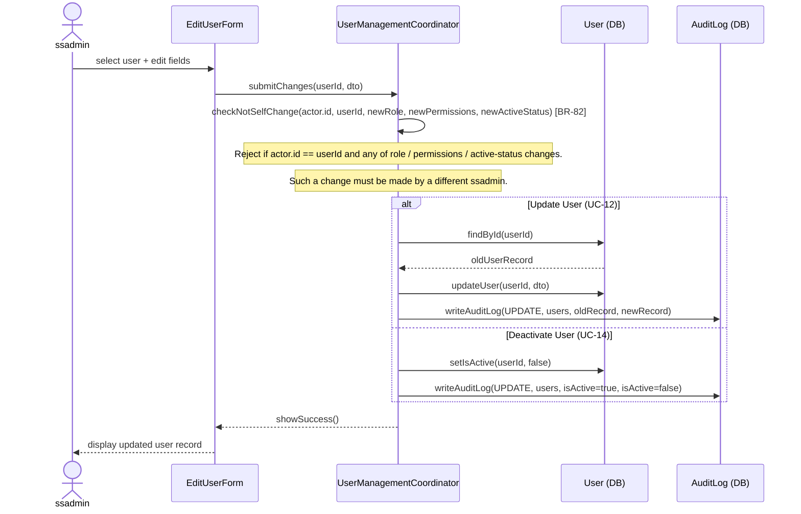
```mermaid
sequenceDiagram
    actor ssadmin
    participant EditForm as EditUserForm
    participant UserMgmtCoord as UserManagementCoordinator
    participant UserDB as User (DB)
    participant AuditDB as AuditLog (DB)

    ssadmin->>EditForm: select user + edit fields
    EditForm->>UserMgmtCoord: submitChanges(userId, dto)
    UserMgmtCoord->>UserMgmtCoord: checkNotSelfChange(actor.id, userId, newRole, newPermissions, newActiveStatus) [BR-82]
    Note over UserMgmtCoord: Reject if actor.id == userId and any of role / permissions / active-status changes.
    Note over UserMgmtCoord: Such a change must be made by a different ssadmin.

    alt Update User (UC-12)
        UserMgmtCoord->>UserDB: findById(userId)
        UserDB-->>UserMgmtCoord: oldUserRecord
        UserMgmtCoord->>UserDB: updateUser(userId, dto)
        UserMgmtCoord->>AuditDB: writeAuditLog(UPDATE, users, oldRecord, newRecord)
    else Deactivate User (UC-14)
        UserMgmtCoord->>UserDB: setIsActive(userId, false)
        UserMgmtCoord->>AuditDB: writeAuditLog(UPDATE, users, isActive=true, isActive=false)
    end

    UserMgmtCoord-->>EditForm: showSuccess()
    EditForm-->>ssadmin: display updated user record
```

#### ***3.2.4 UC-83 View User Account Change & Access Review Report***

*\[A **ceoviewer** opens a **read-only** review report of user-account changes and access events for governance/audit purposes (BR-81). The coordinator queries the AuditLog for account-related actions (CREATE / UPDATE on `users`, lock/unlock, deactivate/reactivate) and renders, per row, the **actor** (`userId`), the **target** user, and the **before/after** role/active-status decoded from `oldValueJson` / `newValueJson`. The actor cannot mutate anything from this view.\]*

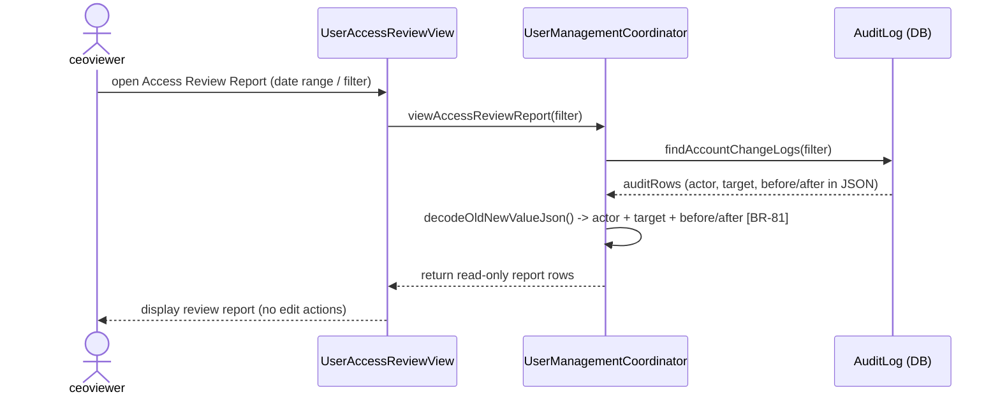
```mermaid
sequenceDiagram
    actor ceoviewer
    participant ReviewView as UserAccessReviewView
    participant UserMgmtCoord as UserManagementCoordinator
    participant AuditDB as AuditLog (DB)

    ceoviewer->>ReviewView: open Access Review Report (date range / filter)
    ReviewView->>UserMgmtCoord: viewAccessReviewReport(filter)
    UserMgmtCoord->>AuditDB: findAccountChangeLogs(filter)
    AuditDB-->>UserMgmtCoord: auditRows (actor, target, before/after in JSON)
    UserMgmtCoord->>UserMgmtCoord: decodeOldNewValueJson() -> actor + target + before/after [BR-81]
    UserMgmtCoord-->>ReviewView: return read-only report rows
    ReviewView-->>ceoviewer: display review report (no edit actions)
```

### **3.3 Menu & Category Management**

*\[Provide the detailed design for Menu & Category Management, covering UC-15→UC-19, UC-68→UC-74 (View/Add/Update/Delete Menu Items, Categories, Toppings, Raw Material Master, Recipe Management, Branch Availability Toggle). Actors: businessadmin (chain-wide catalog CRUD), storemanager (local branch availability toggle via branch_menu_status), cashier/POS (read-only list view of items available at their branch). For features with the same class structure, the class diagram is provided once.\]*

#### ***3.3.1 Class Diagram***

*\[Class diagram for Menu & Category Management. COMET stereotypes: MenuCategoryView, AddMenuItemForm, EditMenuItemForm, AddCategoryForm, RawMaterialMasterView («boundary»); CatalogCoordinator («control»); MenuItem, Category, OptionTopping, MenuItemToppingMapping, RecipeItem, RawMaterial, BranchMenuStatus, AuditLog («entity»). Toppings are **global** (an OptionTopping is not owned by a single menu item); a MenuItemToppingMapping join entity links a topping to one or more menu items (BR-29 "linked globally or selectively"). MenuItem supports size **variants** via a self-reference: a child variant row (S/M/L, its own sku/price) points to its parent through parentItemId.\]*

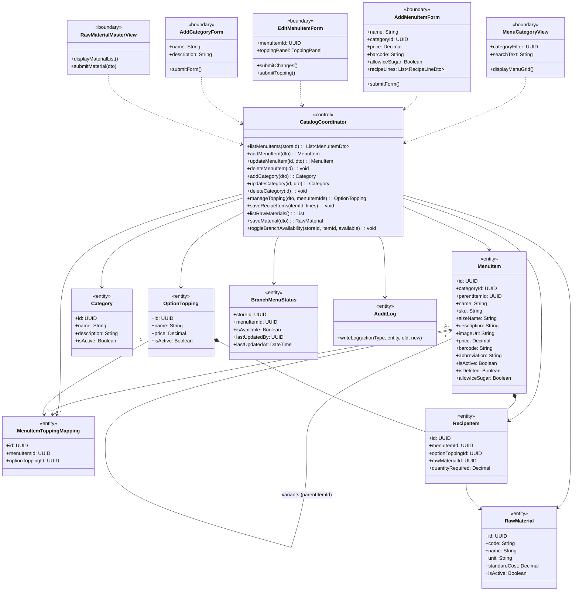
```mermaid
classDiagram
    class MenuCategoryView {
        <<boundary>>
        +categoryFilter: UUID
        +searchText: String
        +displayMenuGrid()
    }
    class AddMenuItemForm {
        <<boundary>>
        +name: String
        +categoryId: UUID
        +price: Decimal
        +barcode: String
        +allowIceSugar: Boolean
        +recipeLines: List~RecipeLineDto~
        +submitForm()
    }
    class EditMenuItemForm {
        <<boundary>>
        +menuItemId: UUID
        +toppingPanel: ToppingPanel
        +submitChanges()
        +submitTopping()
    }
    class AddCategoryForm {
        <<boundary>>
        +name: String
        +description: String
        +submitForm()
    }
    class RawMaterialMasterView {
        <<boundary>>
        +displayMaterialList()
        +submitMaterial(dto)
    }
    class CatalogCoordinator {
        <<control>>
        +listMenuItems(storeId): List~MenuItemDto~
        +addMenuItem(dto): MenuItem
        +updateMenuItem(id, dto): MenuItem
        +deleteMenuItem(id): void
        +addCategory(dto): Category
        +updateCategory(id, dto): Category
        +deleteCategory(id): void
        +manageTopping(dto, menuItemIds): OptionTopping
        +saveRecipeItems(itemId, lines): void
        +listRawMaterials(): List
        +saveMaterial(dto): RawMaterial
        +toggleBranchAvailability(storeId, itemId, available): void
    }
    class MenuItem {
        <<entity>>
        +id: UUID
        +categoryId: UUID
        +parentItemId: UUID
        +name: String
        +sku: String
        +sizeName: String
        +description: String
        +imageUrl: String
        +price: Decimal
        +barcode: String
        +abbreviation: String
        +isActive: Boolean
        +isDeleted: Boolean
        +allowIceSugar: Boolean
    }
    class Category {
        <<entity>>
        +id: UUID
        +name: String
        +description: String
        +isActive: Boolean
    }
    class OptionTopping {
        <<entity>>
        +id: UUID
        +name: String
        +price: Decimal
        +isActive: Boolean
    }
    class MenuItemToppingMapping {
        <<entity>>
        +id: UUID
        +menuItemId: UUID
        +optionToppingId: UUID
    }
    class RecipeItem {
        <<entity>>
        +id: UUID
        +menuItemId: UUID
        +optionToppingId: UUID
        +rawMaterialId: UUID
        +quantityRequired: Decimal
    }
    class RawMaterial {
        <<entity>>
        +id: UUID
        +code: String
        +name: String
        +unit: String
        +standardCost: Decimal
        +isActive: Boolean
    }
    class BranchMenuStatus {
        <<entity>>
        +storeId: UUID
        +menuItemId: UUID
        +isAvailable: Boolean
        +lastUpdatedBy: UUID
        +lastUpdatedAt: DateTime
    }
    class AuditLog {
        <<entity>>
        +writeLog(actionType, entity, old, new)
    }

    MenuCategoryView ..> CatalogCoordinator
    AddMenuItemForm ..> CatalogCoordinator
    EditMenuItemForm ..> CatalogCoordinator
    AddCategoryForm ..> CatalogCoordinator
    RawMaterialMasterView ..> CatalogCoordinator
    CatalogCoordinator --> MenuItem
    CatalogCoordinator --> Category
    CatalogCoordinator --> OptionTopping
    CatalogCoordinator --> MenuItemToppingMapping
    CatalogCoordinator --> RecipeItem
    CatalogCoordinator --> RawMaterial
    CatalogCoordinator --> BranchMenuStatus
    CatalogCoordinator --> AuditLog
    RecipeItem --> RawMaterial
    MenuItem *-- RecipeItem
    OptionTopping *-- RecipeItem
    MenuItem "1" --> "0..*" MenuItemToppingMapping
    OptionTopping "1" --> "0..*" MenuItemToppingMapping
    MenuItem "1" --> "0..*" MenuItem : variants (parentItemId)
```

#### ***3.3.2 UC-15 List Menu Items (two-level availability)***

*\[Lists menu items for a given store/branch. `listMenuItems(storeId)` takes a store context so availability can be resolved at two levels: chain-level `MenuItem.isActive` AND branch-level `BranchMenuStatus.isAvailable`. An item is shown as **"Out of Stock"** when it is chain-active but the branch has toggled it unavailable (BR-25); a chain-inactive item is hidden entirely. The Cashier/POS actor uses this read-only view to populate the order screen; businessadmin uses it (with no storeId, or chain context) for catalog browsing.\]*

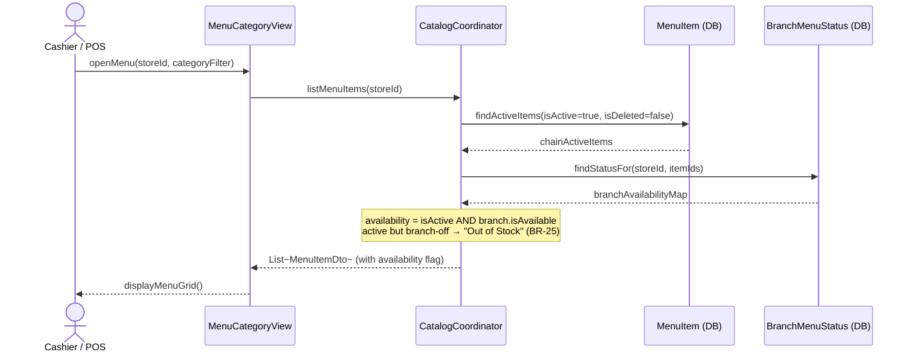
```mermaid
sequenceDiagram
    actor cashier as Cashier / POS
    participant MenuView as MenuCategoryView
    participant CatalogCoord as CatalogCoordinator
    participant MenuDB as MenuItem (DB)
    participant BranchDB as BranchMenuStatus (DB)

    cashier->>MenuView: openMenu(storeId, categoryFilter)
    MenuView->>CatalogCoord: listMenuItems(storeId)
    CatalogCoord->>MenuDB: findActiveItems(isActive=true, isDeleted=false)
    MenuDB-->>CatalogCoord: chainActiveItems
    CatalogCoord->>BranchDB: findStatusFor(storeId, itemIds)
    BranchDB-->>CatalogCoord: branchAvailabilityMap
    Note over CatalogCoord: availability = isActive AND branch.isAvailable<br/>active but branch-off → "Out of Stock" (BR-25)
    CatalogCoord-->>MenuView: List~MenuItemDto~ (with availability flag)
    MenuView-->>cashier: displayMenuGrid()
```

#### ***3.3.3 UC-18 Add Menu Item with Recipe Formula***

*\[businessadmin creates a new menu item and links its raw material recipe formula. A menu item may be a base item or carry size **variants** (S/M/L): each variant is a child MenuItem row (its own sku + price) that points to the base item via parentItemId. System validates barcode uniqueness and recipe unit consistency (BR-73) before saving. Creating a menu item writes a **CREATE** audit-log entry; subsequent selling-price edits write a **PRICE_UPDATE** entry (BR-68 — see UC-19).\]*

```mermaid
sequenceDiagram
    actor bizadmin
    participant AddForm as AddMenuItemForm
    participant CatalogCoord as CatalogCoordinator
    participant RawMatDB as RawMaterial (DB)
    participant MenuDB as MenuItem (DB)
    participant RecipeDB as RecipeItem (DB)
    participant AuditDB as AuditLog (DB)

    bizadmin->>AddForm: inputMenuItemDetails(name, sku, price, barcode, sizeVariants, recipeLines)
    AddForm->>CatalogCoord: submitForm(dto)
    CatalogCoord->>MenuDB: checkBarcodeUnique(barcode)
    CatalogCoord->>RawMatDB: verifyMaterialsExist(recipeLines)
    RawMatDB-->>CatalogCoord: materials validated
    Note over CatalogCoord: Validate units match master (BR-73)
    CatalogCoord->>MenuDB: createMenuItem(name, sku, price, barcode, abbreviation, description, imageUrl, allowIceSugar)
    MenuDB-->>CatalogCoord: baseMenuItem
    opt size variants (S/M/L) provided
        loop for each size variant
            CatalogCoord->>MenuDB: createVariantItem(parentItemId=baseMenuItem.id, sizeName, sku, price)
        end
    end
    loop for each recipe line
        CatalogCoord->>RecipeDB: createRecipeItem(menuItemId, rawMaterialId, qty)
    end
    CatalogCoord->>AuditDB: writeAuditLog(CREATE, menu_items, null, baseMenuItem)
    Note over CatalogCoord,AuditDB: BR-68 - CREATE on add, PRICE_UPDATE logged separately on selling-price change (UC-19)
    CatalogCoord-->>AddForm: showSuccess()
    AddForm-->>bizadmin: displaySuccess()
```

#### ***3.3.4 UC-71 Manage Toppings & Options (with Recipe)***

*\[businessadmin adds or edits a **global** topping, then links it to one or more menu items. The topping itself is created once in OptionTopping (no menuItemId); each link is a row in the MenuItemToppingMapping join table — a topping may be linked globally (every item) or selectively (a chosen subset), per BR-29. Each topping may optionally have its own recipe formula (ingredients consumed when the topping is ordered). Price must be >= 0. Recipe unit consistency is validated against raw material master (BR-73).\]*

```mermaid
sequenceDiagram
    actor bizadmin
    participant EditForm as EditMenuItemForm
    participant CatalogCoord as CatalogCoordinator
    participant RawMatDB as RawMaterial (DB)
    participant ToppingDB as OptionTopping (DB)
    participant MapDB as MenuItemToppingMapping (DB)
    participant RecipeDB as RecipeItem (DB)

    bizadmin->>EditForm: inputToppingDetails(name, price, menuItemIds, recipeLines)
    EditForm->>CatalogCoord: submitTopping(dto, menuItemIds)
    CatalogCoord->>CatalogCoord: validate(price >= 0)
    CatalogCoord->>ToppingDB: saveTopping(name, price)
    Note over CatalogCoord,ToppingDB: global topping — no menuItemId on OptionTopping (BR-29)
    ToppingDB-->>CatalogCoord: globalTopping

    loop for each linked menu item (global or selective)
        CatalogCoord->>MapDB: mapToppingToItem(menuItemId, globalTopping.id)
    end

    alt Recipe lines provided
        CatalogCoord->>RawMatDB: verifyMaterialsExist(recipeLines)
        Note over CatalogCoord: Validate units match master (BR-73)
        loop for each recipe line
            CatalogCoord->>RecipeDB: createRecipeItem(toppingId, rawMaterialId, qty)
        end
    end

    CatalogCoord-->>EditForm: showSuccess()
    EditForm-->>bizadmin: displayToppingList()
```

#### ***3.3.5 UC-16/17/70 CRUD Category***

*\[businessadmin creates, updates, or soft-deletes product categories. Delete (soft) is blocked if the category still contains active menu items, preventing orphaned items.\]*

```mermaid
sequenceDiagram
    actor bizadmin
    participant CatForm as AddCategoryForm / EditCategoryForm
    participant CatalogCoord as CatalogCoordinator
    participant MenuDB as MenuItem (DB)
    participant CatDB as Category (DB)

    bizadmin->>CatForm: submitAction(dto)
    CatForm->>CatalogCoord: submitAction(dto)

    alt ADD Category (UC-16)
        CatalogCoord->>CatDB: checkNameUnique(name)
        CatalogCoord->>CatDB: createCategory(name, description)
    else UPDATE Category (UC-17)
        CatalogCoord->>CatDB: updateCategory(id, dto)
    else DELETE Category (UC-70)
        CatalogCoord->>MenuDB: countActiveItems(categoryId)
        MenuDB-->>CatalogCoord: count = 0 (no active items)
        CatalogCoord->>CatDB: setIsActive(id, false)
    end

    CatalogCoord-->>CatForm: showSuccess()
    CatForm-->>bizadmin: displayCategoryList()
```

#### ***3.3.6 UC-74 Manage Raw Material Master Catalog***

*\[businessadmin maintains the chain-wide raw material catalog. Material code is immutable after creation. Unit is locked once the material is referenced by any stock transaction (BR-63/BR-64). Soft-delete via is_active flag prevents deletion of materials referenced by recipes.\]*

```mermaid
sequenceDiagram
    actor bizadmin
    participant MatView as RawMaterialMasterView
    participant CatalogCoord as CatalogCoordinator
    participant StockTxDB as StockTransaction (DB)
    participant MatDB as RawMaterial (DB)

    bizadmin->>MatView: openRawMaterialMaster()
    MatView->>CatalogCoord: listMaterials()
    CatalogCoord->>MatDB: findAllActive()
    MatDB-->>CatalogCoord: materialList
    CatalogCoord-->>MatView: displayGrid(materialList)
    MatView-->>bizadmin: displayMaterialGrid()

    bizadmin->>MatView: inputMaterialDetails(code, name, unit, cost)
    MatView->>CatalogCoord: saveMaterial(dto)
    CatalogCoord->>MatDB: checkCodeUnique(code)

    alt Edit: check unit immutability (BR-63)
        CatalogCoord->>StockTxDB: hasTransactions(materialId)
        StockTxDB-->>CatalogCoord: hasTransactions (locked if true)
    end

    CatalogCoord->>MatDB: createOrUpdate(dto)
    CatalogCoord-->>MatView: showSuccess()
    MatView-->>bizadmin: displayMaterialList()
```

#### ***3.3.7 UC-72 Delete Menu Item***

*\[businessadmin removes a menu item. Deletion is a **soft delete** (BR-28): the item is never physically removed — `deleteMenuItem(id)` sets `isDeleted=true` so historical orders/recipes that reference it stay intact. A soft-deleted item is excluded from list views (UC-15) and the order screen. A PRICE_UPDATE/DELETE audit entry is written for traceability (BR-68).\]*

```mermaid
sequenceDiagram
    actor bizadmin
    participant MenuView as MenuCategoryView
    participant CatalogCoord as CatalogCoordinator
    participant MenuDB as MenuItem (DB)
    participant AuditDB as AuditLog (DB)

    bizadmin->>MenuView: clickDelete(menuItemId)
    MenuView->>CatalogCoord: deleteMenuItem(id)
    CatalogCoord->>MenuDB: findById(id)
    MenuDB-->>CatalogCoord: existingItem
    CatalogCoord->>MenuDB: setIsDeleted(id, true)
    Note over CatalogCoord,MenuDB: soft delete — row retained for order/recipe history (BR-28)
    CatalogCoord->>AuditDB: writeAuditLog(DELETE, menu_items, existingItem, isDeleted=true)
    CatalogCoord-->>MenuView: showSuccess()
    MenuView-->>bizadmin: refreshMenuGrid()
```

### **3.4 Voucher Management**

*\[Provide the detailed design for Voucher Management, covering UC-20→UC-23 (View/Add/Update/Delete Voucher). Voucher application at checkout is described in Section 3.7 POS Transaction (UC-48). Actor: businessadmin (CRUD). The class diagram covers the voucher lifecycle; the sequence diagram covers the add/update flow. The VOUCHER statechart documents the full lifecycle — status is computed dynamically over 3 states (SCHEDULED / ACTIVE / EXPIRED) per BR-52, and deactivation is terminal.\]*

#### ***3.4.1 Class Diagram***

*\[Class diagram for Voucher Management. COMET stereotypes: VoucherListView, AddVoucherForm, EditVoucherForm («boundary»); VoucherCoordinator («control»); Voucher, AuditLog («entity»).\]*

```mermaid
classDiagram
    class VoucherListView {
        <<boundary>>
        +searchFilter: String
        +statusFilter: Status
        +displayVoucherGrid()
    }
    class AddVoucherForm {
        <<boundary>>
        +code: String
        +discountType: DiscountType
        +discountValue: Decimal
        +capAmount: Decimal
        +minOrderValue: Decimal
        +validFrom: Date
        +validTo: Date
        +maxUsesTotal: Integer
        +maxUsesPerCustomer: Integer
        +submitForm()
    }
    class EditVoucherForm {
        <<boundary>>
        +voucherId: UUID
        +updateFields: VoucherDto
        +submitChanges()
    }
    class VoucherCoordinator {
        <<control>>
        +listVouchers(filter): List~VoucherDto~
        +addVoucher(dto): Voucher
        +updateVoucher(id, dto): Voucher
        +deleteVoucher(id): void
        +validateVoucherForOrder(code, orderDto): VoucherResult
    }
    class Voucher {
        <<entity>>
        +id: UUID
        +code: String
        +description: String
        +discountType: DiscountType
        +discountValue: Decimal
        +capAmount: Decimal
        +minOrderValue: Decimal
        +validFrom: Date
        +validTo: Date
        +maxUsesTotal: Integer
        +maxUsesPerCustomer: Integer
        +currentUsesTotal: Integer
        +isActive: Boolean
    }
    class AuditLog {
        <<entity>>
        +writeLog(actionType, entity, old, new)
    }

    VoucherListView ..> VoucherCoordinator
    AddVoucherForm ..> VoucherCoordinator
    EditVoucherForm ..> VoucherCoordinator
    VoucherCoordinator --> Voucher
    VoucherCoordinator --> AuditLog
```

#### ***3.4.2 UC-21/22 Add / Update Voucher***

*\[businessadmin creates or updates a voucher. System validates: code uniqueness on add, validFrom < validTo, PERCENTAGE type must have capAmount set (BR-42), discountValue must be in [1..100] for PERCENTAGE type. An optional description (max 250 chars) may be supplied. Every mutation is audit-logged (BR-68).\]*

```mermaid
sequenceDiagram
    actor bizadmin
    participant VoucherForm as AddVoucherForm / EditVoucherForm
    participant VoucherCoord as VoucherCoordinator
    participant VoucherDB as Voucher (DB)
    participant AuditDB as AuditLog (DB)

    bizadmin->>VoucherForm: inputVoucherDetails(code, discountType, discountValue, capAmount, validity, limits)
    VoucherForm->>VoucherCoord: submitForm(dto)

    alt ADD Voucher (UC-21)
        VoucherCoord->>VoucherDB: checkCodeUnique(code)
    else UPDATE Voucher (UC-22)
        VoucherCoord->>VoucherDB: findById(id)
        VoucherDB-->>VoucherCoord: oldVoucherRecord
    end

    Note over VoucherCoord: Validate validFrom < validTo
    Note over VoucherCoord: PERCENTAGE type must have capAmount set (BR-42)
    Note over VoucherCoord: discountValue in [1..100] for PERCENTAGE type

    VoucherCoord->>VoucherDB: save(dto)
    VoucherDB-->>VoucherCoord: savedVoucher
    VoucherCoord->>AuditDB: writeAuditLog(action, vouchers, oldRecord, savedVoucher)
    VoucherCoord-->>VoucherForm: showSuccess()
    VoucherForm-->>bizadmin: displayVoucherList()
```

#### ***3.4.3 VOUCHER Lifecycle Statechart***

*\[The Voucher lifecycle has 3 states (BR-52), computed dynamically from validFrom/validTo and the is_active flag rather than stored as a column: SCHEDULED (before validFrom), ACTIVE (within the validity window and is_active == true), EXPIRED (past validTo, or once deactivated). Usage exhaustion (currentUsesTotal >= maxUsesTotal) does not change the status — it remains ACTIVE; the max-uses limit simply blocks further redemptions. Deactivation is terminal: it immediately and permanently stops redemptions (BR-41) and folds the voucher into EXPIRED; there is no reactivation. Vouchers that have been used in orders cannot be deleted from the database (foreign key constraint on orders table); deactivation via the is_active flag is used instead of deletion.\]*

```mermaid
stateDiagram-v2
    [*] --> SCHEDULED : createVoucher() [validFrom > currentDate && isActive == true]

    SCHEDULED --> ACTIVE : timeTrigger [currentDate >= validFrom && isActive == true]

    ACTIVE --> EXPIRED : timeTrigger [currentDate > validTo]

    SCHEDULED --> EXPIRED : deactivate() [isBusinessAdmin == true] / setIsActive(false)
    ACTIVE --> EXPIRED : deactivate() [isBusinessAdmin == true] / setIsActive(false)

    EXPIRED --> [*] : archive()
```

### **3.5 Customer & Membership Management**

*\[Provide the detailed design for Customer & Membership Management, covering UC-24→UC-27 (View/Add/Update Customer, View Customer History) and UC-49 (Apply Loyalty Points at Checkout). Actors: cashier (CRM lookup and register at POS), storemanager (edit customer info), businessadmin (manual loyalty-point adjustment — the only role permitted to adjust points, BR-49). Key design: PDPA consent is mandatory before any loyalty data is stored (BR-71). Loyalty points expire after 12 months of inactivity (BR-35), and redemption is capped (BR-02). Checkout application is covered in Section 3.7.\]*

#### ***3.5.1 Class Diagram***

*\[Class diagram for Customer & Membership. COMET stereotypes: CustomerSearchView, AddCustomerForm, EditCustomerForm, RedemptionPanel («boundary»); CustomerCoordinator («control»); LoyaltyPointCalculator («application logic»); Customer («entity»). The CustomerCoordinator.adjustPoints(customerId, delta, reason) operation is restricted to businessadmin and requires a mandatory reason (BR-49). LoyaltyPointCalculator.calculateEarned operates on the Net Total Payable (BR-69); validateSufficientPoints enforces both the balance and the redemption caps LOYALTY_MAX_REDEMPTION_PERCENT / LOYALTY_MAX_REDEMPTION_LIMIT (BR-02). birthDate is optional.\]*

```mermaid
classDiagram
    class CustomerSearchView {
        <<boundary>>
        +phoneSearch: String
        +displayCustomerCard()
    }
    class AddCustomerForm {
        <<boundary>>
        +fullName: String
        +phone: String
        +email: String
        +birthDate: Date
        +pdpaConsentCheckbox: Boolean
        +submitForm()
    }
    class EditCustomerForm {
        <<boundary>>
        +customerId: UUID
        +updateFields: CustomerDto
        +submitChanges()
    }
    class RedemptionPanel {
        <<boundary>>
        +customerId: UUID
        +pointsToRedeem: Integer
        +calculateEquivalentDiscount()
        +confirmRedemption()
    }
    class CustomerCoordinator {
        <<control>>
        +searchCustomer(phone): CustomerDto
        +addCustomer(dto): Customer
        +updateCustomer(id, dto): Customer
        +getPointsBalance(customerId): Integer
        +applyRedemption(customerId, orderId, points): void
        +adjustPoints(customerId, delta, reason): void
    }
    class LoyaltyPointCalculator {
        <<application logic>>
        +calculateEarned(netTotalPayable): Integer
        +calculateRedemptionValue(points): Decimal
        +validateSufficientPoints(balance, toRedeem, orderNetTotal): Boolean
    }
    class Customer {
        <<entity>>
        +id: UUID
        +fullName: String
        +phone: String
        +email: String
        +birthDate: Date %% optional
        +loyaltyPoints: Integer
        +consentAt: DateTime
        +consentVersion: String
        +isActive: Boolean
    }

    CustomerSearchView ..> CustomerCoordinator
    AddCustomerForm ..> CustomerCoordinator
    EditCustomerForm ..> CustomerCoordinator
    RedemptionPanel ..> CustomerCoordinator
    CustomerCoordinator --> LoyaltyPointCalculator
    CustomerCoordinator --> Customer
```

#### ***3.5.2 UC-25 Add Customer with PDPA Consent***

*\[Cashier registers a new loyalty customer. PDPA consent checkbox is mandatory before submitting the form (BR-71). System stores consent timestamp and consent version. Phone number must be unique. birthDate is optional — the SRS Add/Edit customer forms should include it as an optional field. Initial loyalty points balance is 0.\]*

```mermaid
sequenceDiagram
    actor cashier
    participant AddForm as AddCustomerForm
    participant CustomerCoord as CustomerCoordinator
    participant CustomerDB as Customer (DB)

    cashier->>AddForm: inputCustomerDetails(name, phone, email, birthDate)
    AddForm->>AddForm: validate PDPA checkbox = true (mandatory, BR-71)
    AddForm->>CustomerCoord: submitForm(dto)
    CustomerCoord->>CustomerDB: checkPhoneUnique(phone)
    CustomerDB-->>CustomerCoord: phone available
    CustomerCoord->>CustomerDB: createCustomer(dto, pdpaConsentAt=now, pdpaConsentVersion, loyaltyPoints=0)
    CustomerDB-->>CustomerCoord: newCustomer
    CustomerCoord-->>AddForm: return newCustomer (loyaltyPoints=0)
    AddForm-->>cashier: displayCustomerCard()
```

#### ***3.5.3 UC-49 Apply Loyalty Points at Checkout***

*\[Cashier applies loyalty points as a discount during checkout. The points-to-VND conversion rate is configured in SystemConfig (UC-30). Both the points balance AND the redemption caps are validated before confirming: redemption may not exceed LOYALTY_MAX_REDEMPTION_PERCENT of the order net total nor the absolute LOYALTY_MAX_REDEMPTION_LIMIT (BR-02). Points are deducted immediately upon redemption confirmation. (Note: accrued points expire after 12 months of inactivity, BR-35.)\]*

```mermaid
sequenceDiagram
    actor cashier
    participant RedemptionPanel
    participant CustomerCoord as CustomerCoordinator
    participant LoyaltyCalc as LoyaltyPointCalculator
    participant CustomerDB as Customer (DB)

    cashier->>RedemptionPanel: inputRedemptionDetails(customerId, pointsToRedeem)
    RedemptionPanel->>CustomerCoord: getPointsBalance(customerId)
    CustomerCoord->>CustomerDB: findById(customerId)
    CustomerDB-->>CustomerCoord: customer (loyaltyPoints = N)
    CustomerCoord-->>RedemptionPanel: displayPointsBalance(points)

    RedemptionPanel->>LoyaltyCalc: calculateRedemptionValue(pointsToRedeem)
    LoyaltyCalc-->>RedemptionPanel: discountValue (VND equivalent)

    cashier->>RedemptionPanel: confirmRedemption()
    RedemptionPanel->>CustomerCoord: applyRedemption(customerId, orderId, points)
    CustomerCoord->>LoyaltyCalc: validateSufficientPoints(N, pointsToRedeem, orderNetTotal)
    Note over LoyaltyCalc: enforce balance AND caps —<br/>LOYALTY_MAX_REDEMPTION_PERCENT / LOYALTY_MAX_REDEMPTION_LIMIT (BR-02)
    LoyaltyCalc-->>CustomerCoord: valid
    CustomerCoord->>CustomerDB: decrementPoints(customerId, pointsToRedeem)
    CustomerCoord-->>RedemptionPanel: showSuccess(remainingPoints)
    RedemptionPanel-->>cashier: displayUpdatedBalance(remainingPoints)
```

#### ***3.5.4 Manual Point Adjustment (businessadmin)***

*\[Only businessadmin may manually adjust a customer's loyalty balance (BR-49) — e.g. goodwill credit or correction. A reason is mandatory; the adjustment is rejected without one. The signed delta is applied to the balance and the action is audit-logged.\]*

```mermaid
sequenceDiagram
    actor bizadmin
    participant CustomerCoord as CustomerCoordinator
    participant CustomerDB as Customer (DB)
    participant AuditDB as AuditLog (DB)

    bizadmin->>CustomerCoord: adjustPoints(customerId, delta, reason)
    Note over CustomerCoord: require role == businessadmin (BR-49)
    Note over CustomerCoord: reason is mandatory — reject if blank
    CustomerCoord->>CustomerDB: findById(customerId)
    CustomerDB-->>CustomerCoord: customer (loyaltyPoints = N)
    CustomerCoord->>CustomerDB: setPoints(customerId, N + delta)
    CustomerCoord->>AuditDB: writeAuditLog(POINT_ADJUSTMENT, customer, N, N + delta, reason)
    CustomerCoord-->>bizadmin: showSuccess(newBalance)
```

### **3.6 Inventory & Stock Management**

*\[Provide the detailed design for Inventory & Stock Management, covering UC-31→UC-34 (View Stock Dashboard, Import Stock, Export Stock, Stock Audit/Physical Count), UC-61 (View Import/Export History), UC-74 (Manage Raw Material Master, businessadmin), UC-62 (Recipe-based Auto-Deduction on PREPARING status), plus the daily Low Stock Alert behavior (BR-89/MSG07, a scheduled behavior, not a numbered UC). Actors: businessadmin (chain-wide raw-material master), storemanager (manual import/export/audit + history), system scheduler (auto-deduction via RecipeDeductionService, daily alert via LowStockAlertScheduler).\]*

#### ***3.6.1 Class Diagram***

*\[Class diagram for Inventory & Stock. COMET stereotypes: StockDashboardView, ImportStockForm, ExportStockForm, StockAuditForm («boundary»), EmailServiceProxy («boundary» external); StockCoordinator («control»); RecipeDeductionService («application logic»); LowStockAlertScheduler («timer»); StockItem, StockTransaction, RawMaterial («entity»).\]*

```mermaid
classDiagram
    class StockDashboardView {
        <<boundary>>
        +branchId: UUID
        +displayStockGrid()
        +displayAlerts()
    }
    class ImportStockForm {
        <<boundary>>
        +stockItemId: UUID
        +quantity: Decimal
        +note: String
        +submitImport()
    }
    class ExportStockForm {
        <<boundary>>
        +stockItemId: UUID
        +quantity: Decimal
        +reason: String
        +submitExport()
    }
    class StockAuditForm {
        <<boundary>>
        +stockItemId: UUID
        +actualQuantity: Decimal
        +note: String
        +submitAudit()
    }
    class StockCoordinator {
        <<control>>
        +viewStock(storeId): List~StockItemDto~
        +importStock(dto): StockTransaction
        +exportStock(dto): StockTransaction
        +auditStock(dto): StockTransaction
        +checkLowStock(storeId): List~LowStockAlert~
    }
    class RecipeDeductionService {
        <<application logic>>
        +deductIngredients(orderId): DeductionResult
        +calculateRequiredQty(orderItems, recipes): Map
        +createPhantomUsageTx(stockItemId, shortageQty): void
    }
    class LowStockAlertScheduler {
        <<timer>>
        +schedule: "0 0 22 * * *" (daily 22:00)
        +scanAllBranches(): void
        +onLowStockDetected(storeId, items): void
    }
    class StockItem {
        <<entity>>
        +id: UUID
        +storeId: UUID
        +rawMaterialId: UUID
        +quantityOnHand: Decimal
        +minimumThreshold: Decimal
        +unit: String
    }
    class StockTransaction {
        <<entity>>
        +id: UUID
        +stockItemId: UUID
        +transactionType: TxType
        +quantityBefore: Decimal
        +quantityChange: Decimal
        +quantityAfter: Decimal
        +managerId: UUID
        +note: String
        +createdAt: DateTime
    }
    class RawMaterial {
        <<entity>>
        +id: UUID
        +code: String
        +name: String
        +unit: String
        +standardCost: Decimal
        +suggestedMinThreshold: Decimal
        +isActive: Boolean
    }
    class EmailServiceProxy {
        <<boundary>>
        +sendLowStockAlert(to, items): void
    }

    StockDashboardView ..> StockCoordinator
    ImportStockForm ..> StockCoordinator
    ExportStockForm ..> StockCoordinator
    StockAuditForm ..> StockCoordinator
    StockCoordinator --> RecipeDeductionService
    StockCoordinator --> StockItem
    StockCoordinator --> StockTransaction
    StockCoordinator --> RawMaterial
    LowStockAlertScheduler --> StockCoordinator
    LowStockAlertScheduler --> EmailServiceProxy
```

#### ***3.6.2 UC-74 Manage Raw Material Master***

*\[`businessadmin` maintains the chain-wide raw-material catalog — the canonical source for recipe formulations (§3.3) and for the item dropdowns on every branch's Import/Export Stock screens. Chain-wide scope: a single master list shared by all branches (no central warehouse; branches import directly from suppliers). Constraints: the material **`code` is immutable after creation** (BR-63) and the **`unit` is locked once recipes or stock transactions reference it** (BR-64, to keep recipe/stock/COGS on like units). Materials are **never hard-deleted** — `isActive` is toggled to soft-delete (BR-64): inactive materials are hidden from new recipe/import selections but remain visible in history and existing branch stock. `standardCost` (per master unit) and `suggestedMinThreshold` are set here and feed COGS (BR-66) and the branch low-stock default. Store Managers may only transact quantities (UC-32/33/34); they cannot create, rename, or delete material types.\]*

```mermaid
sequenceDiagram
    actor businessadmin
    participant MasterForm as RawMaterialMasterForm
    participant StockCoord as StockCoordinator
    participant RawMatDB as RawMaterial (DB)

    businessadmin->>MasterForm: open Raw Material Master (chain-wide catalog)
    MasterForm->>StockCoord: listRawMaterials()
    StockCoord->>RawMatDB: findAll()
    RawMatDB-->>StockCoord: materials[]
    StockCoord-->>MasterForm: display catalog

    alt create material
        businessadmin->>MasterForm: enter code, name, unit, standardCost, suggestedMinThreshold
        MasterForm->>StockCoord: createRawMaterial(dto)
        StockCoord->>RawMatDB: insert(code immutable, isActive=true)
    else edit material
        businessadmin->>MasterForm: edit name / standardCost / suggestedMinThreshold
        Note over StockCoord, RawMatDB: reject code change (BR-63), reject unit change if referenced (BR-64)
        MasterForm->>StockCoord: updateRawMaterial(dto)
        StockCoord->>RawMatDB: update(allowed fields only)
    else soft-delete material
        businessadmin->>MasterForm: set Inactive
        MasterForm->>StockCoord: deactivateRawMaterial(id)
        StockCoord->>RawMatDB: setIsActive(false)
    end
    StockCoord-->>MasterForm: showSuccess()
```

#### ***3.6.3 UC-32 Import Stock***

*\[storemanager records an incoming stock delivery. System validates quantity > 0, reads current on-hand quantity, creates an IMPORT transaction with before/after snapshot for audit trail, then increments the stock item quantity.\]*

```mermaid
sequenceDiagram
    actor storemanager
    participant ImportForm as ImportStockForm
    participant StockCoord as StockCoordinator
    participant StockItemDB as StockItem (DB)
    participant TxDB as StockTransaction (DB)

    storemanager->>ImportForm: select stock item + enter quantity + note
    ImportForm->>StockCoord: submitImport(dto)
    StockCoord->>StockCoord: validate(quantity > 0)
    StockCoord->>StockItemDB: findByIdForUpdate(stockItemId)
    StockItemDB-->>StockCoord: stockItem (quantityBefore = Q)
    StockCoord->>StockItemDB: incrementQuantity(stockItemId, quantity)
    StockCoord->>TxDB: createTransaction(IMPORT, stockItemId, Q, +qty, Q+qty, managerId, note)
    TxDB-->>StockCoord: txRecord
    StockCoord-->>ImportForm: showSuccess(newOnHand = Q+qty)
    ImportForm-->>storemanager: display updated stock level
```

#### ***3.6.4 UC-34 Stock Audit / Physical Count Adjustment***

*\[storemanager performs a physical count. If actual count differs from system quantity, an AUDIT_ADJUSTMENT transaction is created recording the discrepancy delta. A note explaining the difference is mandatory.\]*

```mermaid
sequenceDiagram
    actor storemanager
    participant AuditForm as StockAuditForm
    participant StockCoord as StockCoordinator
    participant StockItemDB as StockItem (DB)
    participant TxDB as StockTransaction (DB)

    storemanager->>AuditForm: enter actual count (actualQty) for each item + note
    AuditForm->>StockCoord: submitAudit(dtoList)
    loop for each item
        StockCoord->>StockItemDB: findByIdForUpdate(stockItemId)
        StockItemDB-->>StockCoord: stockItem (systemQty = S)
        StockCoord->>StockCoord: adjustment = actualQty - S
        StockCoord->>StockItemDB: setQuantity(stockItemId, actualQty)
        StockCoord->>TxDB: createTransaction(AUDIT_ADJUSTMENT, stockItemId, S, adjustment, actualQty, managerId, note)
    end
    StockCoord-->>AuditForm: showAuditSummary(adjustmentReport)
    AuditForm-->>storemanager: display adjustment report (discrepancy per item)
```

#### ***3.6.5 UC-61 View Import/Export History***

*\[storemanager reviews past stock movements for their branch. The system returns the StockTransaction ledger filtered by branch (and optionally by stock item / type / date range), reading the canonical transaction types IMPORT / EXPORT / AUDIT_ADJUSTMENT / RECIPE_DEDUCTION / PHANTOM_USAGE. Read-only; no stock mutation occurs.\]*

```mermaid
sequenceDiagram
    actor storemanager
    participant HistoryView as StockHistoryView
    participant StockCoord as StockCoordinator
    participant TxDB as StockTransaction (DB)

    storemanager->>HistoryView: open Import/Export History (filter by item/type/date)
    HistoryView->>StockCoord: getTransactionHistory(storeId, filter)
    StockCoord->>TxDB: findByStore(storeId, filter)
    TxDB-->>StockCoord: transactions[] (before/change/after snapshots)
    StockCoord-->>HistoryView: history list
    HistoryView-->>storemanager: display stock movement ledger
```

#### ***3.6.6 UC-62 Automatic Recipe-Based Stock Deduction***

*\[When the Barista updates order status to PREPARING, the RecipeDeductionService is triggered. Deduction at PREPARING consumes the recipe of the **base menu item AND the recipe of every selected topping/option** on each order line — not just the base item's recipe (BR-65). Material-free options (e.g. "No Ice") simply have an empty recipe and deduct nothing. If any ingredient is insufficient, the system still deducts everything (allowing negative balance) and records a `PHANTOM_USAGE` transaction to monitor leakage (BR-89). It does NOT set the order status to HOLD. A low-stock alert MSG07 is dispatched, but the order preparation proceeds without blocking. RECIPE_DEDUCTION transactions have null manager_id to distinguish them from manual adjustments. Stock transaction types are the canonical set IMPORT / EXPORT / AUDIT_ADJUSTMENT / RECIPE_DEDUCTION / PHANTOM_USAGE.\]*

```mermaid
sequenceDiagram
    actor barista
    participant BaristaMonitor as BaristaQueueMonitor
    participant OrderCoord as OrderCoordinator
    participant RecipeDeductSvc as RecipeDeductionService
    participant RecipeDB as RecipeItem (DB)
    participant StockItemDB as StockItem (DB)
    participant TxDB as StockTransaction (DB)

    barista->>BaristaMonitor: startPreparation(orderId) on order
    BaristaMonitor->>OrderCoord: updateStatus(orderId, PREPARING)
    OrderCoord->>RecipeDeductSvc: deductIngredients(orderId)
    RecipeDeductSvc->>RecipeDB: fetchRecipesForOrder(orderId)
    Note over RecipeDeductSvc, RecipeDB: Recipes of base menu items AND every selected topping/option (BR-65)
    RecipeDB-->>RecipeDeductSvc: requireMap (ingredientId to qty, base items + toppings)

    loop for each ingredient in requireMap
        RecipeDeductSvc->>StockItemDB: getStockItem(storeId, ingredientId)
        StockItemDB-->>RecipeDeductSvc: stockItem (currentOnHand)
        
        Note over RecipeDeductSvc, StockItemDB: Decrement qty from stock level (may go negative)
        RecipeDeductSvc->>StockItemDB: setQuantity(stockItemId, currentOnHand - requiredQty)
        RecipeDeductSvc->>TxDB: createTransaction(RECIPE_DEDUCTION, stockItemId, requiredQty, managerId=null)
        
        alt currentOnHand - requiredQty < 0
            Note over RecipeDeductSvc, TxDB: Create phantom_usage transaction for the deficit (BR-89)
            RecipeDeductSvc->>TxDB: createTransaction(PHANTOM_USAGE, stockItemId, abs(deficit), managerId=null)
            RecipeDeductSvc-->>OrderCoord: triggerLowStockAlert(MSG07, ingredientId)
        end
    end
    
    RecipeDeductSvc-->>OrderCoord: SUCCESS
    OrderCoord-->>BaristaMonitor: showStatus(PREPARING)
```

#### ***3.6.7 Daily Low-Stock Alert (LowStockAlertScheduler — scheduled behavior)***

*\[A scheduled behavior, not a numbered use case. The LowStockAlertScheduler scans every branch daily (cron `0 0 22 * * *`) and, for each StockItem whose quantityOnHand has fallen below its minimumThreshold (or gone negative per BR-89), dispatches MSG07 to the Store Manager via EmailServiceProxy and the dashboard notification badge. Read-only over stock levels — it raises alerts but performs no stock mutation.\]*

```mermaid
sequenceDiagram
    participant Scheduler as LowStockAlertScheduler
    participant StockCoord as StockCoordinator
    participant EmailSvc as EmailServiceProxy

    loop daily at 22:00 (all branches)
        Scheduler->>StockCoord: checkLowStock(storeId)
        StockCoord-->>Scheduler: lowStockItems[] (below threshold or negative)
        alt lowStockItems not empty
            Scheduler->>EmailSvc: sendLowStockAlert(storeManager, lowStockItems) MSG07
        end
    end
```

### **3.7 POS Transaction**

*\[Provide the detailed design for POS Transaction, covering UC-44 (Open Shift), the Full Checkout Pipeline (cash + VietQR payment), and UC-53 (Close Shift / Z-Report). Actor: cashier (POS Terminal on Flutter). Key design decisions: (1) DiscountStackingEngine enforces voucher + loyalty point stacking rules (BR-70); (2) VietQR uses idempotency key = orderId and is **auto-confirmed on the gateway callback** (no manual cashier confirm), with a late-callback status guard (BR-84/BR-85); (3) ShiftAutoCloseScheduler force-closes open shifts at 23:59, but only after force-abandoning READY orders so it never closes over non-terminal work (BR-03/BR-88); (4) shift close flags any cash discrepancy > 100,000 VND and auto-emails the Store Manager (BR-04). Note: UC-53 = Close Shift; the VietQR payment flow is a checkout behavior governed by BR-84/BR-85, not a separate UC id.\]*

#### ***3.7.1 Class Diagram***

*\[Class diagram for POS Transaction. COMET stereotypes: ShiftOpenForm, PosCheckoutGrid, PaymentPanel, ShiftCloseForm («boundary»); VietQRClient, PrinterServiceProxy («boundary» external); CheckoutCoordinator, ShiftSessionCoordinator («control»); DiscountStackingEngine, ShiftReconciliationService («application logic»); ShiftAutoCloseScheduler («timer»); ShiftSession, Order, Voucher, Customer, SystemConfig («entity»).\]*

```mermaid
classDiagram
    class ShiftOpenForm {
        <<boundary>>
        +cashierId: UUID
        +openingCash: Decimal
        +registerNumber: Integer
        +submitOpen()
    }
    class PosCheckoutGrid {
        <<boundary>>
        +menuGrid: MenuItemGrid
        +cart: CartPanel
        +customerPanel: CustomerPanel
        +voucherInput: TextField
        +totalPanel: TotalPanel
        +submitOrder()
    }
    class PaymentPanel {
        <<boundary>>
        +paymentMethod: PaymentMethod
        +cashReceived: Decimal
        +qrCodeDisplay: QRImage
        +confirmCash()
        +onQrPaidPushed()
    }
    note for PaymentPanel "VietQR has NO manual cashier confirm (BR-84): the panel only renders the QR and reacts to the gateway auto-callback (onQrPaidPushed). The former confirmQrPaid() manual method is removed."
    class ShiftCloseForm {
        <<boundary>>
        +closingCash: Decimal
        +submitClose()
    }

    class CheckoutCoordinator {
        <<control>>
        +buildCart(items): CartDto
        +applyVoucher(code, cart): CartDto
        +applyLoyaltyPoints(customerId, points, cart): CartDto
        +submitOrder(cart, paymentMethod): OrderDto
        +confirmCashPayment(orderId, cashReceived): ReceiptDto
        +initiateQrPayment(orderId): QrPaymentDto
        +handleQrCallback(orderId, status): void
        +printReceipt(orderId): void
    }
    class ShiftSessionCoordinator {
        <<control>>
        +openShift(dto): ShiftSession
        +closeShift(sessionId, closingCash): ZReportDto
        +getActiveShift(cashierId): ShiftSession
    }
    class DiscountStackingEngine {
        <<application logic>>
        +applyVoucher(voucherCode, cart): CartDto
        +applyLoyaltyPoints(points, cart): CartDto
        +computeFinalTotal(cart): Decimal
        +enforceStackingRules(cart): CartDto
    }
    class ShiftReconciliationService {
        <<application logic>>
        +computeExpectedCash(sessionId): Decimal
        +computeDiscrepancy(expected, actual): Decimal
        +flagDiscrepancyIfOverThreshold(discrepancy): void
        +generateZReport(sessionId): ZReportDto
    }
    note for ShiftReconciliationService "BR-04: |discrepancy| > 100,000 VND is flagged and auto-emailed to the Store Manager via EmailServiceProxy (in-app dashboard push as fallback if email fails)."

    class ShiftAutoCloseScheduler {
        <<timer>>
        +schedule: "59 23 * * *" (23:59 cron)
        +forceCloseOpenShifts(): void
        +forceAbandonReadyOrders(sessionId): void
    }
    note for ShiftAutoCloseScheduler "Must NOT close a shift while it still has non-terminal orders (BR-03). Before forcing close it force-abandons READY orders (READY → ABANDONED, BR-88), mirroring the manual SM close rules."
    class ShiftSession {
        <<entity>>
        +id: UUID
        +storeId: UUID
        +cashierId: UUID
        +registerNumber: Integer
        +openingCash: Decimal
        +closingCash: Decimal
        +status: ShiftStatus
        +openedAt: DateTime
        +closedAt: DateTime
    }
    class VietQRClient {
        <<boundary>>
        +generateQrCode(orderId, amount): QrPaymentDto
        +verifyWebhookSignature(payload): Boolean
        +processCallback(payload): PaymentResult
    }
    class PrinterServiceProxy {
        <<boundary>>
        +printReceipt(receiptDto): void
        +printCupLabel(labelDto): void
    }
    class EmailServiceProxy {
        <<boundary>>
        +sendDiscrepancyAlert(storeManager, discrepancy): void
    }
    class Voucher {
        <<entity>>
        +id: UUID
        +code: String
        +discountType: DiscountType
    }
    class Customer {
        <<entity>>
        +id: UUID
        +loyaltyPoints: Integer
    }
    class SystemConfig {
        <<entity>>
        +configKey: String
        +configValue: String
        +scope: ConfigScope
        +storeId: UUID
    }

    ShiftOpenForm ..> ShiftSessionCoordinator
    ShiftCloseForm ..> ShiftSessionCoordinator
    PosCheckoutGrid ..> CheckoutCoordinator
    PaymentPanel ..> CheckoutCoordinator

    CheckoutCoordinator --> DiscountStackingEngine
    CheckoutCoordinator --> ShiftSession
    CheckoutCoordinator --> VietQRClient
    CheckoutCoordinator --> PrinterServiceProxy
    ShiftSessionCoordinator --> ShiftReconciliationService
    ShiftSessionCoordinator --> ShiftSession
    ShiftReconciliationService --> EmailServiceProxy
    ShiftAutoCloseScheduler --> ShiftSessionCoordinator
    DiscountStackingEngine --> Voucher
    DiscountStackingEngine --> Customer
    DiscountStackingEngine --> SystemConfig
```

#### ***3.7.2 UC-44 Open Shift***

*\[Cashier opens a new work shift by declaring the opening cash float. Only one OPEN shift is allowed per register per branch at a time (BR-92). System validates no duplicate active shift before creating the ShiftSession record.\]*

```mermaid
sequenceDiagram
    actor cashier
    participant OpenForm as ShiftOpenForm
    participant ShiftCoord as ShiftSessionCoordinator
    participant ShiftDB as ShiftSession (DB)

    cashier->>OpenForm: inputOpeningCashFloat(openingCash) + register number
    OpenForm->>ShiftCoord: openShift(cashierId, storeId, openingCash, register)
    ShiftCoord->>ShiftDB: findOpenShift(storeId, register)
    ShiftDB-->>ShiftCoord: null (no active shift — OK)
    ShiftCoord->>ShiftDB: createShift(dto, status=OPEN, openedAt=now)
    ShiftDB-->>ShiftCoord: newSession
    ShiftCoord-->>OpenForm: return sessionId + shiftOpenedMsg
    OpenForm-->>cashier: navigate to POS Checkout Grid
```

#### ***3.7.3 UC-48/49/50/51 Full Checkout Pipeline (Cash Payment)***

*\[Cashier builds cart → optionally attaches customer and applies voucher/loyalty points → selects payment method → confirms payment → system creates order, earns loyalty points for customer, writes audit log, and prints receipt + cup label.\]*

```mermaid
sequenceDiagram
    actor cashier
    participant PosGrid as PosCheckoutGrid
    participant CheckoutCoord as CheckoutCoordinator
    participant DiscountEngine as DiscountStackingEngine
    participant VoucherDB as Voucher (DB)
    participant CustomerDB as Customer (DB)
    participant OrderDB as Order (DB)
    participant PayPanel as PaymentPanel
    participant PrintSvc as PrinterServiceProxy
    participant AuditDB as AuditLog (DB)

    cashier->>PosGrid: add items to cart
    cashier->>PosGrid: (optional) search + attach customer
    cashier->>PosGrid: (optional) enter voucher code
    PosGrid->>CheckoutCoord: applyVoucher(code, cart)
    CheckoutCoord->>DiscountEngine: applyVoucher(code, cart)
    DiscountEngine->>VoucherDB: validateVoucher(code, orderTotal)
    VoucherDB-->>DiscountEngine: voucherRecord (valid + discountValue)
    DiscountEngine-->>CheckoutCoord: updatedCart (discountApplied)

    cashier->>PosGrid: (optional) apply loyalty points
    PosGrid->>CheckoutCoord: applyLoyaltyPoints(customerId, points, cart)
    CheckoutCoord->>DiscountEngine: applyLoyaltyPoints(points, cart)
    DiscountEngine->>CustomerDB: getBalance(customerId)
    DiscountEngine-->>CheckoutCoord: updatedCart (pointsDeducted)

    cashier->>PosGrid: confirm order
    PosGrid->>CheckoutCoord: submitOrder(cart, CASH)
    CheckoutCoord->>OrderDB: createOrder(cart, status=PENDING, payment=PENDING)
    OrderDB-->>CheckoutCoord: newOrder

    cashier->>PayPanel: enter cash received
    PayPanel->>CheckoutCoord: confirmCashPayment(orderId, cashReceived)
    CheckoutCoord->>OrderDB: updatePaymentStatus(PAID)
    CheckoutCoord->>CustomerDB: incrementPoints(customerId, earnedPoints)
    CheckoutCoord->>AuditDB: writeAuditLog(CHECKOUT, voucher/points usage)
    CheckoutCoord->>PrintSvc: printReceipt(orderId)
    CheckoutCoord->>PrintSvc: printCupLabel(orderId)
    CheckoutCoord-->>PayPanel: showChange(cashReceived - totalAmount)
    PayPanel-->>cashier: display change + order goes to barista queue
```

#### ***3.7.4 VietQR Payment Flow (checkout behavior — BR-84/BR-85)***

*\[A checkout behavior, not a standalone UC id. When cashier selects VietQR, system calls the VietQR gateway to generate a QR code. Customer scans QR and completes payment in their banking app. The gateway sends a webhook callback; payment is **auto-confirmed on this callback** (BR-84) — there is no manual cashier confirm. System verifies the HMAC signature, then applies a **status guard (BR-85)**: it marks the order PAID **only if the order is still awaiting payment**. If the order has already been CANCELLED / timed-out (or otherwise not awaiting payment), the callback must NOT revive it or mark it PAID — instead the funds are routed to a payment-reconciliation queue, flagged for refund, and the Store Manager is alerted. No void order is silently resurrected and no money lands unreconciled.\]*

```mermaid
sequenceDiagram
    actor cashier
    actor customer
    participant PayPanel as PaymentPanel
    participant CheckoutCoord as CheckoutCoordinator
    participant VietQRClient
    participant VietQRGateway as VietQR Gateway (External)
    participant OrderDB as Order (DB)
    participant PrintSvc as PrinterServiceProxy

    cashier->>PayPanel: select VietQR payment
    PayPanel->>CheckoutCoord: initiateQrPayment(orderId)
    CheckoutCoord->>VietQRClient: generateQrCode(orderId, totalAmount)
    VietQRClient->>VietQRGateway: POST /create-payment (idempotencyKey=orderId)
    VietQRGateway-->>VietQRClient: qrPaymentUrl + transactionRef
    VietQRClient-->>CheckoutCoord: QrPaymentDto
    CheckoutCoord-->>PayPanel: displayQrCode(qrPaymentUrl)
    PayPanel-->>cashier: show QR code on screen

    customer->>VietQRGateway: scan QR + complete bank payment
    VietQRGateway->>CheckoutCoord: POST /api/v1/payments/vietqr/callback (webhook, auto-confirm)
    CheckoutCoord->>VietQRClient: verifyWebhookSignature(payload)
    VietQRClient-->>CheckoutCoord: signature valid
    CheckoutCoord->>OrderDB: findById(orderId)
    OrderDB-->>CheckoutCoord: orderRecord (status, paymentStatus)

    alt order still awaiting payment (PENDING, payment != PAID)
        CheckoutCoord->>OrderDB: updatePaymentStatus(PAID, transactionRef)
        CheckoutCoord->>PrintSvc: printReceipt(orderId)
        CheckoutCoord->>PrintSvc: printCupLabel(orderId)
        CheckoutCoord-->>PayPanel: notifyPaidSuccess()
        PayPanel-->>cashier: show "Payment Received" confirmation
    else order already CANCELLED / timed-out / not awaiting payment (BR-85)
        Note over CheckoutCoord, OrderDB: Do NOT mark PAID and do NOT revive the order
        CheckoutCoord->>CheckoutCoord: routeToReconciliationQueue(transactionRef, amount)
        CheckoutCoord->>CheckoutCoord: flagForRefund(transactionRef)
        CheckoutCoord->>CheckoutCoord: alertStoreManager(orderId, transactionRef)
    end
```

#### ***3.7.5 UC-53 Close Shift (Z-Report)***

*\[Cashier declares the closing cash amount. A shift cannot close while it still has non-terminal orders (BR-03); at close the Store Manager may force-close remaining READY orders to ABANDONED (READY → ABANDONED, BR-88, logged). System computes expected cash from all CASH orders in the shift, calculates discrepancy, and if |discrepancy| > **100,000 VND** it flags the shift and auto-emails the Store Manager (in-app dashboard push as fallback if email fails, BR-04). It then generates the Z-Report and sets the shift to CLOSED. ShiftAutoCloseScheduler forces close at 23:59 if the cashier forgets — first force-abandoning READY orders so it never closes over non-terminal work.\]*

```mermaid
sequenceDiagram
    actor cashier
    actor storemanager
    participant CloseForm as ShiftCloseForm
    participant ShiftCoord as ShiftSessionCoordinator
    participant ReconcileSvc as ShiftReconciliationService
    participant EmailSvc as EmailServiceProxy
    participant OrderDB as Order (DB)
    participant ShiftDB as ShiftSession (DB)

    cashier->>CloseForm: enter closing cash amount
    CloseForm->>ShiftCoord: closeShift(sessionId, closingCash)

    ShiftCoord->>OrderDB: findNonTerminalOrders(sessionId)
    OrderDB-->>ShiftCoord: nonTerminalOrders[]
    alt READY orders remain (BR-88)
        Note over ShiftCoord, OrderDB: SM force-closes uncollected READY orders at shift close
        storemanager->>ShiftCoord: forceAbandonReadyOrders(sessionId)
        ShiftCoord->>OrderDB: updateStatus(readyOrderIds, ABANDONED) [logged]
    end
    Note over ShiftCoord, OrderDB: Block close if any order is still non-terminal after force-abandon (BR-03)

    ShiftCoord->>ReconcileSvc: computeExpectedCash(sessionId)
    ReconcileSvc->>OrderDB: sumCashPayments(sessionId, status=PAID)
    OrderDB-->>ReconcileSvc: totalCashSales
    ReconcileSvc->>ReconcileSvc: expectedCash = openingCash + totalCashSales - refunds
    ReconcileSvc->>ReconcileSvc: discrepancy = closingCash - expectedCash
    alt abs(discrepancy) > 100,000 VND (BR-04)
        ReconcileSvc->>ReconcileSvc: flagDiscrepancy(sessionId)
        ReconcileSvc->>EmailSvc: sendDiscrepancyAlert(storeManager, discrepancy)
        Note over ReconcileSvc, EmailSvc: in-app dashboard push fallback if email delivery fails
    end
    ReconcileSvc->>ReconcileSvc: generateZReport(sessionId, summary)
    ReconcileSvc-->>ShiftCoord: ZReportDto
    ShiftCoord->>ShiftDB: updateShift(sessionId, closingCash, status=CLOSED, closedAt=now)
    ShiftCoord-->>CloseForm: displayZReport(ZReportDto)
    CloseForm-->>cashier: displayZReport(ZReportDto)
```

#### ***3.7.6 SHIFT Session Statechart***

*\[A ShiftSession follows a simple 2-state lifecycle: OPEN → CLOSED. Only one shift can be OPEN per register per branch. ShiftAutoCloseScheduler forces CLOSED at 23:59 daily for any session still OPEN (BR-92), but it must first force-abandon any READY orders (READY → ABANDONED, BR-88) and must NOT close over orders still in non-terminal states (BR-03).\]*

```mermaid
stateDiagram-v2
    [*] --> OPEN : openShift(openingCash) / status = OPEN

    OPEN --> CLOSED : closeShift(closingCash) [no non-terminal orders, BR-03] / forceAbandonReadyOrders(); generateZReport(); status = CLOSED

    OPEN --> CLOSED : timeTrigger [currentDate == 23:59] / forceAbandonReadyOrders() (BR-88); autoCloseShift(); status = CLOSED

    CLOSED --> [*] : archive()
```

### **3.8 Order Management**

*\[Provide the detailed design for Order Management, covering the barista queue (View Order Queue, Barista Update Status), UC-55 (Request Transaction Refund & Cancellation — cancel PENDING orders by cashier), UC-73 (View Order Detail), UC-75 (SM-Authorized Refund/Comp), plus the system Auto-Abandon of READY orders (a scheduled behavior governed by BR-88, not a numbered UC). Actors: cashier (cancel PENDING only), storemanager (refund/comp authorization + force-close READY at shift close), barista (queue display + status transitions), system scheduler (auto-abandon after `READY_ABANDON_TIMEOUT`). The ORDER statechart documents all 7 valid states and their transitions. Stock model (BR-07/BR-88): stock is deducted only at PREPARING; cancellation is PENDING-only (BR-05), so a cancel never reverses stock.\]*

#### ***3.8.1 Class Diagram***

*\[Class diagram for Order Management. COMET stereotypes: OrderQueueView, BaristaQueueMonitor, CancellationDialog, RefundAuthDialog («boundary»); OrderCoordinator, OrderQueueCoordinator («control»); OrderTimeoutScheduler («timer»); Order, OrderItem, OrderItemTopping, OrderCancellation, OrderRefund («entity»).\]*

```mermaid
classDiagram
    class OrderQueueView {
        <<boundary>>
        +storeId: UUID
        +statusFilter: OrderStatus
        +displayOrders()
    }
    class BaristaQueueMonitor {
        <<boundary>>
        +displayPendingQueue()
        +updateStatus(orderId, status)
    }
    class CancellationDialog {
        <<boundary>>
        +orderId: UUID
        +reason: CancelReason
        +notes: String
        +confirmCancel()
    }
    class RefundAuthDialog {
        <<boundary>>
        +orderId: UUID
        +refundType: RefundType
        +amount: Decimal
        +smApprovalPin: String
        +submitRefund()
    }
    class OrderCoordinator {
        <<control>>
        +getOrderQueue(storeId, filter): List~OrderDto~
        +updateOrderStatus(orderId, newStatus): OrderDto
        +cancelOrder(dto): OrderCancellation
        +authorizeRefund(dto): OrderRefund
    }
    class OrderQueueCoordinator {
        <<control>>
        +getActiveQueue(storeId): List~OrderDto~
        +pushStatusUpdate(orderId, status): void
    }
    class OrderTimeoutScheduler {
        <<timer>>
        +checkInterval: "*/1 * * * *" (every 1 min)
        +readyAbandonTimeout: Duration (READY_ABANDON_TIMEOUT, configurable; default 15 min)
        +scanReadyOrders(): void
        +onTimeout(orderId): void
    }
    class Order {
        <<entity>>
        +id: UUID
        +storeId: UUID
        +shiftSessionId: UUID
        +customerId: UUID
        +voucherId: UUID
        +status: OrderStatus
        +paymentStatus: PaymentStatus
        +paymentMethod: PaymentMethod
        +totalAmount: Decimal
        +notes: String
        +createdAt: DateTime
    }
    class OrderItem {
        <<entity>>
        +id: UUID
        +orderId: UUID
        +menuItemId: UUID
        +quantity: Integer
        +unitPrice: Decimal
    }
    class OrderItemTopping {
        <<entity>>
        +id: UUID
        +orderItemId: UUID
        +toppingId: UUID
        +quantity: Integer
        +unitPrice: Decimal
    }
    class OrderCancellation {
        <<entity>>
        +id: UUID
        +orderId: UUID
        +cashierId: UUID
        +reason: CancelReason
        +notes: String
        +cancelledAt: DateTime
    }
    class OrderRefund {
        <<entity>>
        +id: UUID
        +orderId: UUID
        +smId: UUID
        +cashierId: UUID
        +refundType: RefundType
        +refundAmount: Decimal
        +reason: String
        +authorisedAt: DateTime
    }

    OrderQueueView ..> OrderCoordinator
    BaristaQueueMonitor ..> OrderQueueCoordinator
    CancellationDialog ..> OrderCoordinator
    RefundAuthDialog ..> OrderCoordinator
    OrderTimeoutScheduler --> OrderCoordinator
    OrderCoordinator --> Order
    OrderCoordinator --> OrderItem
    OrderCoordinator --> OrderCancellation
    OrderCoordinator --> OrderRefund
    OrderQueueCoordinator --> Order
    Order *-- OrderItem
    Order *-- OrderCancellation
    Order *-- OrderRefund
    OrderItem *-- OrderItemTopping
```

#### ***3.8.2 UC-55 Request Transaction Refund & Cancellation (Cancel PENDING Order)***

*\[Only PENDING orders can be cancelled by cashier (BR-05). The cancellation creates an immutable OrderCancellation record with the reason code and notes, and the order status transitions to CANCELLED. Cancelled orders cannot be reopened. **No stock action occurs**: in the simplified stock model, stock is deducted only at PREPARING (BR-07), and cancellation is restricted to PENDING — before any deduction — so there is never a stock rollback or replenishment to perform. The cancel flow logs the OrderCancellation only.\]*

```mermaid
sequenceDiagram
    actor cashier
    participant CancelDialog as CancellationDialog
    participant OrderCoord as OrderCoordinator
    participant OrderDB as Order (DB)
    participant CancelDB as OrderCancellation (DB)

    cashier->>CancelDialog: inputCancellationDetails(orderId, reason, notes)
    CancelDialog->>OrderCoord: cancelOrder(dto)
    OrderCoord->>OrderDB: findById(orderId)
    OrderDB-->>OrderCoord: orderRecord
    OrderCoord->>OrderCoord: verifyStatus(order.status == PENDING)
    OrderCoord->>OrderDB: updateStatus(orderId, CANCELLED)
    OrderCoord->>CancelDB: createCancellation(orderId, cashierId, reason, notes, now)
    CancelDB-->>OrderCoord: cancellationRecord
    OrderCoord-->>CancelDialog: showCancellationSuccess()
    CancelDialog-->>cashier: displaySuccess()
```

#### ***3.8.3 UC-75 SM-Authorized Refund / Comp Remake***

*\[For post-PENDING complaints (e.g., wrong order already prepared), only storemanager can authorize a REFUND or COMP_REMAKE. SM enters their PIN to authorize. System creates an immutable OrderRefund record. For COMP_REMAKE type, a new duplicate order is created in PENDING status.\]*

```mermaid
sequenceDiagram
    actor cashier
    actor storemanager
    participant RefundDialog as RefundAuthDialog
    participant OrderCoord as OrderCoordinator
    participant UserDB as User (DB)
    participant OrderDB as Order (DB)
    participant RefundDB as OrderRefund (DB)

    cashier->>RefundDialog: inputRefundDetails(orderId, refundType, amount)
    RefundDialog->>RefundDialog: requestSmPin()
    storemanager->>RefundDialog: inputSmPin(smPin)
    RefundDialog->>OrderCoord: authorizeRefund(dto, smPin)
    OrderCoord->>UserDB: verifySmPin(smId, smPin)
    UserDB-->>OrderCoord: authenticated
    OrderCoord->>OrderDB: findById(orderId)
    OrderDB-->>OrderCoord: orderRecord
    OrderCoord->>RefundDB: createRefund(orderId, smId, cashierId, refundType, amount, reason, now)
    RefundDB-->>OrderCoord: refundRecord

    alt REFUND type
        OrderCoord->>OrderDB: flagRefunded(orderId)
    else COMP_REMAKE type
        OrderCoord->>OrderDB: createNewOrder(cloneOf=orderId, status=PENDING)
    end

    OrderCoord-->>RefundDialog: showRefundSuccess(refundRecord)
    RefundDialog-->>cashier: displaySuccess()
```

#### ***3.8.4 Auto-Abandon READY Orders (OrderTimeoutScheduler — scheduled behavior, BR-88)***

*\[A scheduled behavior, not a numbered use case. READY orders not picked up beyond `READY_ABANDON_TIMEOUT` (configurable; default 15 min) are automatically set to ABANDONED by the OrderTimeoutScheduler. This prevents stale orders from persisting indefinitely in the barista queue. Stock was already deducted at PREPARING (BR-07), so abandonment performs no stock reversal; abandoned orders are reported as uncollected and excluded from net sales (BR-88).\]*

```mermaid
sequenceDiagram
    participant TimeoutScheduler as OrderTimeoutScheduler
    participant OrderCoord as OrderCoordinator
    participant OrderDB as Order (DB)

    loop every 1 minute
        TimeoutScheduler->>OrderDB: findReadyOrdersOlderThan(READY_ABANDON_TIMEOUT)
        OrderDB-->>TimeoutScheduler: expiredOrders[]

        loop for each expiredOrder
            TimeoutScheduler->>OrderCoord: updateOrderStatus(orderId, ABANDONED)
            OrderCoord->>OrderDB: updateStatus(orderId, ABANDONED)
        end
    end
```

#### ***3.8.5 UC-73 View Order Detail***

*\[cashier, storemanager, or barista taps an order to inspect it. The system returns the order header, payment log, and the full item list (each OrderItem plus its selected OrderItemToppings) along with fulfillment status. Read-only — no state transition or stock action occurs.\]*

```mermaid
sequenceDiagram
    actor user as cashier / storemanager / barista
    participant QueueView as OrderQueueView
    participant OrderCoord as OrderCoordinator
    participant OrderDB as Order (DB)

    user->>QueueView: tap order
    QueueView->>OrderCoord: getOrderDetail(orderId)
    OrderCoord->>OrderDB: findByIdWithItems(orderId)
    OrderDB-->>OrderCoord: order + items + toppings + payment log
    OrderCoord-->>QueueView: OrderDetailDto
    QueueView-->>user: display receipt details, payments, fulfillment tracking
```

#### ***3.8.6 ORDER Lifecycle Statechart***

*\[The Order has 7 states. Transitions are enforced by OrderCoordinator. The HOLD state is triggered when a preparation issue is reported by the Barista (reportIssue()). ABANDONED is reached two ways from READY (BR-88): system-triggered after `READY_ABANDON_TIMEOUT` (configurable; default 15 min) in READY state, and Store-Manager force-close of remaining READY orders at shift close. CANCELLED and ABANDONED are terminal states. PENDING → CANCELLED logs the cancellation only; stock is deducted at PREPARING (BR-07), so no transition performs a stock rollback.\]*

```mermaid
stateDiagram-v2
    [*] --> PENDING : submitCheckout() / status = PENDING

    PENDING --> PREPARING : startPreparation() / deductStock(); status = PREPARING

    PENDING --> CANCELLED : cancelOrder(reason) [status == PENDING] / logCancellation(); status = CANCELLED

    PREPARING --> HOLD : reportIssue() / status = HOLD

    PREPARING --> READY : completePreparation() / status = READY

    HOLD --> PREPARING : resolveIssue() / status = PREPARING

    READY --> COMPLETED : confirmPickup() / status = COMPLETED

    READY --> ABANDONED : timeTrigger [elapsedTime >= READY_ABANDON_TIMEOUT] / status = ABANDONED

    READY --> ABANDONED : forceCloseAtShiftClose() [SM authorises, BR-88] / logAbandon(); status = ABANDONED

    COMPLETED --> [*] : archive()
    CANCELLED --> [*] : archive()
    ABANDONED --> [*] : archive()
```

### **3.9 Staff Management**

*\[Provide the detailed design for Staff Management, covering UC-35→UC-39 (View/Create/Update/Delete Schedule, View Attendance Report), UC-66 (View Branch Staff List — Store Manager views own-branch roster), UC-67 (Attendance Check-in/out with PIN + Photo Capture, per BR-53/BR-93), and UC-80 (Export Worked Hours). Actors: storemanager (schedule CRUD + roster view + attendance oversight), cashier/barista (self check-in at branch). Key PDPA design: attendance photo URLs are stored in DB (`photoUrl`); the photo is purged by PhotoAutoDeleteScheduler — a daily 02:00 cron that nulls `photoUrl` after 90 days (BR-72).\]*

#### ***3.9.1 Class Diagram***

*\[Class diagram for Staff Management. COMET stereotypes: ScheduleCalendarView, CreateScheduleForm, AttendanceCheckInScreen, AttendanceReportView, BranchStaffListView («boundary»); ScheduleCoordinator, AttendanceCoordinator («control»); AttendancePhotoManager («application logic»); PhotoAutoDeleteScheduler («timer»); StaffSchedule, AttendanceLog, User («entity»).\]*

```mermaid
classDiagram
    class ScheduleCalendarView {
        <<boundary>>
        +weekView: CalendarGrid
        +storeId: UUID
        +displaySchedule()
    }
    class CreateScheduleForm {
        <<boundary>>
        +employeeId: UUID
        +date: Date
        +shiftType: ShiftType
        +startTime: Time
        +endTime: Time
        +posRegisterId: String
        +submitSchedule()
    }
    class AttendanceCheckInScreen {
        <<boundary>>
        +employeeId: UUID
        +pin: TextField
        +cameraCapture: CameraWidget
        +submitCheckIn()
        +submitCheckOut()
    }
    class AttendanceReportView {
        <<boundary>>
        +storeId: UUID
        +dateRange: DateRange
        +displayReport()
        +exportCsv()
        +exportPdf()
    }
    class BranchStaffListView {
        <<boundary>>
        +storeId: UUID
        +displayStaffRoster()
    }
    class ScheduleCoordinator {
        <<control>>
        +getSchedule(storeId, week): List~ScheduleDto~
        +getBranchStaffList(storeId): List~StaffRosterDto~
        +createSchedule(dto): StaffSchedule
        +updateSchedule(id, dto): StaffSchedule
        +deleteSchedule(id): void
        +validateScheduleNotInPast(shiftDate): Boolean
        +validateWorkingHoursConstraints(employeeId, shiftDate, startTime, endTime): Boolean
        +validateLabourBudget(storeId, shiftDate, additionalHours): BudgetValidationResult
        +assignCrossBranch(employeeId, targetStoreId, shiftDate, shiftType): StaffSchedule
        +notifyAffectedEmployees(schedule): void
    }
    class AttendanceCoordinator {
        <<control>>
        +checkIn(storeId, pin, photo): AttendanceLog
        +checkOut(attendanceId, pin): AttendanceLog
        +getAttendanceReport(storeId, range): ReportDto
        +exportWorkedHours(storeId, range, format): CsvOrPdfFile
        +validatePinUniquenessInBranch(storeId, pin): Boolean
        +deriveLatenessAndOT(scheduledShift, checkInAt, checkOutAt): AttendanceMetrics
    }
    class AttendancePhotoManager {
        <<application logic>>
        +savePhotoToFilesystem(photoData): String
        +getPhotoPath(attendanceId): String
        +validatePhotoFormat(data): Boolean
    }
    class PhotoAutoDeleteScheduler {
        <<timer>>
        +schedule: "0 2 * * *" (daily 02:00)
        +purgePhotoUrlsOlderThan(days: 90): void
    }
    class StaffSchedule {
        <<entity>>
        +id: UUID
        +storeId: UUID
        +userId: UUID
        +date: Date
        +shiftType: ShiftType
        +startTime: Time
        +endTime: Time
        +posRegisterId: String
    }
    note for StaffSchedule "posRegisterId is a String such as REG-01. Mandatory when role is CASHIER, optional for BARISTA or STORE_MANAGER."
    class AttendanceLog {
        <<entity>>
        +id: UUID
        +storeId: UUID
        +userId: UUID
        +scheduledDate: Date
        +scheduledStart: DateTime
        +checkInAt: DateTime
        +checkOutAt: DateTime
        +status: AttendanceStatus
        +photoUrl: String
    }
    note for AttendanceLog "One row per attendance pairing: check-in sets checkInAt (with status + photoUrl); the matching check-out updates checkOutAt on the SAME row — NOT a second event row."
    class User {
        <<entity>>
        +id: UUID
        +attendancePin: String
        +pinFailedAttempts: Integer
        +pinLockedUntil: DateTime
        +fullName: String
        +role: Role
    }

    ScheduleCalendarView ..> ScheduleCoordinator
    BranchStaffListView ..> ScheduleCoordinator
    CreateScheduleForm ..> ScheduleCoordinator
    AttendanceCheckInScreen ..> AttendanceCoordinator
    AttendanceReportView ..> AttendanceCoordinator
    AttendanceCoordinator --> AttendancePhotoManager
    AttendanceCoordinator --> AttendanceLog
    AttendanceCoordinator --> User
    ScheduleCoordinator --> StaffSchedule
    ScheduleCoordinator --> User
    PhotoAutoDeleteScheduler --> AttendanceLog
```

#### ***3.9.2 UC-36 Create Staff Schedule (with Cross-Branch and Hours Validation)***

*\[storemanager creates a schedule entry for a specific employee in the branch. System validates the employee belongs to the branch (or handles cross-branch assignment per BR-90 directly without target-branch host approval), validates working hour limits (BR-92), and detects scheduling conflicts (same employee, overlapping dates/shifts). `posRegisterId` (a String such as "REG-01") is mandatory when the shift role is CASHIER and optional for BARISTA / STORE_MANAGER.\]*

```mermaid
sequenceDiagram
    actor storemanager
    participant CreateForm as CreateScheduleForm
    participant ScheduleCoord as ScheduleCoordinator
    participant UserDB as User (DB)
    participant ScheduleDB as StaffSchedule (DB)
    participant AuditDB as AuditLog (DB)

    storemanager->>CreateForm: inputScheduleDetails(employeeId, date, shiftType, targetStoreId)
    CreateForm->>ScheduleCoord: createSchedule(dto)
    
    alt Cross-Branch Assignment (BR-90)
        ScheduleCoord->>UserDB: verifyEmployeeHomeBranch(employeeId)
        UserDB-->>ScheduleCoord: homeStoreId
        Note over ScheduleCoord, UserDB: Store Manager assigns employee to targetStoreId directly
        ScheduleCoord->>AuditDB: logCrossBranchAssignment(employeeId, homeStoreId, targetStoreId, managerId)
    else Standard Assignment
        ScheduleCoord->>UserDB: verifyEmployeeInBranch(employeeId, storeId)
        UserDB-->>ScheduleCoord: employee confirmed
    end

    Note over ScheduleCoord, ScheduleDB: Labour Budget & Time Constraints Validation (BR-92)
    ScheduleCoord->>ScheduleCoord: validateDailyWeeklyRestHours(employeeId, date, shiftType)
    
    alt Exceeds Hard Blocks (MAX_DAILY_HOURS, MAX_WEEKLY_HOURS, MIN_REST_HOURS)
        ScheduleCoord-->>CreateForm: showValidationError(ERR_TIME_CONSTRAINTS)
        CreateForm-->>storemanager: display error and block save
    else Within Constraints
        ScheduleCoord->>ScheduleCoord: checkLabourHourBudget(targetStoreId, date)
        alt Soft Budget Exceeded
            ScheduleCoord-->>CreateForm: promptForBudgetOverrideReason()
            CreateForm-->>storemanager: display warning and ask for reason
            storemanager->>CreateForm: inputOverrideReason(reasonText)
            CreateForm->>ScheduleCoord: createScheduleWithOverride(dto, reasonText)
            ScheduleCoord->>AuditDB: logBudgetOverride(targetStoreId, date, reasonText)
        end
        
        ScheduleCoord->>ScheduleDB: checkConflict(employeeId, date, startTime, endTime)
        ScheduleDB-->>ScheduleCoord: noConflict
        ScheduleCoord->>ScheduleDB: createSchedule(dto)
        ScheduleDB-->>ScheduleCoord: newSchedule
        ScheduleCoord-->>CreateForm: showSuccess()
        CreateForm-->>storemanager: refreshCalendarView()
    end
```

#### ***3.9.3 UC-37 Update / Delete Staff Schedule (BR-36 Future-Only Guard, BR-37 Delete-Notify)***

*\[storemanager edits or removes an existing schedule entry. **BR-36:** a schedule whose shift date is in the past cannot be modified — the coordinator runs a future-only guard (`validateScheduleNotInPast`) and rejects edits to past shifts. **BR-37:** deleting a schedule notifies every affected employee (the assigned employee, plus any cross-branch host) so they know the shift was cancelled.\]*

```mermaid
sequenceDiagram
    actor storemanager
    participant CalView as ScheduleCalendarView
    participant ScheduleCoord as ScheduleCoordinator
    participant ScheduleDB as StaffSchedule (DB)
    participant NotifySvc as Notification Service
    participant AuditDB as AuditLog (DB)

    alt Update (UC-37)
        storemanager->>CalView: editSchedule(id, changes)
        CalView->>ScheduleCoord: updateSchedule(id, dto)
        Note over ScheduleCoord: BR-36 — cannot modify a past schedule
        ScheduleCoord->>ScheduleCoord: validateScheduleNotInPast(shiftDate)
        alt shiftDate in the past
            ScheduleCoord-->>CalView: showValidationError(ERR_PAST_SCHEDULE)
            CalView-->>storemanager: block edit (past shifts are read-only)
        else shiftDate today or future
            ScheduleCoord->>ScheduleDB: applyUpdate(id, dto)
            ScheduleDB-->>ScheduleCoord: updatedSchedule
            ScheduleCoord-->>CalView: showSuccess()
        end
    else Delete (UC-37)
        storemanager->>CalView: deleteSchedule(id)
        CalView->>ScheduleCoord: deleteSchedule(id)
        ScheduleCoord->>ScheduleDB: findById(id)
        ScheduleDB-->>ScheduleCoord: schedule (affected employee, store)
        ScheduleCoord->>ScheduleDB: delete(id)
        Note over ScheduleCoord, NotifySvc: BR-37 — notify affected employees of cancellation
        ScheduleCoord->>ScheduleCoord: notifyAffectedEmployees(schedule)
        ScheduleCoord->>NotifySvc: sendScheduleCancelled(employeeId, shiftDate, shiftType)
        ScheduleCoord->>AuditDB: logScheduleDeletion(id, managerId)
        ScheduleCoord-->>CalView: showSuccess()
        CalView-->>storemanager: refreshCalendarView()
    end
```

#### ***3.9.4 UC-66 View Branch Staff List***

*\[storemanager views the roster of staff assigned to their own branch (UC-66 = "View Branch Staff List"). The ScheduleCoordinator returns each employee's name, role, attendance PIN status, and `posRegisterId` for cashiers. This is a read-only roster view — it is distinct from the attendance check-in flow (now UC-67).\]*

```mermaid
sequenceDiagram
    actor storemanager
    participant StaffListView as BranchStaffListView
    participant ScheduleCoord as ScheduleCoordinator
    participant UserDB as User (DB)

    storemanager->>StaffListView: openBranchStaffList(storeId)
    StaffListView->>ScheduleCoord: getBranchStaffList(storeId)
    ScheduleCoord->>UserDB: findEmployeesByStore(storeId)
    UserDB-->>ScheduleCoord: employees[] (name, role, posRegisterId, pin status)
    ScheduleCoord-->>StaffListView: List~StaffRosterDto~
    StaffListView-->>storemanager: displayStaffRoster()
```

#### ***3.9.5 UC-67 Attendance Check-In with Photo (BR-53 action, BR-93 PIN+Photo, PDPA Fallback)***

*\[Employee clocks in / out at the branch. **BR-53** defines the check-in/out action itself (the employee records arrival and departure at their assigned branch). **BR-93** governs the PIN + photo mechanism for that action: the PIN must be unique within the store (used to identify the employee), a camera snapshot is mandatory, and if the camera is unavailable the action is queued and flagged for Store Manager confirmation rather than recorded without a photo. After a configurable number of failed PIN entries the user is locked (BR-93) — tracked on the `User` entity via `pinFailedAttempts` / `pinLockedUntil`. The check-in writes a new `AttendanceLog` row (setting `checkInAt`, `scheduledStart`, `status`, `photoUrl`); the matching check-out updates `checkOutAt` on that **same** row — one row per attendance pairing. PDPA compliance: the photo is purged after 90 days by PhotoAutoDeleteScheduler (BR-72).\]*

```mermaid
sequenceDiagram
    actor employee
    participant CheckInScreen as AttendanceCheckInScreen
    participant AttendCoord as AttendanceCoordinator
    participant PhotoMgr as AttendancePhotoManager
    participant UserDB as User (DB)
    participant ScheduleDB as StaffSchedule (DB)
    participant AttendDB as AttendanceLog (DB)

    employee->>CheckInScreen: inputPinAndCapturePhoto(pin, photoData)
    CheckInScreen->>AttendCoord: checkIn(storeId, pin, photoData)
    
    Note over AttendCoord, UserDB: Identify employee via branch-unique PIN (BR-93)
    AttendCoord->>UserDB: findByStoreAndPin(storeId, pin)
    
    alt PIN invalid / Not unique / Locked
        UserDB-->>AttendCoord: notFound or pinLocked
        Note over AttendCoord, UserDB: BR-93 - increment pinFailedAttempts, lock (set pinLockedUntil) after configurable failures
        AttendCoord->>UserDB: incrementPinFailedAttempts(userId)
        AttendCoord-->>CheckInScreen: showAuthError(ERR_INVALID_PIN / ERR_PIN_LOCKED)
        CheckInScreen-->>employee: display error (remaining attempts / locked until)
    else Employee identified
        UserDB-->>AttendCoord: employeeRecord
        Note over AttendCoord, UserDB: reset pinFailedAttempts on success
        AttendCoord->>UserDB: resetPinFailedAttempts(userId)
        
        alt Camera/Photo Unavailable
            Note over AttendCoord, AttendDB: Flag check-in for manager confirmation (BR-93 fallback)
            AttendCoord->>AttendDB: createPendingVerificationLog(employeeId, storeId, checkInAt, photoStatus=MISSING)
            AttendDB-->>AttendCoord: pendingLog
            AttendCoord-->>CheckInScreen: showWarning(Check-in queued, requires SM photo verification)
            CheckInScreen-->>employee: displayWarning()
        else Photo Captured
            AttendCoord->>PhotoMgr: validatePhotoFormat(photoData)
            PhotoMgr-->>AttendCoord: valid
            AttendCoord->>PhotoMgr: savePhoto(photoData)
            PhotoMgr-->>AttendCoord: photoUrl (stored in DB, BR-72 PDPA)
            
            AttendCoord->>ScheduleDB: findTodaySchedule(employeeId, storeId)
            ScheduleDB-->>AttendCoord: scheduleRecord (scheduledStart)
            
            Note over AttendCoord, AttendDB: One row per pairing - check-in creates the row, check-out updates checkOutAt on the same row
            Note over AttendCoord: Lateness and OT derived dynamically at reporting layer (BR-39/BR-91)
            AttendCoord->>AttendDB: createAttendanceLog(employeeId, checkInAt, scheduledStart, photoUrl, status)
            AttendDB-->>AttendCoord: attendanceRecord
            AttendCoord-->>CheckInScreen: showCheckInSuccess(status)
            CheckInScreen-->>employee: displaySuccess()
        end
    end
```

#### ***3.9.6 PDPA Photo Auto-Deletion (PhotoAutoDeleteScheduler)***

*\[PhotoAutoDeleteScheduler runs every day at 02:00 (cron). It finds all attendance log rows whose `photoUrl` is non-null and whose check-in is older than 90 days, and sets `photoUrl` to null in the database (no separate `photo_purge_at` column is needed — age is derived from the row's check-in timestamp). This satisfies BR-72 (PDPA data minimization).\]*

```mermaid
sequenceDiagram
    participant PhotoScheduler as PhotoAutoDeleteScheduler
    participant AttendDB as AttendanceLog (DB)

    Note over PhotoScheduler: Triggered at 02:00 daily (cron: 0 2 * * *)
    PhotoScheduler->>AttendDB: findLogsWithPhotoUrlOlderThan(90 days)
    AttendDB-->>PhotoScheduler: expiredLogsList[]

    loop for each attendanceLog in expiredLogsList
        PhotoScheduler->>AttendDB: setPhotoUrl(log.id, null)
    end

    Note over PhotoScheduler: PDPA BR-72 compliance satisfied
```

#### ***3.9.7 UC-39/UC-80 View Attendance Report & Worked Hours (BR-91 Derivation)***

*\[storemanager views the branch attendance report and exports worked hours (UC-80) as **CSV or PDF** (per SRS UC-80 — Excel is not produced). The AttendanceCoordinator retrieves schedules and logs, and derives key attendance metrics (Absence, Overtime, and Early-Leave) dynamically in branch-local timezone as per BR-39 and BR-91. Outliers are flagged for review.\]*

```mermaid
sequenceDiagram
    actor storemanager
    participant ReportView as AttendanceReportView
    participant AttendCoord as AttendanceCoordinator
    participant AttendDB as AttendanceLog (DB)
    participant ScheduleDB as StaffSchedule (DB)

    storemanager->>ReportView: requestAttendanceReport(storeId, dateRange)
    ReportView->>AttendCoord: getAttendanceReport(storeId, dateRange)
    AttendCoord->>AttendDB: fetchLogsForStore(storeId, dateRange)
    AttendDB-->>AttendCoord: attendanceLogs[]
    AttendCoord->>ScheduleDB: fetchSchedulesForStore(storeId, dateRange)
    ScheduleDB-->>AttendCoord: schedules[]

    loop for each employee in range
        Note over AttendCoord: Derive Absence, OT, and Early-Leave per BR-91
        AttendCoord->>AttendCoord: deriveLatenessAndOT(schedule, log)
        alt Schedule exists but no log
            AttendCoord->>AttendCoord: setMetric(ABSENT)
        else log.checkOutAt < schedule end
            AttendCoord->>AttendCoord: calculateEarlyLeaveMinutes()
        else (checkOutAt - checkInAt) > schedule_hours
            AttendCoord->>AttendCoord: calculateOvertimeHours()
        end
    end

    AttendCoord-->>ReportView: ReportDto (with derived Absence/OT/Early-Leave flags)
    ReportView-->>storemanager: displayReportGrid()

    opt Export Worked Hours (UC-80)
        storemanager->>ReportView: exportWorkedHours(format = CSV | PDF)
        ReportView->>AttendCoord: exportWorkedHours(storeId, dateRange, format)
        AttendCoord-->>ReportView: CsvOrPdfFile
        ReportView-->>storemanager: downloadFile()
    end
```

### **3.10 Reports & Analytics**

*\[Provide the detailed design for Reports & Analytics, covering UC-28→UC-29 (HQ Consolidated Revenue Dashboard), UC-40→UC-41 (Branch Sales Report, Export Store Reports), UC-76→UC-83 (COGS/Margin & Ingredient Shrinkage, Price & Voucher Change History, Loyalty Liability, Labour Hours vs Revenue, Anomaly Detection, daily Z-Report UC-81). Actors: ceoviewer/businessadmin/ssadmin (HQ reports), storemanager (branch-level reports). Data sources: Order, StockTransaction, AuditLog, ShiftSession tables (read-only).\]*

#### ***3.10.1 Class Diagram***

*\[Class diagram for Reports & Analytics. COMET stereotypes: HQDashboardView, BranchReportView, ZReportArchiveView, PriceHistoryView («boundary»); ReportCoordinator («control»); COGSCalculator, AnomalyDetector, LabourEfficiencyService, LoyaltyLiabilityService («application logic»); Order, StockTransaction, ShiftSession, AuditLog («entity»).\]*

```mermaid
classDiagram
    class HQDashboardView {
        <<boundary>>
        +dateRange: DateRange
        +branchFilter: UUID
        +displayConsolidatedRevenue()
        +displayBranchComparison()
        +exportReport()
    }
    class BranchReportView {
        <<boundary>>
        +storeId: UUID
        +dateRange: DateRange
        +displaySalesReport()
        +displayZReportArchive()
    }
    class ZReportArchiveView {
        <<boundary>>
        +storeId: UUID
        +businessDay: LocalDate
        +displayZReport()
    }
    class PriceHistoryView {
        <<boundary>>
        +menuItemId: UUID
        +displayPriceChanges()
    }
    class ReportCoordinator {
        <<control>>
        +getHQConsolidatedReport(filter): HQReportDto
        +getBranchSalesReport(storeId, range): BranchReportDto
        +getCOGSReport(storeId, range): COGSReportDto
        +getZReportArchive(storeId, range): List~ZReportDto~
        +getAnomalyReport(storeId, range): AnomalyReportDto
        +getLoyaltyLiabilityReport(): LoyaltyLiabilityDto
        +getLabourEfficiencyReport(storeId, range): LabourDto
        +getPriceChangeHistory(itemId): List~AuditLogDto~
    }
    class COGSCalculator {
        <<application logic>>
        +calculateCOGS(orderId): Decimal
        +calculateMargin(revenue, cogs): Decimal
        +aggregateCOGSByPeriod(storeId, range): COGSReportDto
    }
    class AnomalyDetector {
        <<application logic>>
        +detectHighCancellationRatio(storeId, range): List~AnomalyFlag~
        +detectStockDiscrepancy(storeId, range): List~AnomalyFlag~
        +detectRefundSpike(storeId, range): List~AnomalyFlag~
    }
    class LabourEfficiencyService {
        <<application logic>>
        +calculateWorkedHours(storeId, range): Map~User_Hours~
        +calculateRevenuePerStaffHour(storeId, range): Decimal
    }
    class LoyaltyLiabilityService {
        <<application logic>>
        +getTotalOutstandingPoints(): Integer
        +getMovementReconciliation(range): LoyaltyMovementDto
        +estimateLiabilityValue(points, conversionRate): Decimal
    }
    note for LoyaltyLiabilityService "BR-75 primary output is in POINTS: getTotalOutstandingPoints() = sum of outstanding balances, plus movement reconciliation (Opening + Issued - Redeemed - Expired = Closing). estimateLiabilityValue(...VND) is a SECONDARY/OPTIONAL estimate only, not the primary figure."
    class Order {
        <<entity>>
        +totalAmount: Decimal
        +status: OrderStatus
        +createdAt: DateTime
    }
    class StockTransaction {
        <<entity>>
        +transactionType: TxType
        +quantityChange: Decimal
        +createdAt: DateTime
    }
    class AuditLog {
        <<entity>>
        +actionType: ActionType
        +oldValueJson: JSON
        +newValueJson: JSON
        +createdAt: DateTime
    }
    class ShiftSession {
        <<entity>>
        +id: UUID
        +storeId: UUID
        +cashierId: UUID
        +status: ShiftStatus
        +openedAt: DateTime
        +closedAt: DateTime
    }

    HQDashboardView ..> ReportCoordinator
    BranchReportView ..> ReportCoordinator
    ZReportArchiveView ..> ReportCoordinator
    PriceHistoryView ..> ReportCoordinator
    ReportCoordinator --> COGSCalculator
    ReportCoordinator --> AnomalyDetector
    ReportCoordinator --> LabourEfficiencyService
    ReportCoordinator --> LoyaltyLiabilityService
    ReportCoordinator --> Order
    ReportCoordinator --> StockTransaction
    ReportCoordinator --> AuditLog
    ReportCoordinator --> ShiftSession
```

#### ***3.10.2 UC-28/29 HQ Consolidated Revenue Report***

*\[ceoviewer or businessadmin views revenue consolidated across all branches for a selected date range. Supports per-branch breakdown and date granularity (daily/weekly/monthly). Exportable to Excel format.\]*

```mermaid
sequenceDiagram
    actor hquser
    participant HQDash as HQDashboardView
    participant ReportCoord as ReportCoordinator
    participant OrderDB as Order (DB)

    hquser->>HQDash: selectDateRangeAndBranchFilter(dateRange, branchFilter)
    HQDash->>ReportCoord: getHQConsolidatedReport(filter)
    ReportCoord->>OrderDB: aggregateRevenue(dateRange, branchFilter, status=COMPLETED)
    OrderDB-->>ReportCoord: revenueByBranch[]
    ReportCoord->>OrderDB: aggregateCancellationRatio(dateRange)
    OrderDB-->>ReportCoord: cancellationData[]
    ReportCoord->>ReportCoord: buildHQReportDto(revenue, cancellations, branchComparison)
    ReportCoord-->>HQDash: HQReportDto
    HQDash-->>hquser: displayDashboardAndComparisonChart()

    opt Export to Excel
        hquser->>HQDash: clickExport()
        HQDash->>ReportCoord: exportReport(filter, format=EXCEL)
        ReportCoord-->>HQDash: excelFile (byte stream)
        HQDash-->>hquser: downloadExcelFile()
    end
```

#### ***3.10.3 UC-76 COGS/Margin & Ingredient Shrinkage Report***

*\[businessadmin or storemanager views Cost of Goods Sold by period. COGSCalculator multiplies each sold order item's recipe quantities by the raw material standard cost, summing across all completed orders in the period. The report also covers ingredient shrinkage (theoretical-vs-actual stock consumption).\]*

```mermaid
sequenceDiagram
    actor reporter
    participant BranchReport as BranchReportView
    participant ReportCoord as ReportCoordinator
    participant COGSCalc as COGSCalculator
    participant OrderDB as Order (DB)
    participant RecipeDB as RecipeItem (DB)
    participant RawMatDB as RawMaterial (DB)

    reporter->>BranchReport: requestCogsReport(dateRange)
    BranchReport->>ReportCoord: getCOGSReport(storeId, range)
    ReportCoord->>COGSCalc: aggregateCOGSByPeriod(storeId, range)
    COGSCalc->>OrderDB: fetchCompletedOrders(storeId, range)
    OrderDB-->>COGSCalc: orderItemsList[]
    COGSCalc->>RecipeDB: fetchRecipes(menuItemIds)
    RecipeDB-->>COGSCalc: recipeList[]
    COGSCalc->>RawMatDB: fetchStandardCosts(rawMaterialIds)
    RawMatDB-->>COGSCalc: materialCosts[]
    COGSCalc->>COGSCalc: computeCOGS = Sum(qty x stdCost) per item
    COGSCalc->>COGSCalc: computeMargin% = (revenue - cogs) / revenue x 100
    COGSCalc-->>ReportCoord: COGSReportDto
    ReportCoord-->>BranchReport: display COGS report (revenue, cogs, margin%)
    BranchReport-->>reporter: displayCogsReport()
```

#### ***3.10.4 UC-82 Anomaly Detection Report***

*\[Store Manager (own branch) or ceoviewer (chain-wide) views per-cashier anomaly flags. Per SRS UC-82 the report scope is per-cashier void/refund/voucher/comp activity. The AnomalyDetector flags cashiers whose void/refund/voucher/comp ratio exceeds the configurable `CANCEL_REFUND_ALERT_THRESHOLD` (BR-79) — there is no hard-coded ">10%". Stock-discrepancy detection is a separate concern and is NOT part of the UC-82 cashier anomaly report.\]*

```mermaid
sequenceDiagram
    actor reporter as Store Manager / ceoviewer
    participant HQDash as HQDashboardView
    participant ReportCoord as ReportCoordinator
    participant AnomalyDetector
    participant OrderDB as Order (DB)
    participant RefundDB as OrderRefund (DB)
    participant ConfigDB as SystemConfig (DB)

    reporter->>HQDash: requestAnomalyReport()
    HQDash->>ReportCoord: getAnomalyReport(storeId, range)

    ReportCoord->>ConfigDB: getConfig(CANCEL_REFUND_ALERT_THRESHOLD)
    ConfigDB-->>ReportCoord: threshold

    ReportCoord->>AnomalyDetector: detectHighCancellationRatio(storeId, range, threshold)
    AnomalyDetector->>OrderDB: getVoidRatioByCashier(storeId, range)
    OrderDB-->>AnomalyDetector: ratioData[] (per cashier)
    AnomalyDetector->>AnomalyDetector: flagIfRatio > CANCEL_REFUND_ALERT_THRESHOLD (BR-79)

    ReportCoord->>AnomalyDetector: detectRefundSpike(storeId, range, threshold)
    AnomalyDetector->>RefundDB: getRefundVoucherCompRatioByCashier(storeId, range)
    RefundDB-->>AnomalyDetector: refundData[] (per cashier)
    AnomalyDetector-->>ReportCoord: AnomalyFlagsList[] (per cashier)

    ReportCoord-->>HQDash: AnomalyReportDto
    HQDash-->>reporter: displayAnomalyReport()
```

*\[Note: any stock-discrepancy detection (`detectStockDiscrepancy`) is a separate inventory concern, not part of UC-82's per-cashier void/refund/voucher/comp anomaly report.\]*

#### ***3.10.5 UC-77 Price & Voucher Change History***

*\[businessadmin or ceoviewer views the full history of price and voucher changes for a menu item / voucher. Data is sourced from the immutable AuditLog (append-only, no UPDATE/DELETE permitted per BR-80/BR-81).\]*

```mermaid
sequenceDiagram
    actor viewer
    participant PriceHistView as PriceHistoryView
    participant ReportCoord as ReportCoordinator
    participant AuditDB as AuditLog (DB)

    viewer->>PriceHistView: selectMenuItem(menuItemId)
    PriceHistView->>ReportCoord: getPriceChangeHistory(menuItemId)
    ReportCoord->>AuditDB: findByEntityAndAction(entity=menu_items, id=menuItemId, action=PRICE_UPDATE)
    AuditDB-->>ReportCoord: auditLogs[] (oldPrice, newPrice, changedBy, changedAt)
    ReportCoord-->>PriceHistView: List~PriceChangeDto~
    PriceHistView-->>viewer: displayPriceChangeTimeline()
```

### **3.11 System Configuration & Branch Management**

*\[Provide the detailed design for System Configuration & Branch Management, covering UC-30 (Central System Config by ssadmin), UC-42 (Branch Local Settings by storemanager), and UC-63→UC-65 (Branch Lifecycle: View List / Add / Update-Deactivate by ssadmin). Key constraints: Adding a branch is blocked if MAX_ACTIVE_BRANCHES is reached (BR-54). Deactivating a branch is blocked while the branch has OPEN shift sessions or any non-terminal order (BR-55), and on deactivation it cascades per BR-56. All config changes are audit-logged.\]*

#### ***3.11.1 Class Diagram***

*\[Class diagram for Config & Branch Management. COMET stereotypes: SystemConfigForm, BranchLocalSettingsForm, AddBranchForm, EditBranchForm, BranchListView («boundary»); SystemConfigCoordinator, BranchCoordinator («control»); SystemConfig, Store, AuditLog («entity»).\]*

```mermaid
classDiagram
    class SystemConfigForm {
        <<boundary>>
        +configKey: String
        +configValue: String
        +scope: ConfigScope
        +submitUpdate()
    }
    class BranchLocalSettingsForm {
        <<boundary>>
        +storeId: UUID
        +timezone: String
        +printerIpOrCom: String
        +cashDrawerIpOrCom: String
        +logo: Image
        +submitSettings()
    }
    note for BranchLocalSettingsForm "UC-42 / BR-47: a FIXED, TYPED settings form owned by the Store Manager (timezone, hardware IP/COM, branch logo) — NOT a generic config key/value override. ssadmin does NOT edit branch-local settings; ssadmin's branch authority is lifecycle UC-63 to UC-65 only."
    class AddBranchForm {
        <<boundary>>
        +name: String
        +address: String
        +phone: String
        +submitCreate()
    }
    class EditBranchForm {
        <<boundary>>
        +storeId: UUID
        +updateFields: StoreDto
        +submitChanges()
    }
    class BranchListView {
        <<boundary>>
        +displayBranches()
        +searchFilter: String
    }
    class SystemConfigCoordinator {
        <<control>>
        +getSystemConfig(key): ConfigDto
        +updateSystemConfig(key, value): void
        +getBranchLocalSettings(storeId): BranchSettingsDto
        +updateBranchLocalSettings(storeId, settings): void
    }
    class BranchCoordinator {
        <<control>>
        +listBranches(filter): List~StoreDto~
        +addBranch(dto): Store
        +updateBranch(id, dto): Store
        +deactivateBranch(id): void
    }
    class SystemConfig {
        <<entity>>
        +id: UUID
        +configKey: String
        +configValue: String
        +scope: ConfigScope
        +storeId: UUID
        +updatedBy: UUID
        +updatedAt: DateTime
    }
    class Store {
        <<entity>>
        +id: UUID
        +name: String
        +address: String
        +phone: String
        +isActive: Boolean
        +createdAt: DateTime
    }
    class AuditLog {
        <<entity>>
        +writeLog(actionType, entity, old, new)
    }

    SystemConfigForm ..> SystemConfigCoordinator
    BranchLocalSettingsForm ..> SystemConfigCoordinator
    AddBranchForm ..> BranchCoordinator
    EditBranchForm ..> BranchCoordinator
    BranchListView ..> BranchCoordinator
    SystemConfigCoordinator --> SystemConfig
    SystemConfigCoordinator --> AuditLog
    BranchCoordinator --> Store
    BranchCoordinator --> AuditLog
```

#### ***3.11.2 UC-30 Central System Configuration***

*\[ssadmin manages central system-wide configurations: tax rate, loyalty earn rate (points per VND), loyalty redemption rate (VND per point), VietQR API credentials, MAX_ACTIVE_BRANCHES, and other global parameters. Every change is audit-logged (BR-80). Config values are loaded fresh from DB on each request (no restart needed).\]*

```mermaid
sequenceDiagram
    actor ssadmin
    participant ConfigForm as SystemConfigForm
    participant ConfigCoord as SystemConfigCoordinator
    participant ConfigDB as SystemConfig (DB)
    participant AuditDB as AuditLog (DB)

    ssadmin->>ConfigForm: openConfigPanel()
    ConfigForm->>ConfigCoord: getSystemConfig(key="*")
    ConfigCoord->>ConfigDB: findAllGlobalConfigs()
    ConfigDB-->>ConfigCoord: configList[] (TAX_RATE, LOYALTY_EARN_RATE, LOYALTY_REDEEM_RATE,<br/>VIETQR_API_CLIENT_ID, VIETQR_API_API_KEY, VIETQR_API_CHECKSUM_KEY,<br/>MAX_ACTIVE_BRANCHES, CANCEL_REFUND_ALERT_THRESHOLD, ...)
    ConfigCoord-->>ConfigForm: displayConfigGrid()

    ssadmin->>ConfigForm: inputConfigValue(key, value)
    ConfigForm->>ConfigCoord: updateSystemConfig(key, newValue, scope=GLOBAL)
    ConfigCoord->>ConfigDB: findByKey(key)
    ConfigDB-->>ConfigCoord: oldConfig
    ConfigCoord->>ConfigDB: updateConfig(key, newValue, updatedBy=ssadmin.id, updatedAt=now)
    ConfigCoord->>AuditDB: writeAuditLog(CONFIG_UPDATE, system_configs, oldConfig, newConfig)
    ConfigCoord-->>ConfigForm: showSuccess(key, newValue)
    ConfigForm-->>ssadmin: displayUpdatedConfigGrid()
```

#### ***3.11.3 UC-63/64/65 Branch Lifecycle Management***

*\[ssadmin views the branch list (UC-63), adds a branch (UC-64), or updates/deactivates a branch (UC-65). Adding a branch checks the MAX_ACTIVE_BRANCHES constraint (BR-54). Deactivating a branch is blocked while the branch has any OPEN shift session OR any non-terminal order (status PENDING/PREPARING/HOLD/READY) per BR-55. On successful deactivation the change cascades per BR-56 (disable branch users + terminate their tokens, delete future schedules + notify, preserve historical records read-only). All operations are audit-logged.\]*

```mermaid
sequenceDiagram
    actor ssadmin
    participant BranchForm as AddBranchForm / EditBranchForm
    participant BranchCoord as BranchCoordinator
    participant ConfigDB as SystemConfig (DB)
    participant ShiftDB as ShiftSession (DB)
    participant OrderDB as Order (DB)
    participant StoreDB as Store (DB)
    participant UserDB as User (DB)
    participant SchedDB as Schedule (DB)
    participant AuditDB as AuditLog (DB)

    ssadmin->>BranchForm: submitBranchAction(dto)
    BranchForm->>BranchCoord: submitAction(dto)

    alt ADD Branch (UC-64)
        BranchCoord->>ConfigDB: getConfig(MAX_ACTIVE_BRANCHES)
        ConfigDB-->>BranchCoord: maxBranches = N
        BranchCoord->>StoreDB: countActiveBranches()
        StoreDB-->>BranchCoord: currentCount = C
        BranchCoord->>BranchCoord: validate(C < N) — blocked if C >= N (BR-54)
        BranchCoord->>StoreDB: createStore(dto, isActive=true)
        StoreDB-->>BranchCoord: newStore
        BranchCoord->>AuditDB: writeAuditLog(CREATE, stores, null, newStore)
    else UPDATE Branch (UC-65)
        BranchCoord->>StoreDB: findById(storeId)
        StoreDB-->>BranchCoord: oldStoreRecord
        BranchCoord->>StoreDB: updateStore(storeId, dto)
        BranchCoord->>AuditDB: writeAuditLog(UPDATE, stores, oldRecord, newRecord)
    else DEACTIVATE Branch (UC-65)
        BranchCoord->>ShiftDB: findOpenShifts(storeId)
        ShiftDB-->>BranchCoord: openShiftsList (must be empty)
        BranchCoord->>OrderDB: findNonTerminalOrders(storeId, status in [PENDING,PREPARING,HOLD,READY])
        OrderDB-->>BranchCoord: nonTerminalOrders (must be empty)
        BranchCoord->>BranchCoord: validate(openShifts.isEmpty() AND nonTerminalOrders.isEmpty()) — blocked otherwise (BR-55)
        BranchCoord->>StoreDB: setIsActive(storeId, false)
        Note over BranchCoord,SchedDB: Cascade on deactivation (BR-56)
        BranchCoord->>UserDB: disableBranchUsers(storeId) + terminateTokens (BR-18)
        BranchCoord->>SchedDB: deleteFutureSchedules(storeId) + notifyAffectedStaff (BR-37)
        Note over BranchCoord,StoreDB: historical records preserved read-only
        BranchCoord->>AuditDB: writeAuditLog(DEACTIVATE, stores, isActive=true, isActive=false)
    end

    BranchCoord-->>BranchForm: showSuccess()
    BranchForm-->>ssadmin: refreshBranchList()
```

