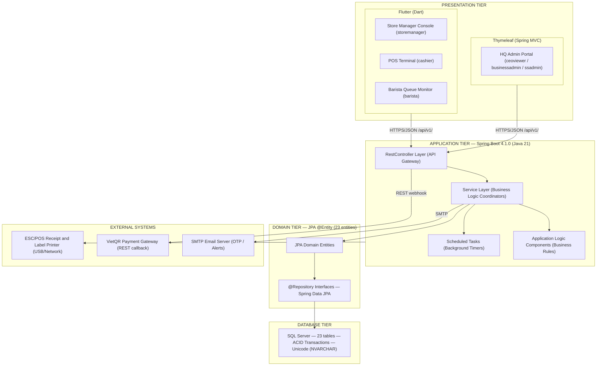
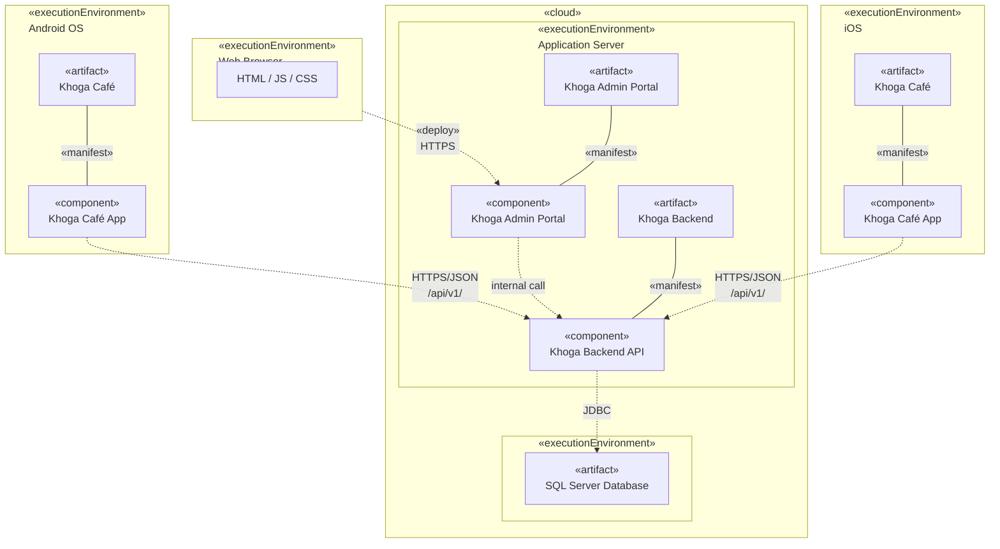

## **1\. System Design**

### **1.1 System Architecture**

*\[The content of this section includes the overall diagram which includes the sub-systems, the external systems, and the relationship/connection among them. The explanation for each of the diagram components (modules, sub-systems, external systems, etc.) is provided in the component descriptions table below. The system adopts a 4-Tier MVC architecture combined with COMET EBC (Entity–Boundary–Control) design method.\]*

***Diagram Component Descriptions***

| No | Component | COMET Type | Description |
| :---: | ----- | ----- | ----- |
| 01 | Thymeleaf Web Frontend | «boundary» (UI) | Server-side rendered web frontend using Spring Boot Thymeleaf templates for HQ Admin Portal. Serves 3 HQ roles: CEO / Executive Viewer (ceoviewer — read-only reports), Business Admin (businessadmin — catalog, voucher, CRM), and System Admin (ssadmin — user management, branch lifecycle, system config). Role-based menu rendering. |
| 02 | Flutter (Dart) Mobile/Tablet App | «boundary» (UI) | Cross-platform mobile/tablet frontend for in-store operations. Serves 3 roles via role-based routing: Store Manager Console (storemanager — inventory, scheduling, store reports), POS Terminal (cashier — checkout, payment), and Barista Queue Monitor (barista — drink queue, label printing). Always-online; communicates with backend via REST API over HTTPS/JSON. |
| 03 | @RestController Layer | «boundary» (API Gateway) | Spring Boot REST controllers. Receive HTTP requests, validate inputs using Bean Validation, apply JWT authentication, and delegate to @Service layer. All endpoints prefixed `/api/v1/`. |
| 04 | @Service Layer | «control» (Coordinator) | Business logic orchestration. Each service coordinates domain entities, calls application logic components, and manages transactions via @Transactional. |
| 05 | Application Logic Components | «application logic» | Stateless business rule engines: DiscountStackingEngine (BR-70), RecipeDeductionEngine (BR-89), LoyaltyPointCalculator, COGSCalculator, AnomalyDetector, AttendancePhotoManager (PDPA). |
| 06 | @Scheduled Tasks | «timer» | Spring @Scheduled background timers: OrderTimeoutTimer (15 min), ShiftAutoCloseTimer (23:59 cron), LowStockAlertTimer (22:00 cron), PhotoAutoDeleteTimer (02:00 cron — PDPA 90-day purge BR-72), OtpExpiryTimer (10 min). |
| 07 | @Entity / @Repository (Domain Tier) | «entity» | 23 JPA domain entities mapped to SQL Server tables via Spring Data JPA repositories. All PK are UUID VARCHAR(36). |
| 08 | SQL Server | Database | Relational database with ACID transactions, Unicode support (NVARCHAR). 23 tables. |
| 09 | VietQR Payment Gateway | External System | Vietnamese QR payment provider. Integrated via REST webhook callback with idempotency key (orderId) to prevent duplicate charges (BR-84/BR-85). |
| 10 | SMTP Email Server | External System | Email delivery service for: OTP delivery (BR-16), low stock daily alerts (22:00), and welcome email for new staff accounts. |
| 11 | ESC/POS Printer | External System | Receipt and cup label printers connected via USB/Network to POS Terminal (Flutter) and Barista tablets. Triggered by PrinterServiceProxy after order completion. |

***COMET EBC Stereotype → Spring Boot MVC Mapping***

| COMET Stereotype | Spring Boot Implementation | Examples |
| ----- | ----- | ----- |
| «boundary» (UI Screen) | View: Thymeleaf templates (.html), Flutter Widgets | LoginForm, PosCheckoutGrid, BaristaQueueMonitor |
| «boundary» (API Endpoint) | Controller: @RestController | AuthController, OrderController, PosController |
| «boundary» (External Proxy) | Adapter: RestTemplate / WebClient | VietQRClient, EmailService, PrinterService |
| «control» (Coordinator) | Service: @Service (business orchestration) | AuthService, CheckoutService, OrderQueueService |
| «application logic» (Engine) | Component: @Component (pure business rules) | DiscountStackingEngine, RecipeDeductionEngine |
| «entity» (Domain Object) | Model: @Entity + @Repository | User, Order, MenuItem, StockItem, AuditLog |
| «timer» (Scheduled Task) | Scheduler: @Scheduled / @Async | OrderTimeoutScheduler, ShiftAutoCloseScheduler |

---

### **1.3 Deployment Diagram**

*\[The Deployment Diagram shows the physical deployment topology of the system — the execution environments (devices/servers), the software artifacts deployed on each, and the communication paths between them. The diagram follows UML deployment diagram notation with stereotypes: «executionEnvironment», «artifact», «component», «manifest», «deploy», and «cloud».\]*

***Deployment Diagram Component Descriptions***

| No | Execution Environment | Deployed Artifact | Component | Description |
| :---: | ----- | ----- | ----- | ----- |
| 01 | Android OS | Khoga Café | Khoga Café App | Flutter cross-platform mobile application deployed on Android devices (phone/tablet). Serves 3 in-store roles via role-based routing: Store Manager (inventory, scheduling, store reports), Cashier (POS checkout, payment), and Barista (drink queue, label printing). |
| 02 | iOS | Khoga Café | Khoga Café App | Same Flutter application compiled for iOS. Identical feature set to Android build. |
| 03 | Web Browser | — | HTML / JS / CSS | Client-side browser rendering Thymeleaf server-side pages delivered by the Application Server. Used by HQ roles (CEO Viewer, Business Admin, System Admin). |
| 04 | Application Server (Cloud) | Khoga Admin Portal | Khoga Admin Portal | Spring Boot application serving Thymeleaf-rendered HTML pages for the HQ Admin Portal. Handles role-based menu rendering for 3 HQ roles: ceoviewer (read-only reports), businessadmin (catalog/voucher/CRM), ssadmin (user/branch/config management). |
| 05 | Application Server (Cloud) | Khoga Backend | Khoga Backend API | Spring Boot 4.1.0 (Java 21) REST API backend. Exposes all `/api/v1/` endpoints consumed by both the Flutter mobile app and the Thymeleaf web frontend. Handles JWT authentication, business logic, and transaction management. |
| 06 | Database Server (Cloud) | SQL Server Database | — | Microsoft SQL Server relational database. 23 tables with ACID transactions, Unicode support (NVARCHAR). All primary keys are UUID VARCHAR(36). |
