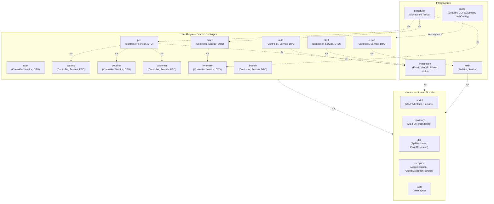
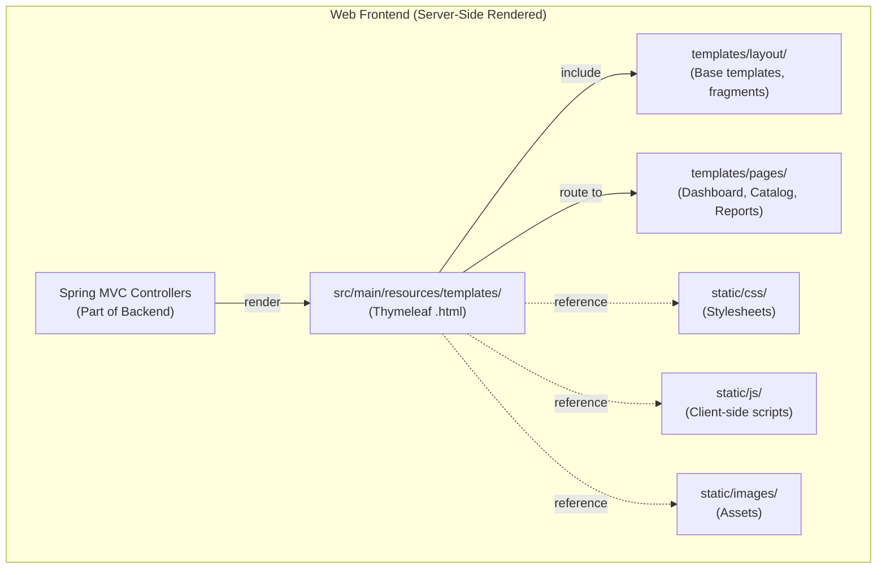
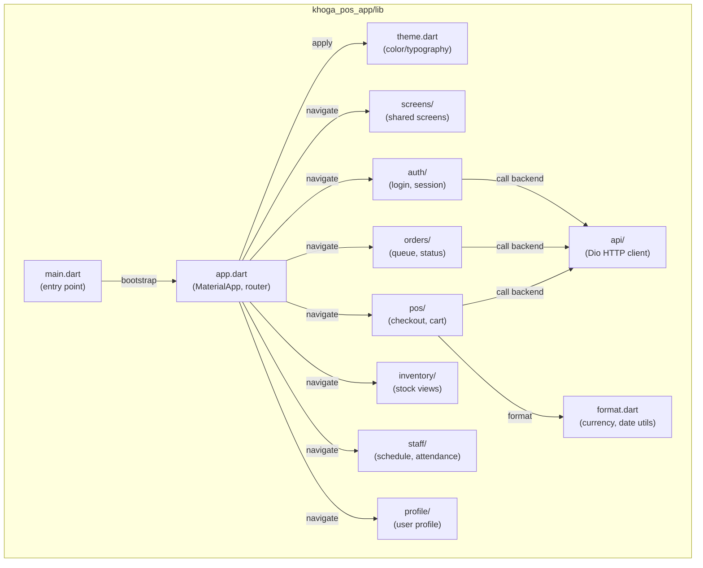

### **1.2 Package Diagram**

#### **1.2.1 Package Diagram - Backend (Spring Boot)**

*\[Backend is organized as a **feature-based modular monolith** — NOT a standard layered architecture. Each feature package contains its own Controller + Service + DTO; Entities and Repositories are grouped together in `common`.]*

*Figure 1.2.1 Package Diagram - Backend*

##### **Backend Package Descriptions**

| No | Package | Actual Content | Description |
|:---:|---|---|---|
| 01 | `com.khoga.auth` | `AuthController`, `AuthService`, `ProfileController`, `ProfileService`, `JwtTokenProvider`, `JwtAuthenticationFilter`, `OtpStore`, `StrongPasswordValidator`, `SecurityUtil`, `dto/` | JWT Auth, Email OTP MFA, password recovery/change, profile. UC-01→UC-09. |
| 02 | `com.khoga.user` | `UserController`, `UserService`, `UsernameGenerator`, `TemporaryPasswordGenerator`, `UserMapper`, `dto/` | Staff account management (CRUD, deactivate, audit). UC-10→UC-14. |
| 03 | `com.khoga.catalog` | `CategoryController/Service`, `MenuItemController/Service`, `RawMaterialController/Service`, `RecipeService`, `AbbreviationGenerator`, `CatalogMapper`, `dto/` | Menu, category, topping, raw material, and recipe management. UC-15→UC-19, UC-68→UC-74. |
| 04 | `com.khoga.voucher` | `VoucherController`, `VoucherService`, `VoucherValidationService`, `VoucherStatusEngine`, `VoucherMapper`, `dto/` | Voucher CRUD, 3-state status engine, checkout validation. UC-20→UC-23. |
| 05 | `com.khoga.customer` | `CustomerController`, `CustomerService`, `LoyaltyPointCalculator`, `LoyaltyExpiryService`, `CustomerRetentionService`, `CustomerMapper`, `dto/` | Customer CRM, loyalty point accumulation/redemption, PDPA retention. UC-24→UC-27. |
| 06 | `com.khoga.inventory` | `StockController`, `StockService`, `RecipeDeductionEngine`, `CogsCalculator`, `InventoryMapper`, `dto/` | Stock import/export/audit, recipe-based deduction, COGS calculation. UC-31→UC-34, UC-61, UC-62. |
| 07 | `com.khoga.pos` | `CheckoutController`, `CheckoutService`, `ShiftController`, `ShiftService`, `PaymentController`, `DiscountStackingEngine`, `dto/` | Open/close shift, checkout pipeline (BR-70), payment processing, reconciliation. UC-44→UC-53. |
| 08 | `com.khoga.order` | `OrderController`, `OrderService`, `OrderMapper`, `dto/` | Order lifecycle, barista queue, cancel/refund/comp. UC-54→UC-60, UC-73, UC-75. |
| 09 | `com.khoga.staff` | `ScheduleController`, `ScheduleService`, `AttendanceController`, `AttendanceService`, `AttendanceMetricsCalculator`, `StaffMapper`, `dto/` | Shift scheduling, PIN+photo attendance check-in, worked-hours export. UC-35→UC-39, UC-66, UC-67, UC-80. |
| 10 | `com.khoga.report` | `ReportController`, `RevenueReportService`, `CogsReportService`, `ZReportService`, `AnomalyDetector`, `LoyaltyLiabilityService`, `LabourEfficiencyService`, `ChangeHistoryService`, `ReportScopeResolver`, `ReportCsvWriter`, `ReportXlsxWriter`, `ReportPdfWriter`, `dto/` | All reports & BI, CSV/Excel/PDF export. UC-28→UC-29, UC-40→UC-41, UC-76→UC-83. |
| 11 | `com.khoga.branch` | `BranchController`, `BranchService`, `BranchMapper`, `dto/` | Add/update/deactivate branch, MAX_ACTIVE_BRANCHES cap. UC-63→UC-65. |
| 12 | `com.khoga.config` | `SecurityConfig`, `WebConfig`, `JpaConfig`, `OpenApiConfig`, `SchedulingConfig`, `DataSeeder`, `SystemConfigController`, `SystemConfigService`, `dto/` | Security, CORS config, data seeder, SystemConfig management. UC-30, UC-42. |
| 13 | `com.khoga.audit` | `AuditLogService` | Append-only audit logging for prices, vouchers, accounts, and checkouts. BR-68/80/81. |
| 14 | `com.khoga.integration` | `EmailService` + `EmailServiceStub`, `VietQrClient` + `VietQrClientStub`, `PrinterService` + `PrinterServiceStub`, `VietQrPayment` | Interfaces + stubs for external systems (SMTP, VietQR, receipt printer). |
| 15 | `com.khoga.scheduler` | `OrderTimeoutScheduler`, `ShiftAutoCloseScheduler`, `LowStockAlertScheduler`, `OtpExpiryScheduler`, `PhotoAutoDeleteScheduler`, `PdpaScheduler` | 6 background scheduled tasks (cron/fixed-rate). |
| 16 | `com.khoga.common` | `model/` (23 Entity + `BaseEntity` + `enums/`), `repository/` (23 Repository), `dto/` (`ApiResponse`, `PageResponse`), `exception/` (`AppException`, `ResourceNotFoundException`, `GlobalExceptionHandler`), `i18n/` (`Messages`) | Shared layer: all Entities, Repositories, common DTOs, exceptions, i18n. |

---

#### **1.2.2 Package Diagram - Web Admin (Thymeleaf / Spring MVC)**

*Figure 1.2.2 Package Diagram - Web Admin (Thymeleaf)*

##### **Web Admin Package Descriptions**

| No | Package / Folder | Description |
|:---:|---|---|
| 01 | `Controllers` | Spring MVC Controllers handle routing, prepare Model data, and return view names. |
| 02 | `templates/` | Root directory for Thymeleaf `.html` view files. |
| 03 | `templates/layout/` | Contains base layouts (e.g., `admin_layout.html`), sidebar, and navbar fragments. |
| 04 | `templates/pages/` | Business operation pages (e.g., Dashboard, Branch Management, Catalog, Staff, Reports). |
| 05 | `static/css/` | Custom CSS files and frontend framework stylesheets (e.g., Bootstrap/Tailwind if used). |
| 06 | `static/js/` | Client-side JavaScript for interactivity, form validation, and AJAX calls. |
| 07 | `static/images/` | Static image assets like logos and icons. |

---

#### **1.2.3 Package Diagram - Mobile POS (Flutter / Dart)**

*Figure 1.2.3 Package Diagram - Mobile POS*

##### **Mobile Package Descriptions**

| No | Package | Description |
|:---:|---|---|
| 01 | `main.dart` | Flutter entry point, initializes the app and runs `App`. |
| 02 | `app.dart` | `MaterialApp` configuration, router setup, and theme application. |
| 03 | `theme.dart` | Defines color palette, typography, and global app styles. |
| 04 | `screens/` | Shared screens used across modules (e.g., splash screen, home). |
| 05 | `auth/` | Login screen and token session management. |
| 06 | `pos/` | POS Module: cart management, checkout, and payment processing. |
| 07 | `orders/` | Order Module: barista queue and status updates. |
| 08 | `inventory/` | Module for viewing branch stock levels. |
| 09 | `staff/` | Staff Module: scheduling and attendance check-in. |
| 10 | `profile/` | View and edit personal user profile. |
| 11 | `api/` | Dio HTTP client configuration and REST API calls to the backend. |
| 12 | `format.dart` | Utility functions for currency and date formatting. |
