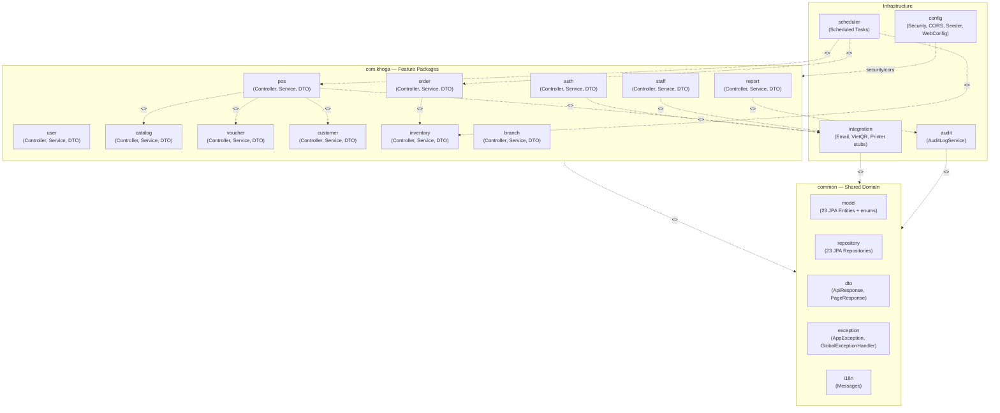
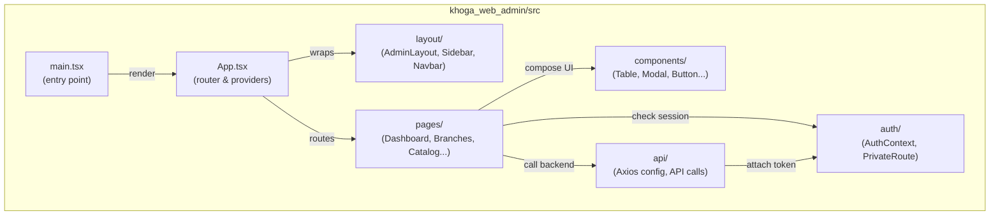
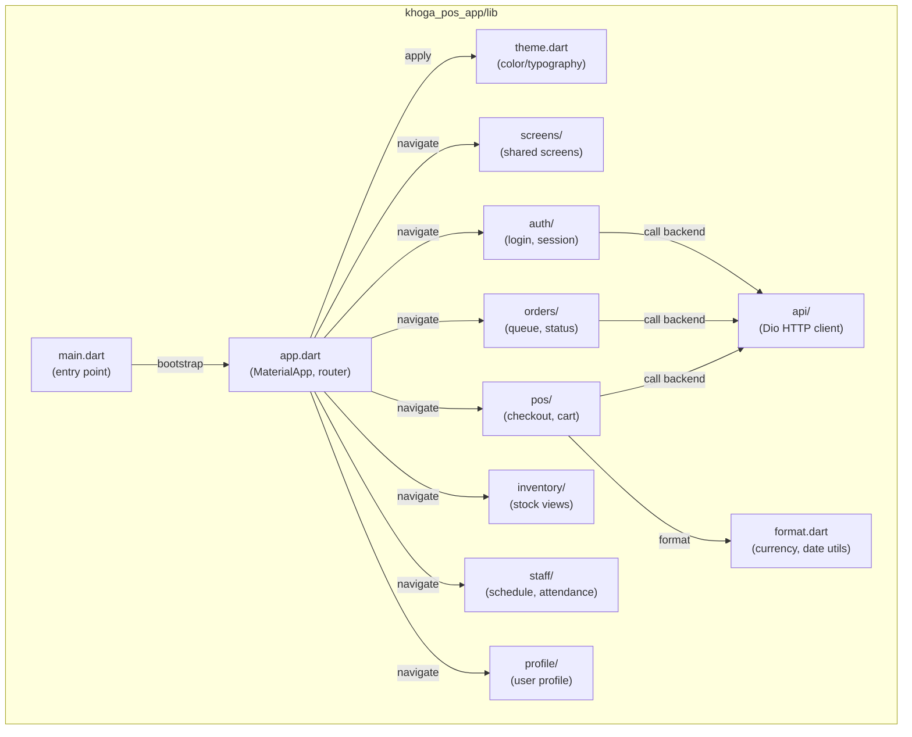

### **1.2 Package Diagram**

#### **1.2.1 Package Diagram - Backend (Spring Boot)**

*\[Backend tổ chức theo **feature-based modular monolith** — KHÔNG phải kiến trúc phân lớp (layered) chuẩn. Mỗi feature package chứa Controller + Service + DTO của riêng mình; Entity và Repository gom chung trong `common`.]*

*Figure 1.2.1 Package Diagram - Backend*

##### **Backend Package Descriptions**

| No | Package | Nội dung thực tế | Mô tả |
|:---:|---|---|---|
| 01 | `com.khoga.auth` | `AuthController`, `AuthService`, `ProfileController`, `ProfileService`, `JwtTokenProvider`, `JwtAuthenticationFilter`, `OtpStore`, `StrongPasswordValidator`, `SecurityUtil`, `dto/` | Xác thực JWT, MFA Email OTP, quên/đổi mật khẩu, profile. UC-01→UC-09. |
| 02 | `com.khoga.user` | `UserController`, `UserService`, `UsernameGenerator`, `TemporaryPasswordGenerator`, `UserMapper`, `dto/` | Quản lý tài khoản nhân viên (CRUD, vô hiệu hóa, audit). UC-10→UC-14. |
| 03 | `com.khoga.catalog` | `CategoryController/Service`, `MenuItemController/Service`, `RawMaterialController/Service`, `RecipeService`, `AbbreviationGenerator`, `CatalogMapper`, `dto/` | Quản lý menu, danh mục, topping, nguyên liệu, công thức. UC-15→UC-19, UC-68→UC-74. |
| 04 | `com.khoga.voucher` | `VoucherController`, `VoucherService`, `VoucherValidationService`, `VoucherStatusEngine`, `VoucherMapper`, `dto/` | CRUD voucher, engine trạng thái 3-state, validate khi checkout. UC-20→UC-23. |
| 05 | `com.khoga.customer` | `CustomerController`, `CustomerService`, `LoyaltyPointCalculator`, `LoyaltyExpiryService`, `CustomerRetentionService`, `CustomerMapper`, `dto/` | CRM khách hàng, tích/đổi điểm, PDPA retention. UC-24→UC-27. |
| 06 | `com.khoga.inventory` | `StockController`, `StockService`, `RecipeDeductionEngine`, `CogsCalculator`, `InventoryMapper`, `dto/` | Nhập/xuất/kiểm kê kho, trừ kho theo recipe, tính COGS. UC-31→UC-34, UC-61, UC-62. |
| 07 | `com.khoga.pos` | `CheckoutController`, `CheckoutService`, `ShiftController`, `ShiftService`, `PaymentController`, `DiscountStackingEngine`, `dto/` | Mở/đóng ca, checkout pipeline (BR-70), thanh toán, đối soát. UC-44→UC-53. |
| 08 | `com.khoga.order` | `OrderController`, `OrderService`, `OrderMapper`, `dto/` | Vòng đời đơn hàng, hàng đợi barista, hủy/refund/comp. UC-54→UC-60, UC-73, UC-75. |
| 09 | `com.khoga.staff` | `ScheduleController`, `ScheduleService`, `AttendanceController`, `AttendanceService`, `AttendanceMetricsCalculator`, `StaffMapper`, `dto/` | Xếp lịch, chấm công PIN+ảnh, xuất giờ công. UC-35→UC-39, UC-66, UC-67, UC-80. |
| 10 | `com.khoga.report` | `ReportController`, `RevenueReportService`, `CogsReportService`, `ZReportService`, `AnomalyDetector`, `LoyaltyLiabilityService`, `LabourEfficiencyService`, `ChangeHistoryService`, `ReportScopeResolver`, `ReportCsvWriter`, `ReportXlsxWriter`, `ReportPdfWriter`, `dto/` | Tất cả báo cáo & BI, xuất CSV/Excel/PDF. UC-28→UC-29, UC-40→UC-41, UC-76→UC-83. |
| 11 | `com.khoga.branch` | `BranchController`, `BranchService`, `BranchMapper`, `dto/` | Thêm/sửa/vô hiệu hóa chi nhánh, cap MAX_ACTIVE_BRANCHES. UC-63→UC-65. |
| 12 | `com.khoga.config` | `SecurityConfig`, `WebConfig`, `JpaConfig`, `OpenApiConfig`, `SchedulingConfig`, `DataSeeder`, `SystemConfigController`, `SystemConfigService`, `dto/` | Cấu hình security, CORS, seed dữ liệu, quản lý SystemConfig. UC-30, UC-42. |
| 13 | `com.khoga.audit` | `AuditLogService` | Ghi audit bất biến (append-only) cho giá, voucher, tài khoản, checkout. BR-68/80/81. |
| 14 | `com.khoga.integration` | `EmailService` + `EmailServiceStub`, `VietQrClient` + `VietQrClientStub`, `PrinterService` + `PrinterServiceStub`, `VietQrPayment` | Interface + stub cho hệ thống ngoài (SMTP, VietQR, máy in). |
| 15 | `com.khoga.scheduler` | `OrderTimeoutScheduler`, `ShiftAutoCloseScheduler`, `LowStockAlertScheduler`, `OtpExpiryScheduler`, `PhotoAutoDeleteScheduler`, `PdpaScheduler` | 6 scheduled tasks chạy nền (cron/fixed-rate). |
| 16 | `com.khoga.common` | `model/` (23 Entity + `BaseEntity` + `enums/`), `repository/` (23 Repository), `dto/` (`ApiResponse`, `PageResponse`), `exception/` (`AppException`, `ResourceNotFoundException`, `GlobalExceptionHandler`), `i18n/` (`Messages`) | Tầng chia sẻ: tất cả Entity, Repository, DTO chung, exception, i18n. |

---

#### **1.2.2 Package Diagram - Web Admin (React / Vite / TypeScript)**

*Figure 1.2.2 Package Diagram - Web Admin*

##### **Web Admin Package Descriptions**

| No | Package | Mô tả |
|:---:|---|---|
| 01 | `main.tsx` | Entry point React, gắn DOM ảo vào `index.html`, khởi tạo app. |
| 02 | `App.tsx` | Cấu hình React Router, bọc Context Providers (Auth, Theme), định nghĩa route. |
| 03 | `layout/` | Khung giao diện chính: sidebar menu, navbar, admin layout bao quanh các trang. |
| 04 | `pages/` | Các trang nghiệp vụ: Dashboard, Branch Management, Catalog, Staff, Reports... |
| 05 | `components/` | Component UI tái sử dụng: bảng dữ liệu, modal, form input, button... |
| 06 | `api/` | Cấu hình Axios (base URL, interceptor), các hàm gọi REST API đến backend. |
| 07 | `auth/` | Quản lý trạng thái đăng nhập, lưu token, bảo vệ route (PrivateRoute). |

---

#### **1.2.3 Package Diagram - Mobile POS (Flutter / Dart)**

*Figure 1.2.3 Package Diagram - Mobile POS*

##### **Mobile Package Descriptions**

| No | Package | Mô tả |
|:---:|---|---|
| 01 | `main.dart` | Entry point Flutter, khởi tạo ứng dụng và chạy `App`. |
| 02 | `app.dart` | Cấu hình `MaterialApp`, router điều hướng, gắn theme. |
| 03 | `theme.dart` | Định nghĩa color palette, typography, style chung cho toàn app. |
| 04 | `screens/` | Màn hình dùng chung giữa các module (splash, home...). |
| 05 | `auth/` | Màn hình đăng nhập, quản lý phiên token. |
| 06 | `pos/` | Module POS: giỏ hàng, checkout, thanh toán. |
| 07 | `orders/` | Module đơn hàng: hàng đợi barista, cập nhật trạng thái. |
| 08 | `inventory/` | Module xem tồn kho chi nhánh. |
| 09 | `staff/` | Module lịch làm việc, chấm công. |
| 10 | `profile/` | Xem/sửa hồ sơ cá nhân. |
| 11 | `api/` | Cấu hình Dio HTTP client, các hàm gọi REST API đến backend. |
| 12 | `format.dart` | Hàm tiện ích format tiền tệ, ngày giờ. |
