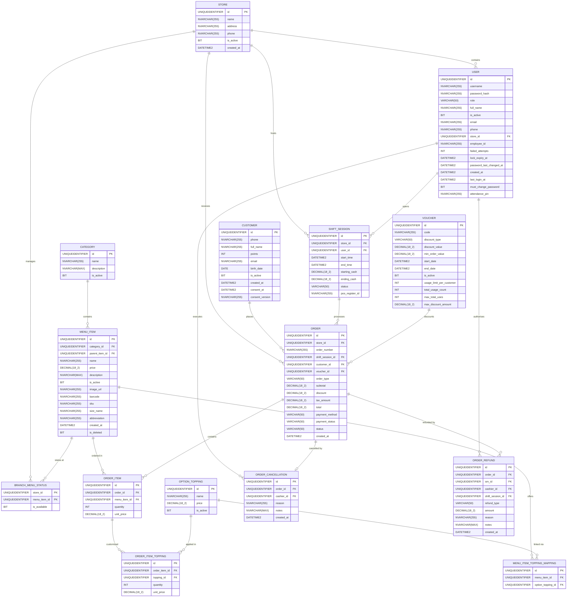
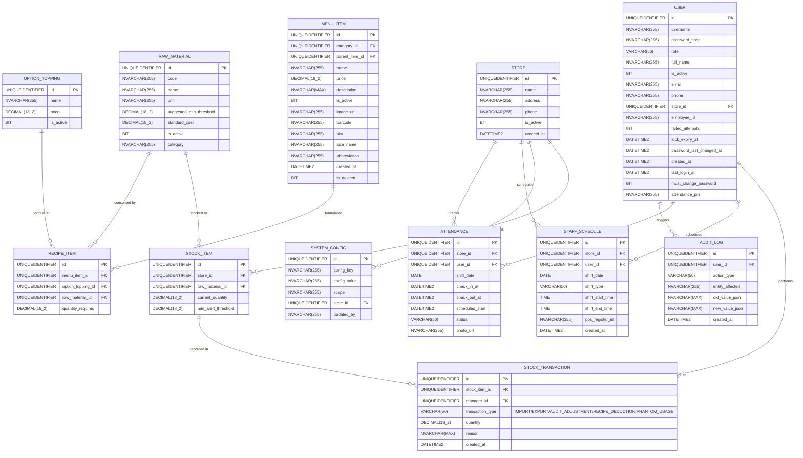

## **2\. Database Design**

*\[The database design follows the entity relationships defined in the SRS (§3.1.5 / §3.1.6). The system uses `SQL Server` with ACID transactions and Unicode support (`NVARCHAR`). All primary keys use `UUID` (`VARCHAR(36)`). The diagrams below show the entity relationships with full column definitions, followed by the table descriptions. Every table also carries an `updated_at` column from the shared `BaseEntity` (JPA auditing), omitted from the diagrams for brevity. The live schema is entity-driven (`ddl-auto=update`) — there are **23 tables**; generated names are concatenated-lowercase (e.g. `categorys`, `menuitems`) pending naming normalization under Flyway (P4).\]*

### **2.1. Core Sales & POS ERD**

*\[This diagram focuses on sales flows at the POS terminal, Menu information, Customers, Shift sessions, and Promotions.\]*

### **2.2. Operations, Staffing & Audit ERD**

*\[This diagram focuses on inventory management, recipe formulation for items/toppings, staff schedules, attendance tracking, and system audit logs.\]*

### **2.3. Table Descriptions**

*\[The table below summarizes the purpose, primary keys, and foreign keys for each of the 23 tables in the database. Every table also inherits an `updated_at DATETIME2` column from `BaseEntity` (JPA auditing).\]*

| No | Table | Description |
|:---:|---|---|
| 01 | **stores** | Physical coffee shop branch locations. - **id**: Primary key (UUID). - **name**: Name of the branch. - **address**: Physical address of the branch. - **phone**: Contact phone number. - **is_active**: Active status flag. - **created_at**: Record creation timestamp. |
| 02 | **users** | Employee accounts with login credentials, RBAC roles, and attendance PIN for check-in/out. - **id**: Primary key (UUID). - **username**: Login username. - **password_hash**: Hashed password. - **role**: User role (e.g., Cashier, Manager). - **full_name**: Full name of the user. - **is_active**: Active status flag. - **email**: Email address. - **phone**: Phone number. - **store_id**: FK to stores. - **employee_id**: Internal employee ID. - **failed_attempts**: Failed login attempts. - **lock_expiry_at**: Account lockout expiry. - **password_last_changed_at**: Last password change time. - **created_at**: Creation timestamp. - **last_login_at**: Last login timestamp. - **must_change_password**: Flag to force password change. - **attendance_pin**: PIN for check-in/out. |
| 03 | **categories** | Main food and beverage product groupings (e.g., Coffee, Tea, Pastry). - **id**: Primary key (UUID). - **name**: Category name. - **description**: Category description. - **is_active**: Active status flag. |
| 04 | **menu_items** | Individual beverage/food catalog entries with pricing, barcodes, and chain-wide status. - **id**: Primary key (UUID). - **category_id**: FK to categories. - **parent_item_id**: FK to parent menu_items. - **name**: Item name. - **price**: Base price. - **description**: Item description. - **is_active**: Active status flag. - **image_url**: Image URL. - **barcode**: Item barcode. - **sku**: Stock Keeping Unit. - **size_name**: Size option (e.g., M, L). - **abbreviation**: Short name. - **created_at**: Creation timestamp. - **is_deleted**: Soft delete flag. |
| 05 | **branch_menu_status** | Per-branch item availability toggle. - **store_id**: PK/FK to stores. - **menu_item_id**: PK/FK to menu_items. - **is_available**: Availability flag at this branch. |
| 06 | **option_toppings** | Global add-ons (e.g., Extra Shot, Oat Milk) shared across menu items. - **id**: Primary key (UUID). - **name**: Topping name. - **price**: Additional price. - **is_active**: Active status flag. |
| 07 | **menu_item_topping_mappings** | Join table linking global option_toppings to menu_items. - **id**: Primary key (UUID). - **menu_item_id**: FK to menu_items. - **option_topping_id**: FK to option_toppings. |
| 08 | **customers** | Loyalty membership registry tracking points balance and PDPA consent. - **id**: Primary key (UUID). - **phone**: Customer phone number. - **full_name**: Customer full name. - **points**: Loyalty points balance. - **email**: Customer email. - **birth_date**: Customer date of birth. - **is_active**: Active status flag. - **created_at**: Creation timestamp. - **consent_at**: PDPA consent timestamp. - **consent_version**: PDPA consent version. |
| 09 | **shift_sessions** | POS cashier work session records. - **id**: Primary key (UUID). - **store_id**: FK to stores. - **user_id**: FK to users (cashier). - **start_time**: Shift start timestamp. - **end_time**: Shift end timestamp. - **starting_cash**: Cash in drawer at start. - **ending_cash**: Cash in drawer at end. - **status**: Shift status. - **pos_register_id**: POS terminal identifier. |
| 10 | **orders** | Sales transaction records following a strict 7-state machine. - **id**: Primary key (UUID). - **store_id**: FK to stores. - **order_number**: Unique order reference. - **shift_session_id**: FK to shift_sessions. - **customer_id**: FK to customers. - **voucher_id**: FK to vouchers. - **order_type**: Dine-in, Takeaway, etc. - **subtotal**: Order subtotal. - **discount**: Total discount applied. - **tax_amount**: Total tax applied. - **total**: Final order total. - **payment_method**: Cash, Card, etc. - **payment_status**: Pending, Paid, etc. - **status**: Order status (state machine). - **created_at**: Creation timestamp. |
| 11 | **order_items** | Line items within each order with snapshot pricing. - **id**: Primary key (UUID). - **order_id**: FK to orders. - **menu_item_id**: FK to menu_items. - **quantity**: Quantity ordered. - **unit_price**: Snapshot price per unit. |
| 12 | **order_item_toppings** | Toppings applied to specific order line items with snapshot pricing. - **id**: Primary key (UUID). - **order_item_id**: FK to order_items. - **topping_id**: FK to option_toppings. - **quantity**: Quantity applied. - **unit_price**: Snapshot price per topping. |
| 13 | **order_cancellations** | Immutable audit log for PENDING-state order cancellations. - **id**: Primary key (UUID). - **order_id**: FK to orders. - **cashier_id**: FK to users (cashier). - **reason**: Reason for cancellation. - **notes**: Additional notes. - **created_at**: Cancellation timestamp. |
| 14 | **order_refunds** | Store-Manager authorized refund/comp audit log for post-PENDING complaints. - **id**: Primary key (UUID). - **order_id**: FK to orders. - **sm_id**: FK to users (store manager). - **cashier_id**: FK to users (cashier). - **shift_session_id**: FK to shift_sessions. - **refund_type**: Type of refund. - **amount**: Refund amount. - **reason**: Reason for refund. - **notes**: Additional notes. - **created_at**: Refund timestamp. |
| 15 | **vouchers** | Promotional discount codes with usage limits. - **id**: Primary key (UUID). - **code**: Voucher code. - **discount_type**: Percentage or Fixed. - **discount_value**: Discount amount/percent. - **min_order_value**: Minimum required subtotal. - **start_date**: Validity start. - **end_date**: Validity end. - **is_active**: Active status flag. - **usage_limit_per_customer**: Max uses per user. - **total_usage_count**: Current usage count. - **max_total_uses**: Global max uses limit. - **max_discount_amount**: Maximum discount cap. |
| 16 | **raw_materials** | Chain-wide master catalog of ingredients/materials. - **id**: Primary key (UUID). - **code**: Material code. - **name**: Material name. - **unit**: Unit of measurement. - **suggested_min_threshold**: Suggested minimum stock. - **standard_cost**: Standard cost. - **is_active**: Active status flag. - **category**: Material category. |
| 17 | **stock_items** | Per-branch on-hand quantity of a master raw material. - **id**: Primary key (UUID). - **store_id**: FK to stores. - **raw_material_id**: FK to raw_materials. - **current_quantity**: Current stock level. - **min_alert_threshold**: Minimum alert threshold. |
| 18 | **stock_transactions** | Immutable historical ledger (append-only) of all stock movements. - **id**: Primary key (UUID). - **stock_item_id**: FK to stock_items. - **manager_id**: FK to users (manager). - **transaction_type**: IMPORT/EXPORT/etc. - **quantity**: Transaction quantity. - **reason**: Reason for transaction. - **created_at**: Transaction timestamp. |
| 19 | **recipe_items** | Ingredient formula defining raw material consumption for items/toppings. - **id**: Primary key (UUID). - **menu_item_id**: FK to menu_items. - **option_topping_id**: FK to option_toppings. - **raw_material_id**: FK to raw_materials. - **quantity_required**: Required quantity per unit. |
| 20 | **staff_schedules** | Assigned employee shift blocks per date and branch. - **id**: Primary key (UUID). - **store_id**: FK to stores. - **user_id**: FK to users (employee). - **shift_date**: Scheduled date. - **shift_type**: Type of shift. - **shift_start_time**: Scheduled start time. - **shift_end_time**: Scheduled end time. - **pos_register_id**: Assigned POS terminal. - **created_at**: Creation timestamp. |
| 21 | **attendance_logs** | Employee clock-in/out records with snapshot scheduling. - **id**: Primary key (UUID). - **store_id**: FK to stores. - **user_id**: FK to users (employee). - **shift_date**: Associated shift date. - **check_in_at**: Clock-in timestamp. - **check_out_at**: Clock-out timestamp. - **scheduled_start**: Snapshot of scheduled start. - **status**: Attendance status. - **photo_url**: Snapshot photo URL. |
| 22 | **audit_logs** | Immutable security event log for configuration and access changes. - **id**: Primary key (UUID). - **user_id**: FK to users. - **action_type**: Type of action. - **entity_affected**: Affected entity name. - **old_value_json**: Previous state. - **new_value_json**: New state. - **created_at**: Event timestamp. |
| 23 | **system_configs** | Central and per-branch runtime configuration. - **id**: Primary key (UUID). - **config_key**: Configuration key. - **config_value**: Configuration value. - **scope**: Scope of config (Global/Branch). - **store_id**: FK to stores. - **updated_by**: User who last updated. |
