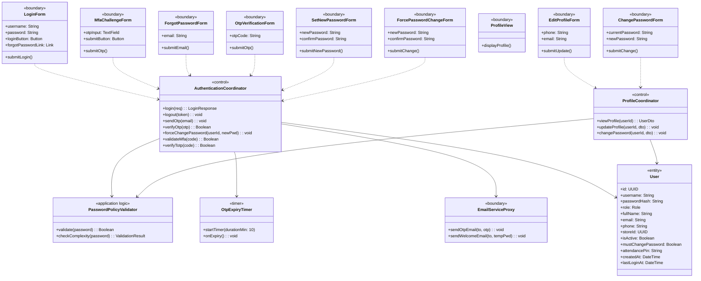
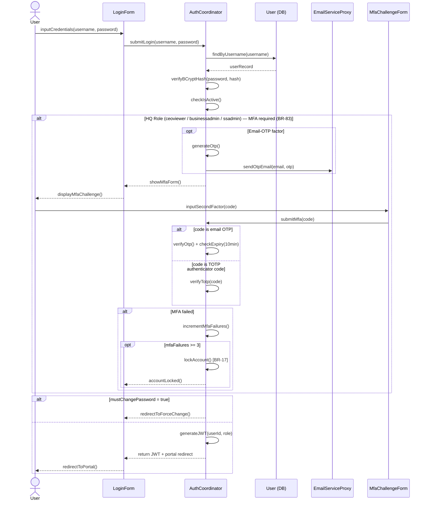
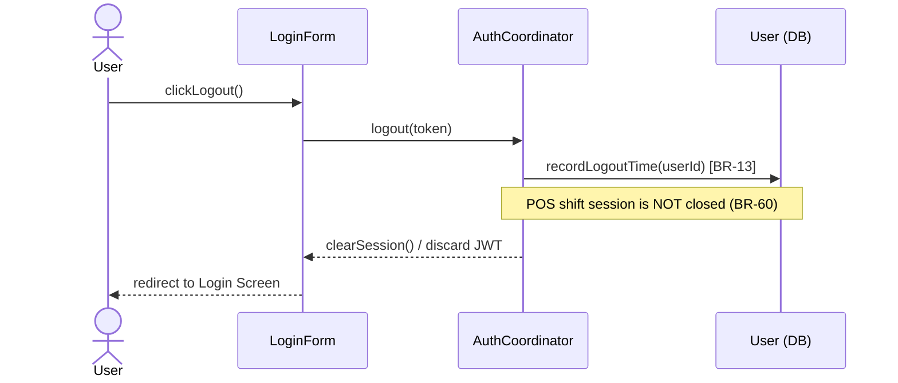
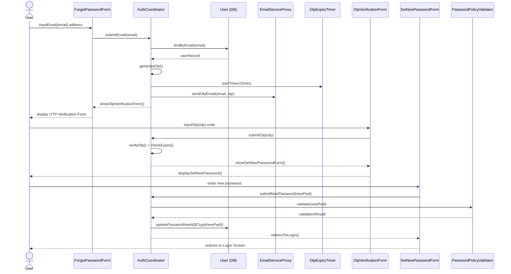
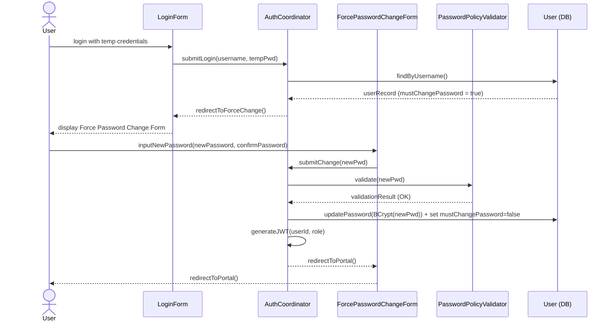
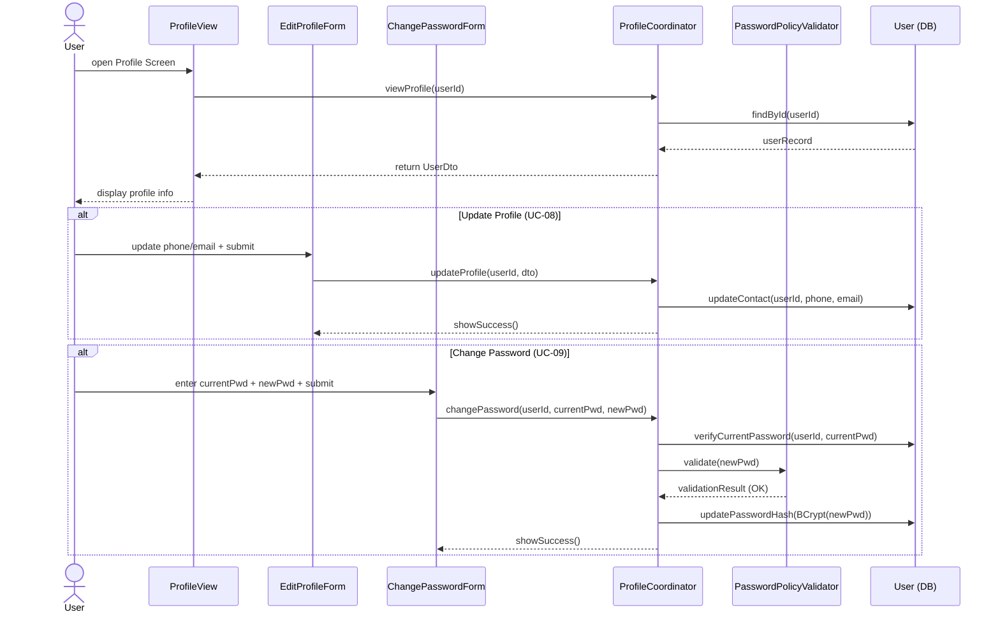
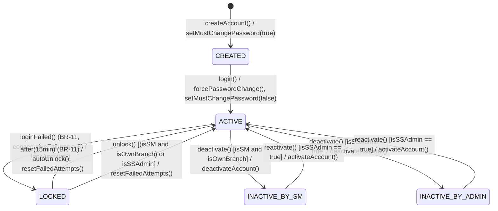

## **3\. Detailed Design**

### **3.1 System Access & Security**

*\[Provide the detailed design for System Access & Security, covering UC-01→UC-09 (Authentication, MFA, Forgot Password, Force Password Change, Profile Management). Actor: User (all 6 roles). For features with the same class structure, the class diagram is provided once and referenced from related features. The class diagram below covers UC-01→UC-09 collectively; each sequence diagram covers one specific use case flow.\]*

#### ***3.1.1 Class Diagram***

*\[This part presents the class diagram for the System Access & Security feature. COMET stereotypes applied: LoginForm, MfaChallengeForm, ForgotPasswordForm, OtpVerificationForm, SetNewPasswordForm, ForcePasswordChangeForm, ProfileView, EditProfileForm, ChangePasswordForm («boundary»), EmailServiceProxy («boundary» external); AuthenticationCoordinator, ProfileCoordinator («control»); PasswordPolicyValidator («application logic»); OtpExpiryTimer («timer»); User («entity»).\]*

#### ***3.1.2 UC-01 Login (including MFA for HQ Roles)***

*\[Describes the login flow. HQ roles (ceoviewer, businessadmin, ssadmin) require MFA after password verification (BR-83). The second factor may be either an **email OTP** or a **TOTP authenticator code** — the user supplies whichever applies, and the coordinator verifies it via the corresponding path (verifyOtp / verifyTotp). **3 consecutive failed MFA attempts trigger a BR-17 lockout** (the account is locked the same way as repeated password failures). TOTP enrollment/verification implementation may be deferred, but the design must show both factors. Branch roles (storemanager, cashier, barista) login with username/password only. After successful login, if must_change_password = true, user is redirected to Force Password Change screen (UC-06).\]*

#### ***3.1.3 UC-02 Logout***

*\[The user ends their authenticated session. Logout is stateless (the client discards the JWT), but the system records the logout time on the user record / audit trail (BR-13). Per BR-60, logging out of the web/management session does **not** close any open POS shift session — closing a shift is an explicit, separate cashier action and is unaffected by logout.\]*

#### ***3.1.4 UC-03/04/05 Forgot Password → OTP → Reset Password***

*\[Describes the password recovery flow. User submits registered email → system generates OTP and sends via email → OTP timer set to 10 minutes (BR-16) → user verifies OTP → user sets new password meeting complexity policy.\]*

#### ***3.1.5 UC-06 Force Password Change (First Login)***

*\[When must_change_password = true (set on account creation by ssadmin), the user is redirected to Force Password Change screen immediately after first login. The user cannot access the portal until they complete this step.\]*

#### ***3.1.6 UC-07/08/09 View Profile / Update Profile / Change Password***

*\[Profile management use cases share the ProfileCoordinator. All roles can view and update their own contact information. Change Password requires the current password for identity verification before allowing the update.\]*

#### ***3.1.7 USER Account Statechart***

*\[The User account lifecycle has 4 states. The CREATED state forces a password change on first login. ACTIVE is the normal operational state. LOCKED occurs after 5 consecutive failed login attempts (BR-11, 15-minute lock). A LOCKED account **auto-expires back to ACTIVE after 15 minutes**, and can also be unlocked early by a **Store Manager (for own-branch staff) or an ssadmin**. INACTIVE results from manual deactivation by ssadmin or storemanager (own branch staff only).\]*

