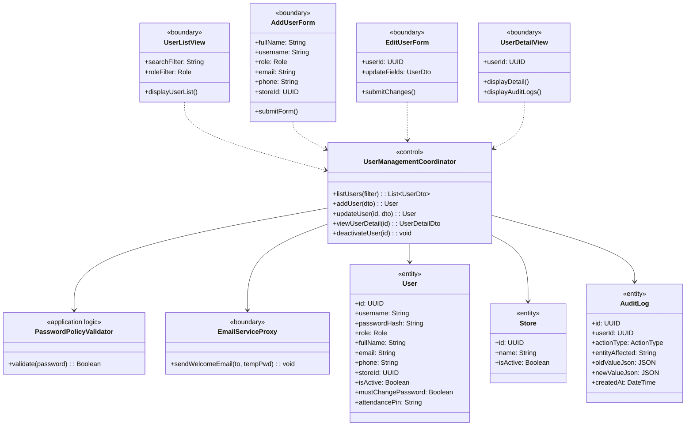
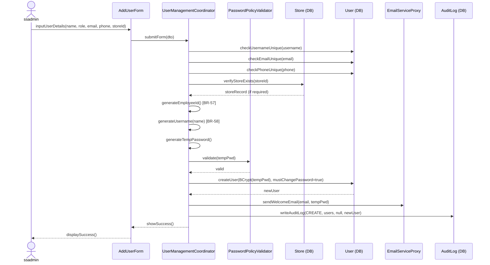
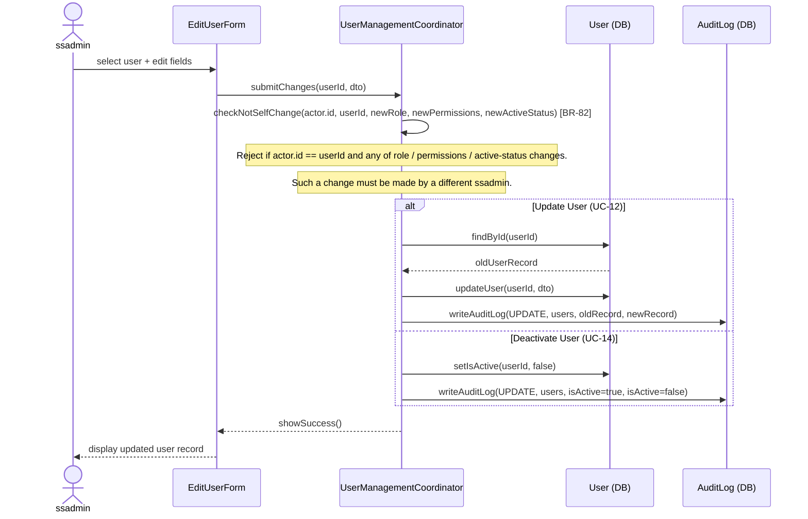
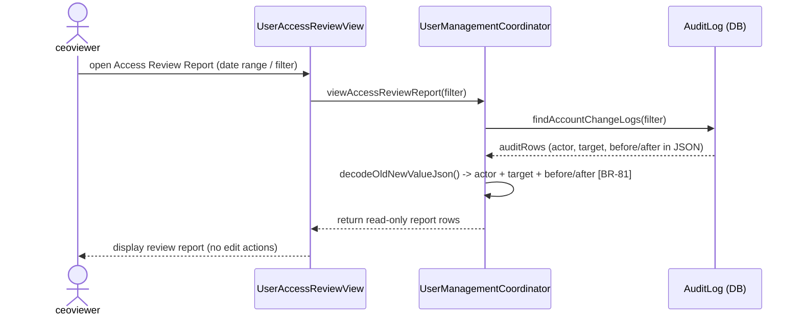

### **3.2 User Account Management**

*\[Provide the detailed design for User Account Management, covering UC-10→UC-14 (View User List, Add User, Update User, View User Detail, Deactivate/Reactivate User) plus UC-83 (User Account Change & Access Review Report). Primary actor: **ssadmin**. In addition, a **Store Manager** may **unlock and view their own branch's staff accounts** (the BR-11 / BR-59 branch-scoped exception); **ceoviewer** has read-only access to the review report (UC-83, BR-81). The class diagram covers all user management use cases. Sequence diagrams cover the Add User and Update/Deactivate User flows.\]*

#### ***3.2.1 Class Diagram***

*\[Class diagram for User Account Management. COMET stereotypes: UserListView, AddUserForm, EditUserForm, UserDetailView («boundary»); UserManagementCoordinator («control»); PasswordPolicyValidator («application logic»); User, Store, AuditLog («entity»); EmailServiceProxy («boundary» external).\]*

*\[**AuditLog note (BR-81):** the entity shape is unchanged — `userId`, `actionType`, `entityAffected`, `oldValueJson`, `newValueJson`, `createdAt`. For account changes, the **actor** is captured by `userId`; the **target** user and the **before/after** role/active-status values are captured inside `oldValueJson` / `newValueJson`. So a single AuditLog row records actor + target + before/after, satisfying BR-81's requirement without adding new columns.\]*

#### ***3.2.2 UC-11 Add User Account***

*\[ssadmin creates a new employee account. Validation: **username must be unique**, the referenced **store must exist**, and the **email and phone must also be unique**. The system **auto-generates the employee id (EMP-id) per BR-57** and **derives the username per BR-58**, auto-generates a temporary password, sends a welcome email with the temporary password, sets mustChangePassword = true, and writes an audit log entry (BR-80).\]*

#### ***3.2.3 UC-12/UC-14 Update / Deactivate User Account***

*\[ssadmin updates user profile details or deactivates an account. Self-escalation is blocked (BR-82): **no user may change their own role, permissions, or active status** — such a change must be performed by a **different** ssadmin. An audit log is written for every change (BR-80). Deactivated users cannot login.\]*

#### ***3.2.4 UC-83 View User Account Change & Access Review Report***

*\[A **ceoviewer** opens a **read-only** review report of user-account changes and access events for governance/audit purposes (BR-81). The coordinator queries the AuditLog for account-related actions (CREATE / UPDATE on `users`, lock/unlock, deactivate/reactivate) and renders, per row, the **actor** (`userId`), the **target** user, and the **before/after** role/active-status decoded from `oldValueJson` / `newValueJson`. The actor cannot mutate anything from this view.\]*

