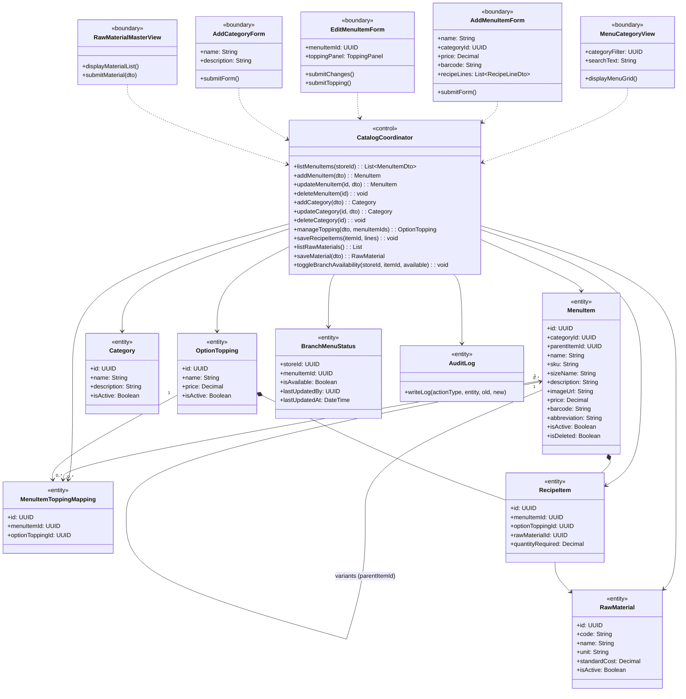
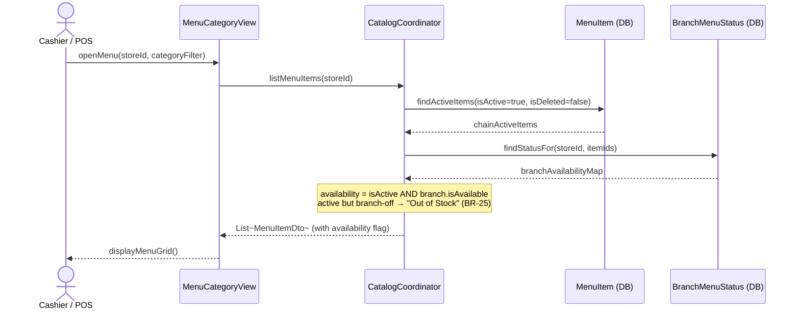
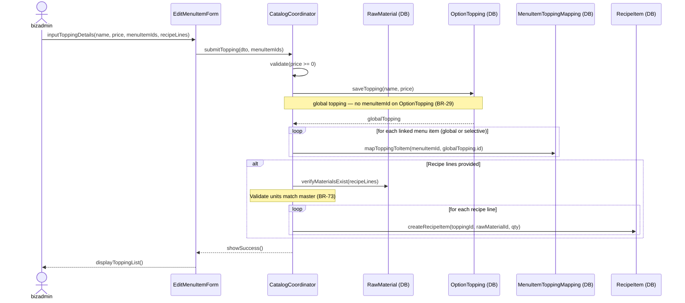
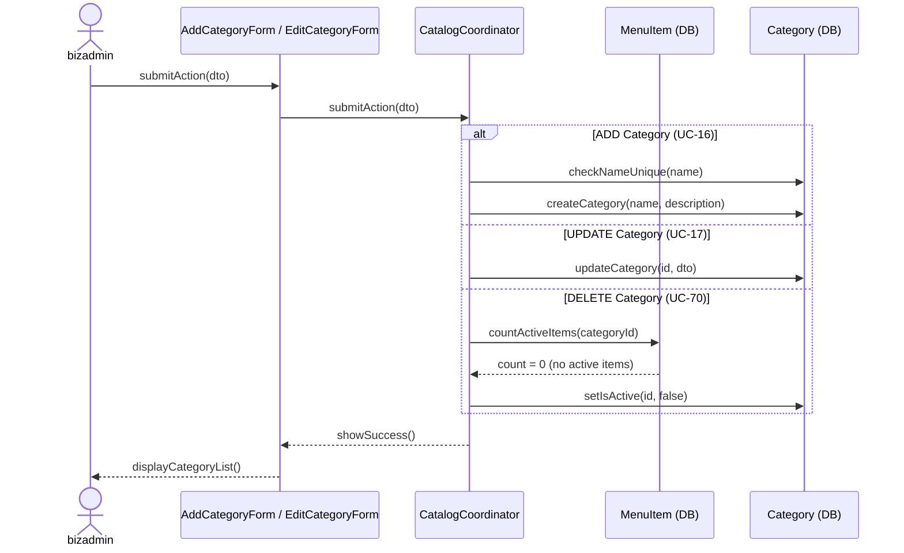
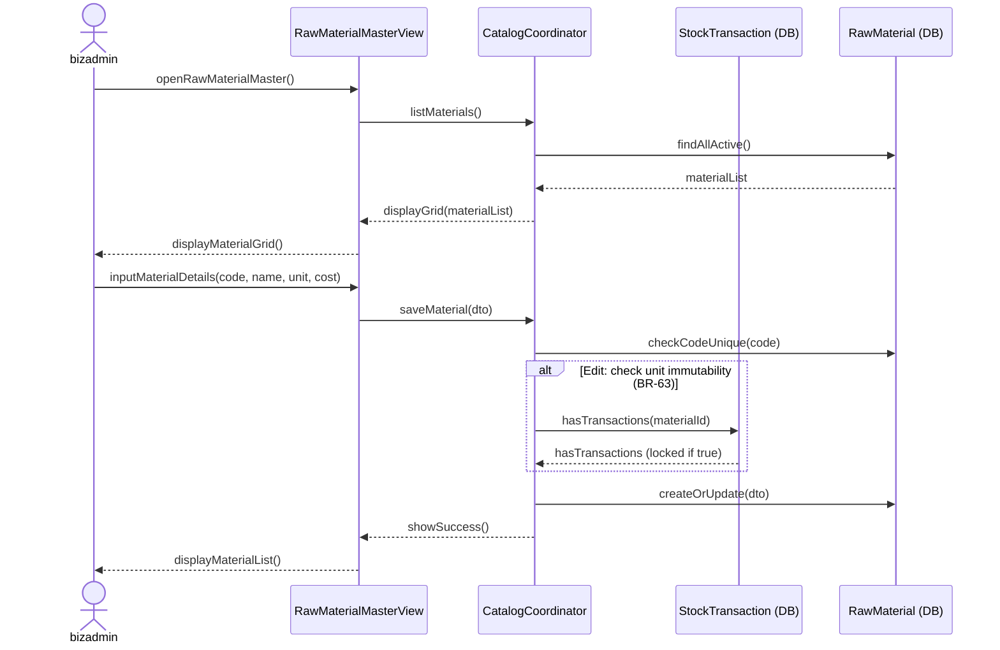
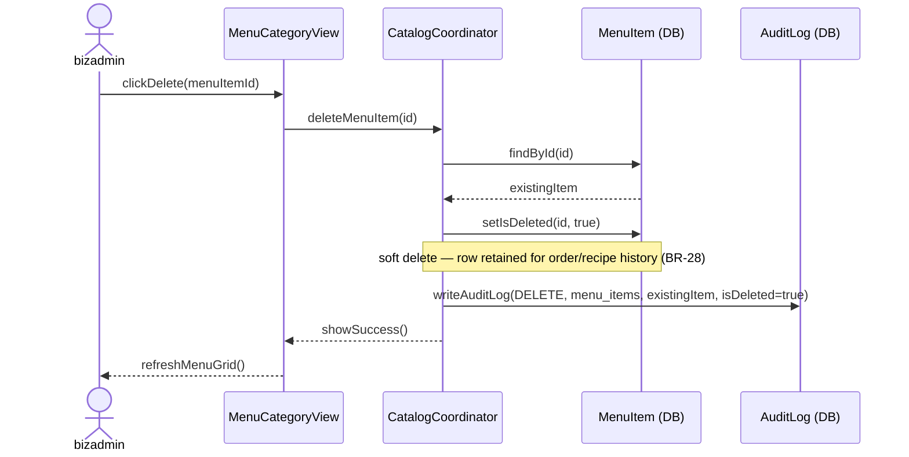

### **3.3 Menu & Category Management**

*\[Provide the detailed design for Menu & Category Management, covering UC-15→UC-19, UC-68→UC-74 (View/Add/Update/Delete Menu Items, Categories, Toppings, Raw Material Master, Recipe Management, Branch Availability Toggle). Actors: businessadmin (chain-wide catalog CRUD), storemanager (local branch availability toggle via branch_menu_status), cashier/POS (read-only list view of items available at their branch). For features with the same class structure, the class diagram is provided once.\]*

#### ***3.3.1 Class Diagram***

*\[Class diagram for Menu & Category Management. COMET stereotypes: MenuCategoryView, AddMenuItemForm, EditMenuItemForm, AddCategoryForm, RawMaterialMasterView («boundary»); CatalogCoordinator («control»); MenuItem, Category, OptionTopping, MenuItemToppingMapping, RecipeItem, RawMaterial, BranchMenuStatus, AuditLog («entity»). Toppings are **global** (an OptionTopping is not owned by a single menu item); a MenuItemToppingMapping join entity links a topping to one or more menu items (BR-29 "linked globally or selectively"). MenuItem supports size **variants** via a self-reference: a child variant row (S/M/L, its own sku/price) points to its parent through parentItemId.\]*



#### ***3.3.2 UC-15 List Menu Items (two-level availability)***

*\[Lists menu items for a given store/branch. `listMenuItems(storeId)` takes a store context so availability can be resolved at two levels: chain-level `MenuItem.isActive` AND branch-level `BranchMenuStatus.isAvailable`. An item is shown as **"Out of Stock"** when it is chain-active but the branch has toggled it unavailable (BR-25); a chain-inactive item is hidden entirely. The Cashier/POS actor uses this read-only view to populate the order screen; businessadmin uses it (with no storeId, or chain context) for catalog browsing.\]*



#### ***3.3.3 UC-18 Add Menu Item with Recipe Formula***

*\[businessadmin creates a new menu item and links its raw material recipe formula. A menu item may be a base item or carry size **variants** (S/M/L): each variant is a child MenuItem row (its own sku + price) that points to the base item via parentItemId. System validates barcode uniqueness and recipe unit consistency (BR-73) before saving. Creating a menu item writes a **CREATE** audit-log entry; subsequent selling-price edits write a **PRICE_UPDATE** entry (BR-68 — see UC-19).\]*

```mermaid
sequenceDiagram
    actor bizadmin
    participant AddForm as AddMenuItemForm
    participant CatalogCoord as CatalogCoordinator
    participant RawMatDB as RawMaterial (DB)
    participant MenuDB as MenuItem (DB)
    participant RecipeDB as RecipeItem (DB)
    participant AuditDB as AuditLog (DB)

    bizadmin->>AddForm: inputMenuItemDetails(name, sku, price, barcode, sizeVariants, recipeLines)
    AddForm->>CatalogCoord: submitForm(dto)
    CatalogCoord->>MenuDB: checkBarcodeUnique(barcode)
    CatalogCoord->>RawMatDB: verifyMaterialsExist(recipeLines)
    RawMatDB-->>CatalogCoord: materials validated
    Note over CatalogCoord: Validate units match master (BR-73)
    CatalogCoord->>MenuDB: createMenuItem(name, sku, price, barcode, abbreviation, description, imageUrl)
    MenuDB-->>CatalogCoord: baseMenuItem
    opt size variants (S/M/L) provided
        loop for each size variant
            CatalogCoord->>MenuDB: createVariantItem(parentItemId=baseMenuItem.id, sizeName, sku, price)
        end
    end
    loop for each recipe line
        CatalogCoord->>RecipeDB: createRecipeItem(menuItemId, rawMaterialId, qty)
    end
    CatalogCoord->>AuditDB: writeAuditLog(CREATE, menu_items, null, baseMenuItem)
    Note over CatalogCoord,AuditDB: BR-68 — CREATE on add; PRICE_UPDATE logged separately on selling-price change (UC-19)
    CatalogCoord-->>AddForm: showSuccess()
    AddForm-->>bizadmin: displaySuccess()
```

#### ***3.3.4 UC-71 Manage Toppings & Options (with Recipe)***

*\[businessadmin adds or edits a **global** topping, then links it to one or more menu items. The topping itself is created once in OptionTopping (no menuItemId); each link is a row in the MenuItemToppingMapping join table — a topping may be linked globally (every item) or selectively (a chosen subset), per BR-29. Each topping may optionally have its own recipe formula (ingredients consumed when the topping is ordered). Price must be >= 0. Recipe unit consistency is validated against raw material master (BR-73).\]*



#### ***3.3.5 UC-16/17/70 CRUD Category***

*\[businessadmin creates, updates, or soft-deletes product categories. Delete (soft) is blocked if the category still contains active menu items, preventing orphaned items.\]*



#### ***3.3.6 UC-74 Manage Raw Material Master Catalog***

*\[businessadmin maintains the chain-wide raw material catalog. Material code is immutable after creation. Unit is locked once the material is referenced by any stock transaction (BR-63/BR-64). Soft-delete via is_active flag prevents deletion of materials referenced by recipes.\]*



#### ***3.3.7 UC-72 Delete Menu Item***

*\[businessadmin removes a menu item. Deletion is a **soft delete** (BR-28): the item is never physically removed — `deleteMenuItem(id)` sets `isDeleted=true` so historical orders/recipes that reference it stay intact. A soft-deleted item is excluded from list views (UC-15) and the order screen. A PRICE_UPDATE/DELETE audit entry is written for traceability (BR-68).\]*



