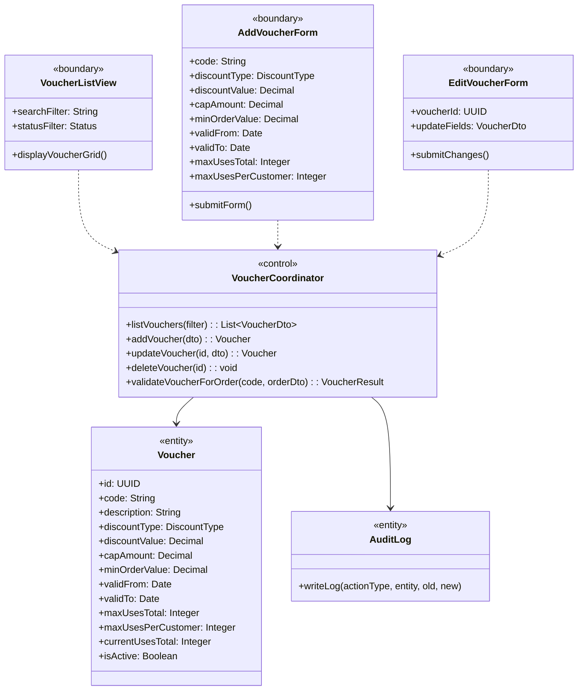
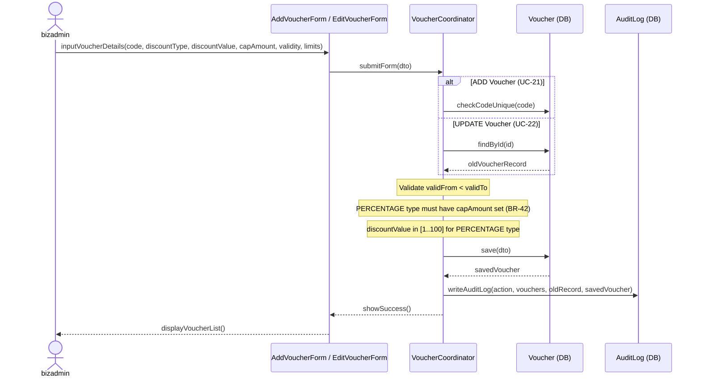
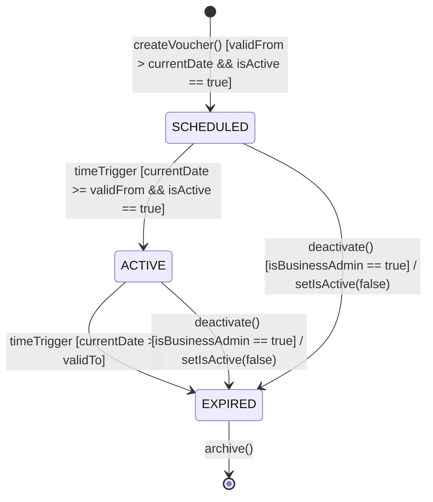

### **3.4 Voucher Management**

*\[Provide the detailed design for Voucher Management, covering UC-20→UC-23 (View/Add/Update/Delete Voucher). Voucher application at checkout is described in Section 3.7 POS Transaction (UC-48). Actor: businessadmin (CRUD). The class diagram covers the voucher lifecycle; the sequence diagram covers the add/update flow. The VOUCHER statechart documents the full lifecycle — status is computed dynamically over 3 states (SCHEDULED / ACTIVE / EXPIRED) per BR-52, and deactivation is terminal.\]*

#### ***3.4.1 Class Diagram***

*\[Class diagram for Voucher Management. COMET stereotypes: VoucherListView, AddVoucherForm, EditVoucherForm («boundary»); VoucherCoordinator («control»); Voucher, AuditLog («entity»).\]*

#### ***3.4.2 UC-21/22 Add / Update Voucher***

*\[businessadmin creates or updates a voucher. System validates: code uniqueness on add, validFrom < validTo, PERCENTAGE type must have capAmount set (BR-42), discountValue must be in [1..100] for PERCENTAGE type. An optional description (max 250 chars) may be supplied. Every mutation is audit-logged (BR-68).\]*

#### ***3.4.3 VOUCHER Lifecycle Statechart***

*\[The Voucher lifecycle has 3 states (BR-52), computed dynamically from validFrom/validTo and the is_active flag rather than stored as a column: SCHEDULED (before validFrom), ACTIVE (within the validity window and is_active == true), EXPIRED (past validTo, or once deactivated). Usage exhaustion (currentUsesTotal >= maxUsesTotal) does not change the status — it remains ACTIVE; the max-uses limit simply blocks further redemptions. Deactivation is terminal: it immediately and permanently stops redemptions (BR-41) and folds the voucher into EXPIRED; there is no reactivation. Vouchers that have been used in orders cannot be deleted from the database (foreign key constraint on orders table); deactivation via the is_active flag is used instead of deletion.\]*

