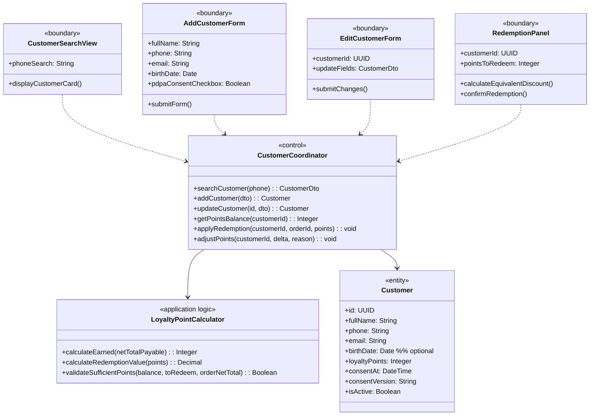
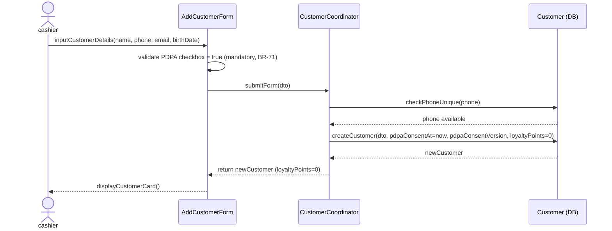
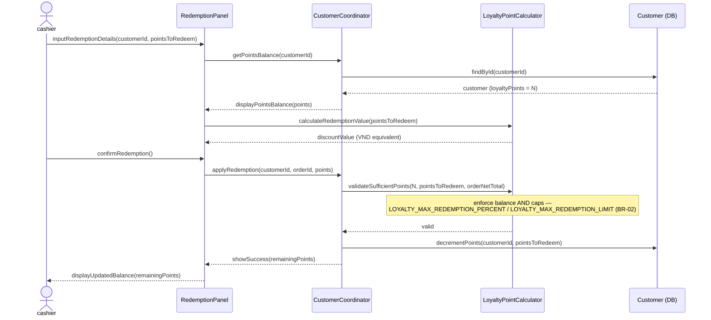
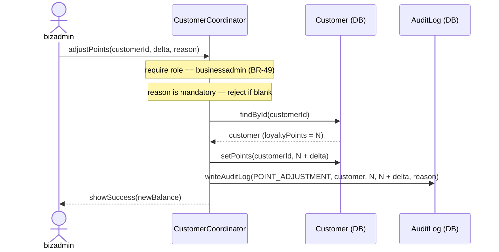

### **3.5 Customer & Membership Management**

*\[Provide the detailed design for Customer & Membership Management, covering UC-24→UC-27 (View/Add/Update Customer, View Customer History) and UC-49 (Apply Loyalty Points at Checkout). Actors: cashier (CRM lookup and register at POS), storemanager (edit customer info), businessadmin (manual loyalty-point adjustment — the only role permitted to adjust points, BR-49). Key design: PDPA consent is mandatory before any loyalty data is stored (BR-71). Loyalty points expire after 12 months of inactivity (BR-35), and redemption is capped (BR-02). Checkout application is covered in Section 3.7.\]*

#### ***3.5.1 Class Diagram***

*\[Class diagram for Customer & Membership. COMET stereotypes: CustomerSearchView, AddCustomerForm, EditCustomerForm, RedemptionPanel («boundary»); CustomerCoordinator («control»); LoyaltyPointCalculator («application logic»); Customer («entity»). The CustomerCoordinator.adjustPoints(customerId, delta, reason) operation is restricted to businessadmin and requires a mandatory reason (BR-49). LoyaltyPointCalculator.calculateEarned operates on the Net Total Payable (BR-69); validateSufficientPoints enforces both the balance and the redemption caps LOYALTY_MAX_REDEMPTION_PERCENT / LOYALTY_MAX_REDEMPTION_LIMIT (BR-02). birthDate is optional.\]*

#### ***3.5.2 UC-25 Add Customer with PDPA Consent***

*\[Cashier registers a new loyalty customer. PDPA consent checkbox is mandatory before submitting the form (BR-71). System stores consent timestamp and consent version. Phone number must be unique. birthDate is optional — the SRS Add/Edit customer forms should include it as an optional field. Initial loyalty points balance is 0.\]*

#### ***3.5.3 UC-49 Apply Loyalty Points at Checkout***

*\[Cashier applies loyalty points as a discount during checkout. The points-to-VND conversion rate is configured in SystemConfig (UC-30). Both the points balance AND the redemption caps are validated before confirming: redemption may not exceed LOYALTY_MAX_REDEMPTION_PERCENT of the order net total nor the absolute LOYALTY_MAX_REDEMPTION_LIMIT (BR-02). Points are deducted immediately upon redemption confirmation. (Note: accrued points expire after 12 months of inactivity, BR-35.)\]*

#### ***3.5.4 Manual Point Adjustment (businessadmin)***

*\[Only businessadmin may manually adjust a customer's loyalty balance (BR-49) — e.g. goodwill credit or correction. A reason is mandatory; the adjustment is rejected without one. The signed delta is applied to the balance and the action is audit-logged.\]*

