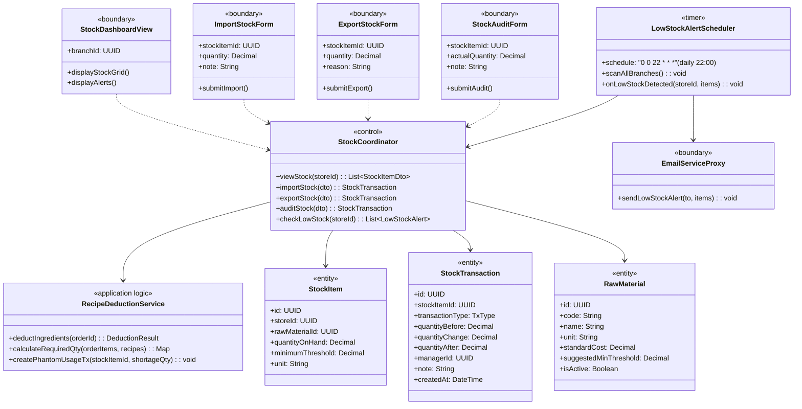
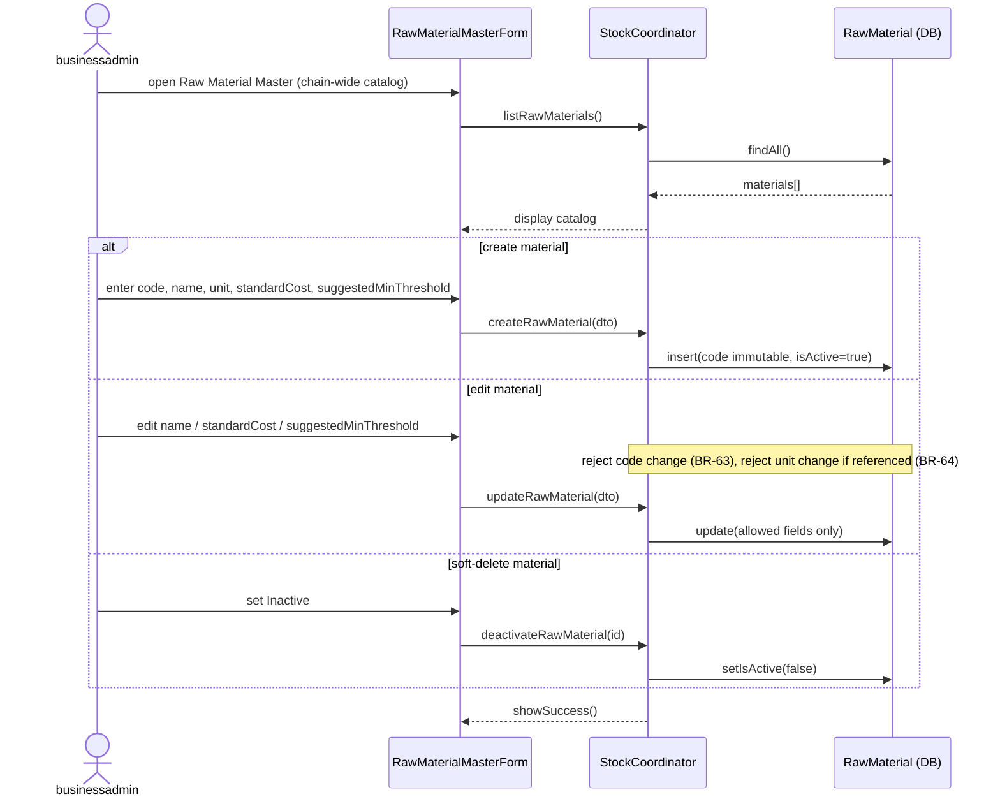
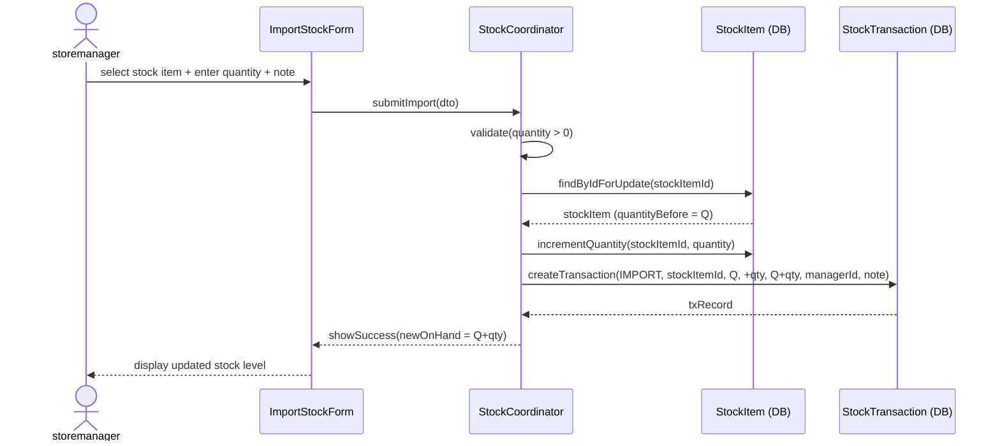
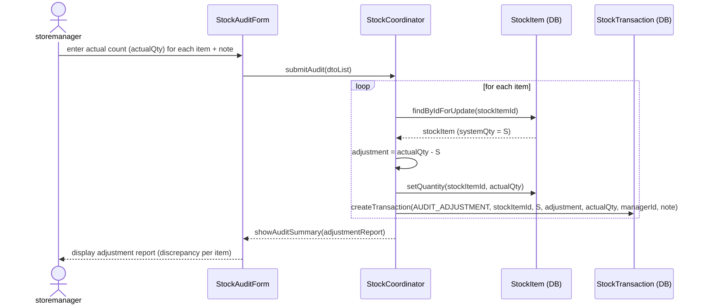
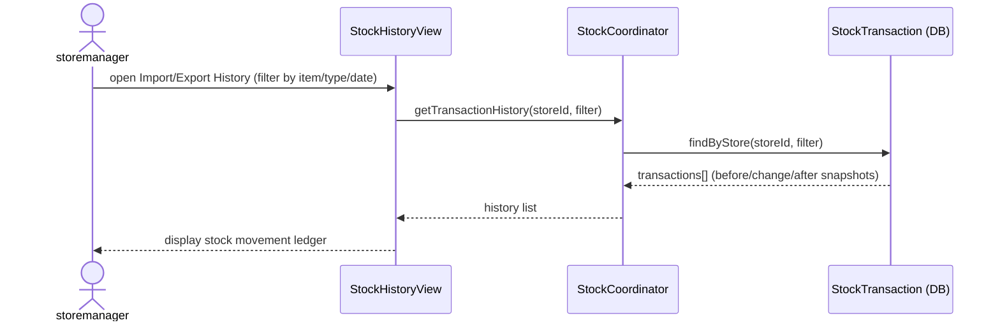
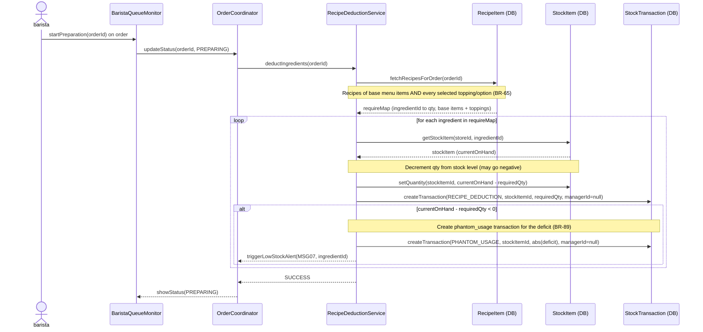
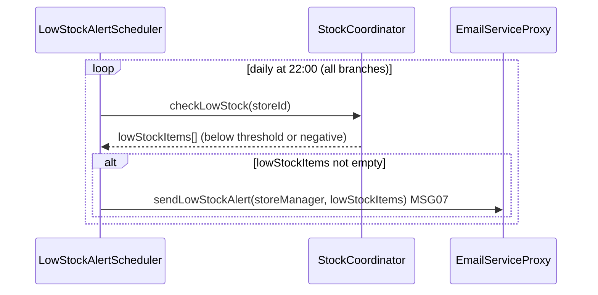

### **3.6 Inventory & Stock Management**

*\[Provide the detailed design for Inventory & Stock Management, covering UC-31→UC-34 (View Stock Dashboard, Import Stock, Export Stock, Stock Audit/Physical Count), UC-61 (View Import/Export History), UC-74 (Manage Raw Material Master, businessadmin), UC-62 (Recipe-based Auto-Deduction on PREPARING status), plus the daily Low Stock Alert behavior (BR-89/MSG07, a scheduled behavior, not a numbered UC). Actors: businessadmin (chain-wide raw-material master), storemanager (manual import/export/audit + history), system scheduler (auto-deduction via RecipeDeductionService, daily alert via LowStockAlertScheduler).\]*

#### ***3.6.1 Class Diagram***

*\[Class diagram for Inventory & Stock. COMET stereotypes: StockDashboardView, ImportStockForm, ExportStockForm, StockAuditForm («boundary»), EmailServiceProxy («boundary» external); StockCoordinator («control»); RecipeDeductionService («application logic»); LowStockAlertScheduler («timer»); StockItem, StockTransaction, RawMaterial («entity»).\]*

#### ***3.6.2 UC-74 Manage Raw Material Master***

*\[`businessadmin` maintains the chain-wide raw-material catalog — the canonical source for recipe formulations (§3.3) and for the item dropdowns on every branch's Import/Export Stock screens. Chain-wide scope: a single master list shared by all branches (no central warehouse; branches import directly from suppliers). Constraints: the material **`code` is immutable after creation** (BR-63) and the **`unit` is locked once recipes or stock transactions reference it** (BR-64, to keep recipe/stock/COGS on like units). Materials are **never hard-deleted** — `isActive` is toggled to soft-delete (BR-64): inactive materials are hidden from new recipe/import selections but remain visible in history and existing branch stock. `standardCost` (per master unit) and `suggestedMinThreshold` are set here and feed COGS (BR-66) and the branch low-stock default. Store Managers may only transact quantities (UC-32/33/34); they cannot create, rename, or delete material types.\]*

#### ***3.6.3 UC-32 Import Stock***

*\[storemanager records an incoming stock delivery. System validates quantity > 0, reads current on-hand quantity, creates an IMPORT transaction with before/after snapshot for audit trail, then increments the stock item quantity.\]*

#### ***3.6.4 UC-34 Stock Audit / Physical Count Adjustment***

*\[storemanager performs a physical count. If actual count differs from system quantity, an AUDIT_ADJUSTMENT transaction is created recording the discrepancy delta. A note explaining the difference is mandatory.\]*

#### ***3.6.5 UC-61 View Import/Export History***

*\[storemanager reviews past stock movements for their branch. The system returns the StockTransaction ledger filtered by branch (and optionally by stock item / type / date range), reading the canonical transaction types IMPORT / EXPORT / AUDIT_ADJUSTMENT / RECIPE_DEDUCTION / PHANTOM_USAGE. Read-only; no stock mutation occurs.\]*

#### ***3.6.6 UC-62 Automatic Recipe-Based Stock Deduction***

*\[When the Barista updates order status to PREPARING, the RecipeDeductionService is triggered. Deduction at PREPARING consumes the recipe of the **base menu item AND the recipe of every selected topping/option** on each order line — not just the base item's recipe (BR-65). Material-free options (e.g. "No Ice") simply have an empty recipe and deduct nothing. If any ingredient is insufficient, the system still deducts everything (allowing negative balance) and records a `PHANTOM_USAGE` transaction to monitor leakage (BR-89). It does NOT set the order status to HOLD. A low-stock alert MSG07 is dispatched, but the order preparation proceeds without blocking. RECIPE_DEDUCTION transactions have null manager_id to distinguish them from manual adjustments. Stock transaction types are the canonical set IMPORT / EXPORT / AUDIT_ADJUSTMENT / RECIPE_DEDUCTION / PHANTOM_USAGE.\]*

#### ***3.6.7 Daily Low-Stock Alert (LowStockAlertScheduler — scheduled behavior)***

*\[A scheduled behavior, not a numbered use case. The LowStockAlertScheduler scans every branch daily (cron `0 0 22 * * *`) and, for each StockItem whose quantityOnHand has fallen below its minimumThreshold (or gone negative per BR-89), dispatches MSG07 to the Store Manager via EmailServiceProxy and the dashboard notification badge. Read-only over stock levels — it raises alerts but performs no stock mutation.\]*

