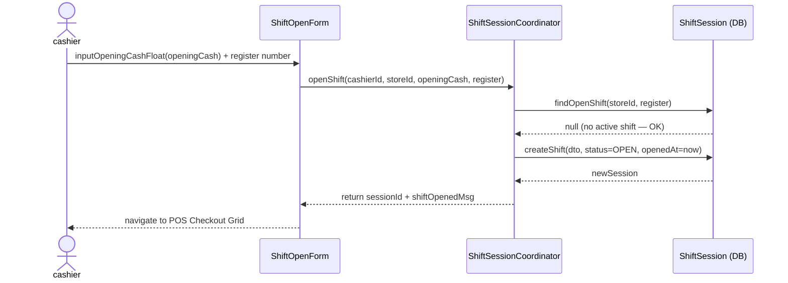
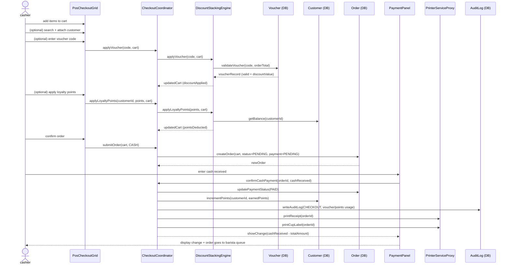
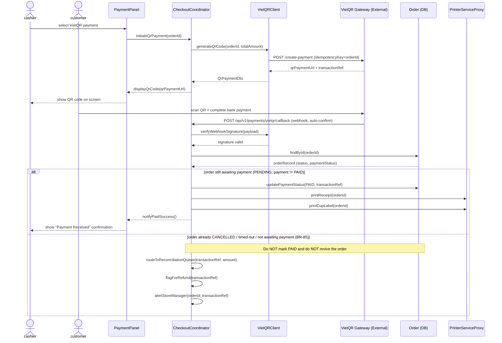
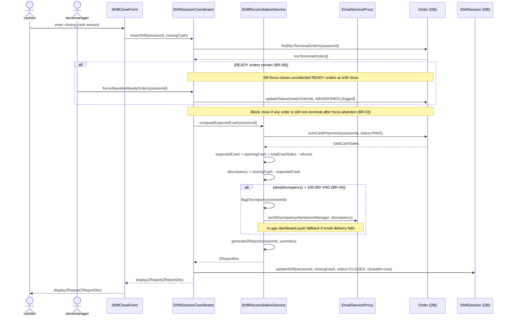

### **3.7 POS Transaction**

*\[Provide the detailed design for POS Transaction, covering UC-44 (Open Shift), the Full Checkout Pipeline (cash + VietQR payment), and UC-53 (Close Shift / Z-Report). Actor: cashier (POS Terminal on Flutter). Key design decisions: (1) DiscountStackingEngine enforces voucher + loyalty point stacking rules (BR-70); (2) VietQR uses idempotency key = orderId and is **auto-confirmed on the gateway callback** (no manual cashier confirm), with a late-callback status guard (BR-84/BR-85); (3) ShiftAutoCloseScheduler force-closes open shifts at 23:59, but only after force-abandoning READY orders so it never closes over non-terminal work (BR-03/BR-88); (4) shift close flags any cash discrepancy > 100,000 VND and auto-emails the Store Manager (BR-04). Note: UC-53 = Close Shift; the VietQR payment flow is a checkout behavior governed by BR-84/BR-85, not a separate UC id.\]*

#### ***3.7.1 Class Diagram***

*\[Class diagram for POS Transaction. COMET stereotypes: ShiftOpenForm, PosCheckoutGrid, PaymentPanel, ShiftCloseForm («boundary»); VietQRClient, PrinterServiceProxy («boundary» external); CheckoutCoordinator, ShiftSessionCoordinator («control»); DiscountStackingEngine, ShiftReconciliationService («application logic»); ShiftAutoCloseScheduler («timer»); ShiftSession, Order, Voucher, Customer, SystemConfig («entity»).\]*

```mermaid
classDiagram
    class ShiftOpenForm {
        <<boundary>>
        +cashierId: UUID
        +openingCash: Decimal
        +registerNumber: Integer
        +submitOpen()
    }
    class PosCheckoutGrid {
        <<boundary>>
        +menuGrid: MenuItemGrid
        +cart: CartPanel
        +customerPanel: CustomerPanel
        +voucherInput: TextField
        +totalPanel: TotalPanel
        +submitOrder()
    }
    class PaymentPanel {
        <<boundary>>
        +paymentMethod: PaymentMethod
        +cashReceived: Decimal
        +qrCodeDisplay: QRImage
        +confirmCash()
        +onQrPaidPushed()
    }
    note for PaymentPanel "VietQR has NO manual cashier confirm (BR-84): the panel only renders the QR and reacts to the gateway auto-callback (onQrPaidPushed). The former confirmQrPaid() manual method is removed."
    class ShiftCloseForm {
        <<boundary>>
        +closingCash: Decimal
        +submitClose()
    }

    class CheckoutCoordinator {
        <<control>>
        +buildCart(items): CartDto
        +applyVoucher(code, cart): CartDto
        +applyLoyaltyPoints(customerId, points, cart): CartDto
        +submitOrder(cart, paymentMethod): OrderDto
        +confirmCashPayment(orderId, cashReceived): ReceiptDto
        +initiateQrPayment(orderId): QrPaymentDto
        +handleQrCallback(orderId, status): void
        +printReceipt(orderId): void
    }
    class ShiftSessionCoordinator {
        <<control>>
        +openShift(dto): ShiftSession
        +closeShift(sessionId, closingCash): ZReportDto
        +getActiveShift(cashierId): ShiftSession
    }
    class DiscountStackingEngine {
        <<application logic>>
        +applyVoucher(voucherCode, cart): CartDto
        +applyLoyaltyPoints(points, cart): CartDto
        +computeFinalTotal(cart): Decimal
        +enforceStackingRules(cart): CartDto
    }
    class ShiftReconciliationService {
        <<application logic>>
        +computeExpectedCash(sessionId): Decimal
        +computeDiscrepancy(expected, actual): Decimal
        +flagDiscrepancyIfOverThreshold(discrepancy): void
        +generateZReport(sessionId): ZReportDto
    }
    note for ShiftReconciliationService "BR-04: |discrepancy| > 100,000 VND is flagged and auto-emailed to the Store Manager via EmailServiceProxy (in-app dashboard push as fallback if email fails)."

    class ShiftAutoCloseScheduler {
        <<timer>>
        +schedule: "59 23 * * *" (23:59 cron)
        +forceCloseOpenShifts(): void
        +forceAbandonReadyOrders(sessionId): void
    }
    note for ShiftAutoCloseScheduler "Must NOT close a shift while it still has non-terminal orders (BR-03). Before forcing close it force-abandons READY orders (READY → ABANDONED, BR-88), mirroring the manual SM close rules."
    class ShiftSession {
        <<entity>>
        +id: UUID
        +storeId: UUID
        +cashierId: UUID
        +registerNumber: Integer
        +openingCash: Decimal
        +closingCash: Decimal
        +status: ShiftStatus
        +openedAt: DateTime
        +closedAt: DateTime
    }
    class VietQRClient {
        <<boundary>>
        +generateQrCode(orderId, amount): QrPaymentDto
        +verifyWebhookSignature(payload): Boolean
        +processCallback(payload): PaymentResult
    }
    class PrinterServiceProxy {
        <<boundary>>
        +printReceipt(receiptDto): void
        +printCupLabel(labelDto): void
    }
    class EmailServiceProxy {
        <<boundary>>
        +sendDiscrepancyAlert(storeManager, discrepancy): void
    }
    class Voucher {
        <<entity>>
        +id: UUID
        +code: String
        +discountType: DiscountType
    }
    class Customer {
        <<entity>>
        +id: UUID
        +loyaltyPoints: Integer
    }
    class SystemConfig {
        <<entity>>
        +configKey: String
        +configValue: String
        +scope: ConfigScope
        +storeId: UUID
    }

    ShiftOpenForm ..> ShiftSessionCoordinator
    ShiftCloseForm ..> ShiftSessionCoordinator
    PosCheckoutGrid ..> CheckoutCoordinator
    PaymentPanel ..> CheckoutCoordinator

    CheckoutCoordinator --> DiscountStackingEngine
    CheckoutCoordinator --> ShiftSession
    CheckoutCoordinator --> VietQRClient
    CheckoutCoordinator --> PrinterServiceProxy
    ShiftSessionCoordinator --> ShiftReconciliationService
    ShiftSessionCoordinator --> ShiftSession
    ShiftReconciliationService --> EmailServiceProxy
    ShiftAutoCloseScheduler --> ShiftSessionCoordinator
    DiscountStackingEngine --> Voucher
    DiscountStackingEngine --> Customer
    DiscountStackingEngine --> SystemConfig
```

#### ***3.7.2 UC-44 Open Shift***

*\[Cashier opens a new work shift by declaring the opening cash float. Only one OPEN shift is allowed per register per branch at a time (BR-92). System validates no duplicate active shift before creating the ShiftSession record.\]*

#### ***3.7.3 UC-48/49/50/51 Full Checkout Pipeline (Cash Payment)***

*\[Cashier builds cart → optionally attaches customer and applies voucher/loyalty points → selects payment method → confirms payment → system creates order, earns loyalty points for customer, writes audit log, and prints receipt + cup label.\]*

#### ***3.7.4 VietQR Payment Flow (checkout behavior — BR-84/BR-85)***

*\[A checkout behavior, not a standalone UC id. When cashier selects VietQR, system calls the VietQR gateway to generate a QR code. Customer scans QR and completes payment in their banking app. The gateway sends a webhook callback; payment is **auto-confirmed on this callback** (BR-84) — there is no manual cashier confirm. System verifies the HMAC signature, then applies a **status guard (BR-85)**: it marks the order PAID **only if the order is still awaiting payment**. If the order has already been CANCELLED / timed-out (or otherwise not awaiting payment), the callback must NOT revive it or mark it PAID — instead the funds are routed to a payment-reconciliation queue, flagged for refund, and the Store Manager is alerted. No void order is silently resurrected and no money lands unreconciled.\]*

#### ***3.7.5 UC-53 Close Shift (Z-Report)***

*\[Cashier declares the closing cash amount. A shift cannot close while it still has non-terminal orders (BR-03); at close the Store Manager may force-close remaining READY orders to ABANDONED (READY → ABANDONED, BR-88, logged). System computes expected cash from all CASH orders in the shift, calculates discrepancy, and if |discrepancy| > **100,000 VND** it flags the shift and auto-emails the Store Manager (in-app dashboard push as fallback if email fails, BR-04). It then generates the Z-Report and sets the shift to CLOSED. ShiftAutoCloseScheduler forces close at 23:59 if the cashier forgets — first force-abandoning READY orders so it never closes over non-terminal work.\]*

#### ***3.7.6 SHIFT Session Statechart***

*\[A ShiftSession follows a simple 2-state lifecycle: OPEN → CLOSED. Only one shift can be OPEN per register per branch. ShiftAutoCloseScheduler forces CLOSED at 23:59 daily for any session still OPEN (BR-92), but it must first force-abandon any READY orders (READY → ABANDONED, BR-88) and must NOT close over orders still in non-terminal states (BR-03).\]*

```mermaid
stateDiagram-v2
    [*] --> OPEN : openShift(openingCash) / status = OPEN

    OPEN --> CLOSED : closeShift(closingCash) [no non-terminal orders, BR-03] / forceAbandonReadyOrders(); generateZReport(); status = CLOSED

    OPEN --> CLOSED : timeTrigger [currentDate == 23:59] / forceAbandonReadyOrders() (BR-88); autoCloseShift(); status = CLOSED

    CLOSED --> [*] : archive()
```

