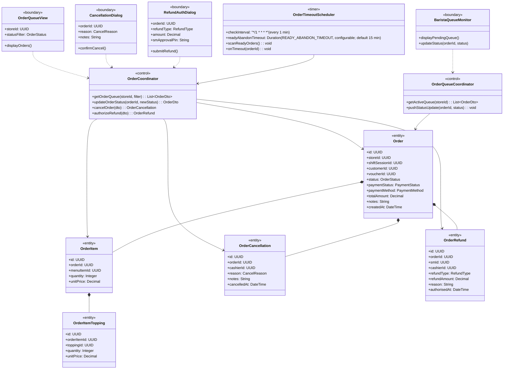
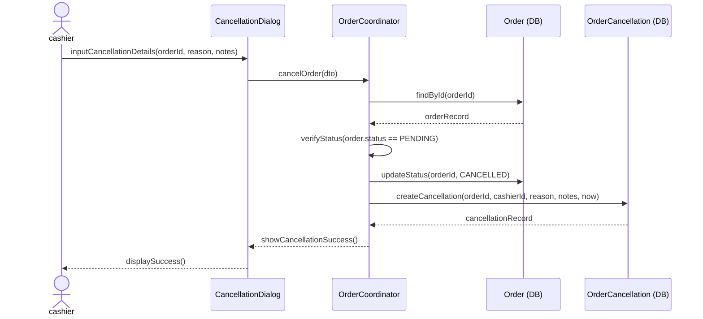
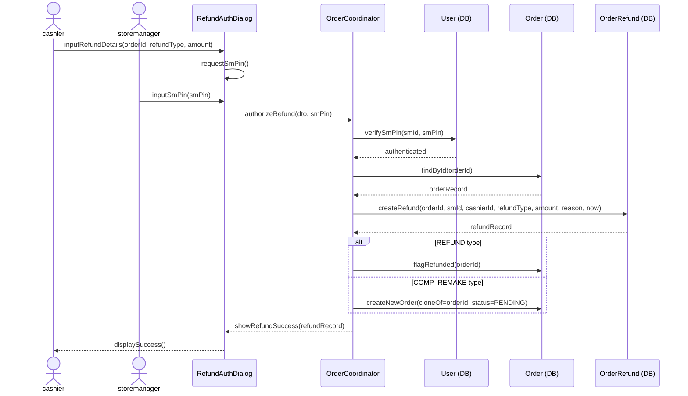
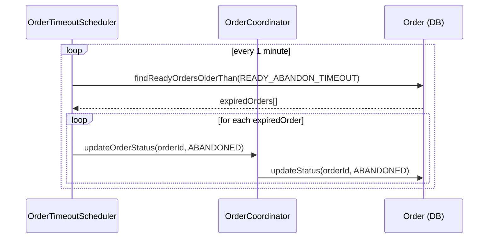
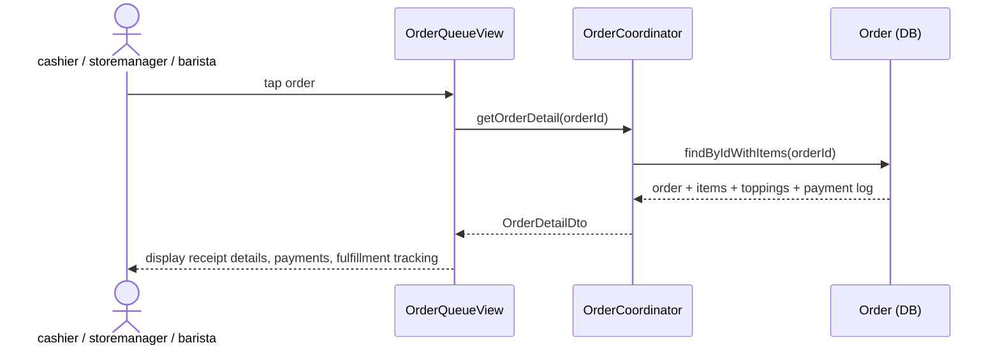

### **3.8 Order Management**

*\[Provide the detailed design for Order Management, covering the barista queue (View Order Queue, Barista Update Status), UC-55 (Request Transaction Refund & Cancellation — cancel PENDING orders by cashier), UC-73 (View Order Detail), UC-75 (SM-Authorized Refund/Comp), plus the system Auto-Abandon of READY orders (a scheduled behavior governed by BR-88, not a numbered UC). Actors: cashier (cancel PENDING only), storemanager (refund/comp authorization + force-close READY at shift close), barista (queue display + status transitions), system scheduler (auto-abandon after `READY_ABANDON_TIMEOUT`). The ORDER statechart documents all 7 valid states and their transitions. Stock model (BR-07/BR-88): stock is deducted only at PREPARING; cancellation is PENDING-only (BR-05), so a cancel never reverses stock.\]*

#### ***3.8.1 Class Diagram***

*\[Class diagram for Order Management. COMET stereotypes: OrderQueueView, BaristaQueueMonitor, CancellationDialog, RefundAuthDialog («boundary»); OrderCoordinator, OrderQueueCoordinator («control»); OrderTimeoutScheduler («timer»); Order, OrderItem, OrderItemTopping, OrderCancellation, OrderRefund («entity»).\]*

#### ***3.8.2 UC-55 Request Transaction Refund & Cancellation (Cancel PENDING Order)***

*\[Only PENDING orders can be cancelled by cashier (BR-05). The cancellation creates an immutable OrderCancellation record with the reason code and notes, and the order status transitions to CANCELLED. Cancelled orders cannot be reopened. **No stock action occurs**: in the simplified stock model, stock is deducted only at PREPARING (BR-07), and cancellation is restricted to PENDING — before any deduction — so there is never a stock rollback or replenishment to perform. The cancel flow logs the OrderCancellation only.\]*

#### ***3.8.3 UC-75 SM-Authorized Refund / Comp Remake***

*\[For post-PENDING complaints (e.g., wrong order already prepared), only storemanager can authorize a REFUND or COMP_REMAKE. SM enters their PIN to authorize. System creates an immutable OrderRefund record. For COMP_REMAKE type, a new duplicate order is created in PENDING status.\]*

#### ***3.8.4 Auto-Abandon READY Orders (OrderTimeoutScheduler — scheduled behavior, BR-88)***

*\[A scheduled behavior, not a numbered use case. READY orders not picked up beyond `READY_ABANDON_TIMEOUT` (configurable; default 15 min) are automatically set to ABANDONED by the OrderTimeoutScheduler. This prevents stale orders from persisting indefinitely in the barista queue. Stock was already deducted at PREPARING (BR-07), so abandonment performs no stock reversal; abandoned orders are reported as uncollected and excluded from net sales (BR-88).\]*

#### ***3.8.5 UC-73 View Order Detail***

*\[cashier, storemanager, or barista taps an order to inspect it. The system returns the order header, payment log, and the full item list (each OrderItem plus its selected OrderItemToppings) along with fulfillment status. Read-only — no state transition or stock action occurs.\]*

#### ***3.8.6 ORDER Lifecycle Statechart***

*\[The Order has 7 states. Transitions are enforced by OrderCoordinator. The HOLD state is triggered when a preparation issue is reported by the Barista (reportIssue()). ABANDONED is reached two ways from READY (BR-88): system-triggered after `READY_ABANDON_TIMEOUT` (configurable; default 15 min) in READY state, and Store-Manager force-close of remaining READY orders at shift close. CANCELLED and ABANDONED are terminal states. PENDING → CANCELLED logs the cancellation only; stock is deducted at PREPARING (BR-07), so no transition performs a stock rollback.\]*

```mermaid
stateDiagram-v2
    [*] --> PENDING : submitCheckout() / status = PENDING

    PENDING --> PREPARING : startPreparation() / deductStock(); status = PREPARING

    PENDING --> CANCELLED : cancelOrder(reason) [status == PENDING] / logCancellation(); status = CANCELLED

    PREPARING --> HOLD : reportIssue() / status = HOLD

    PREPARING --> READY : completePreparation() / status = READY

    HOLD --> PREPARING : resolveIssue() / status = PREPARING

    READY --> COMPLETED : confirmPickup() / status = COMPLETED

    READY --> ABANDONED : timeTrigger [elapsedTime >= READY_ABANDON_TIMEOUT] / status = ABANDONED

    READY --> ABANDONED : forceCloseAtShiftClose() [SM authorises, BR-88] / logAbandon(); status = ABANDONED

    COMPLETED --> [*] : archive()
    CANCELLED --> [*] : archive()
    ABANDONED --> [*] : archive()
```

