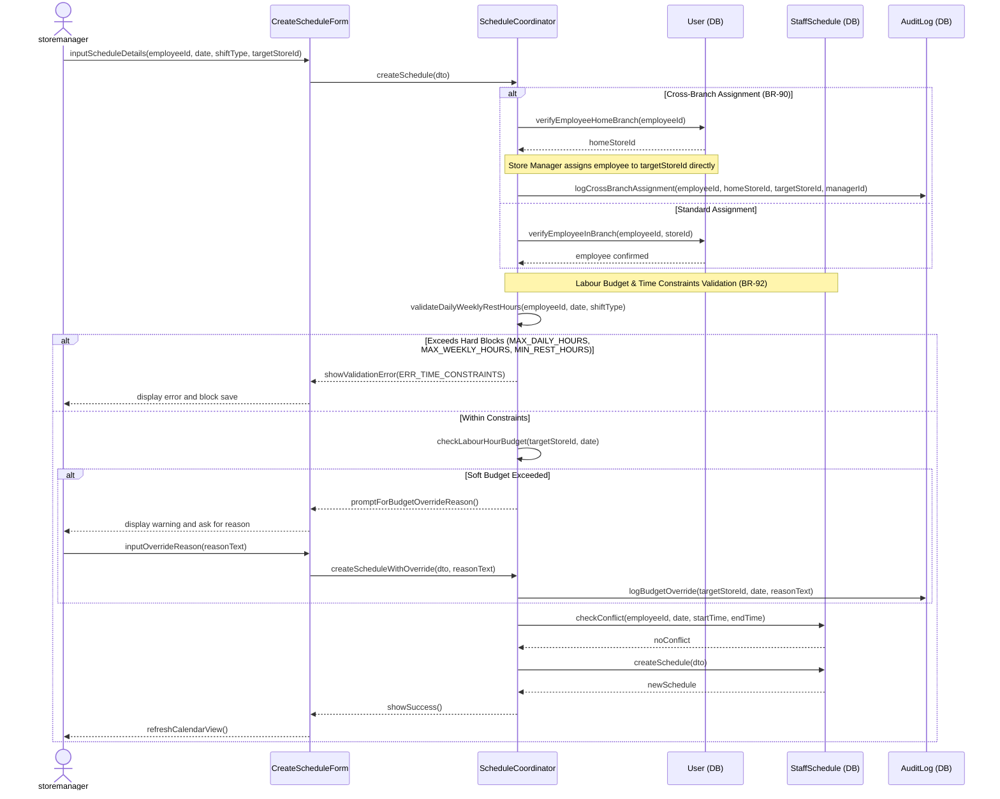
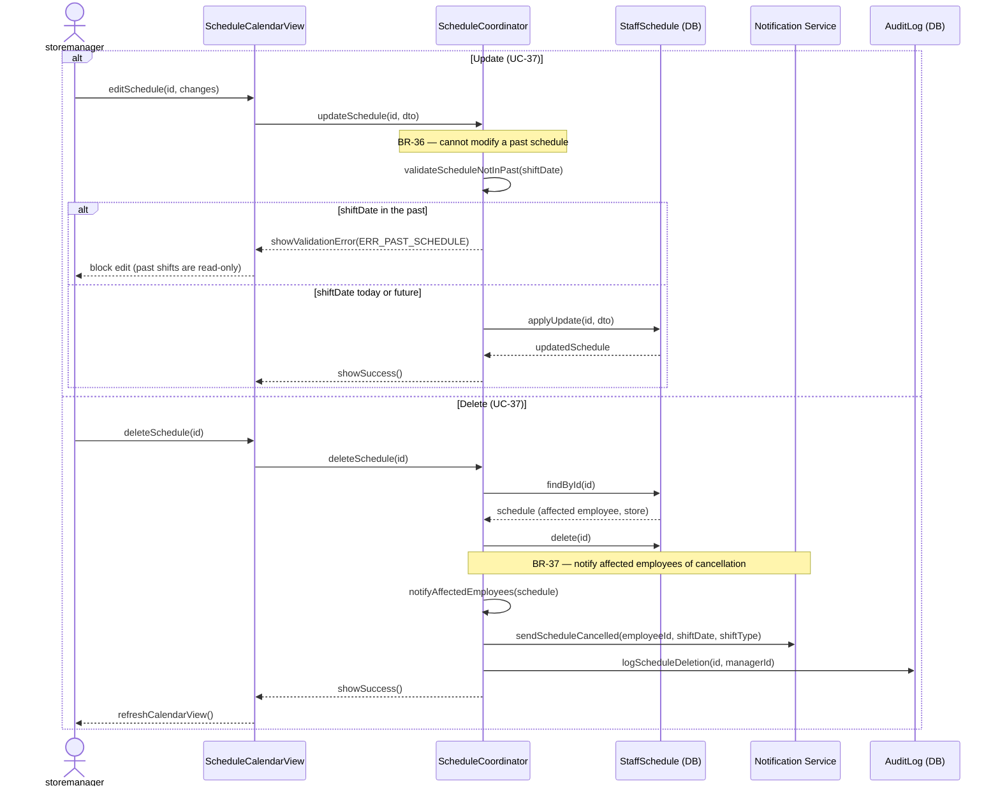
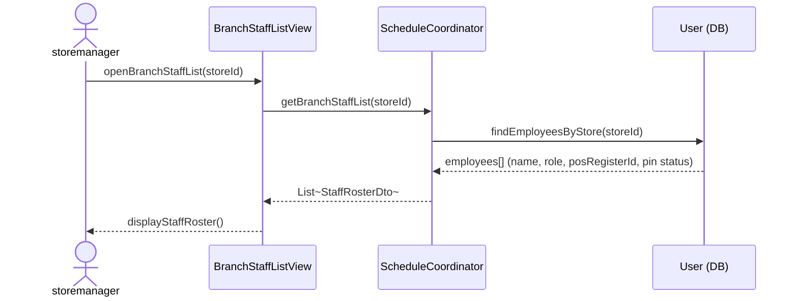
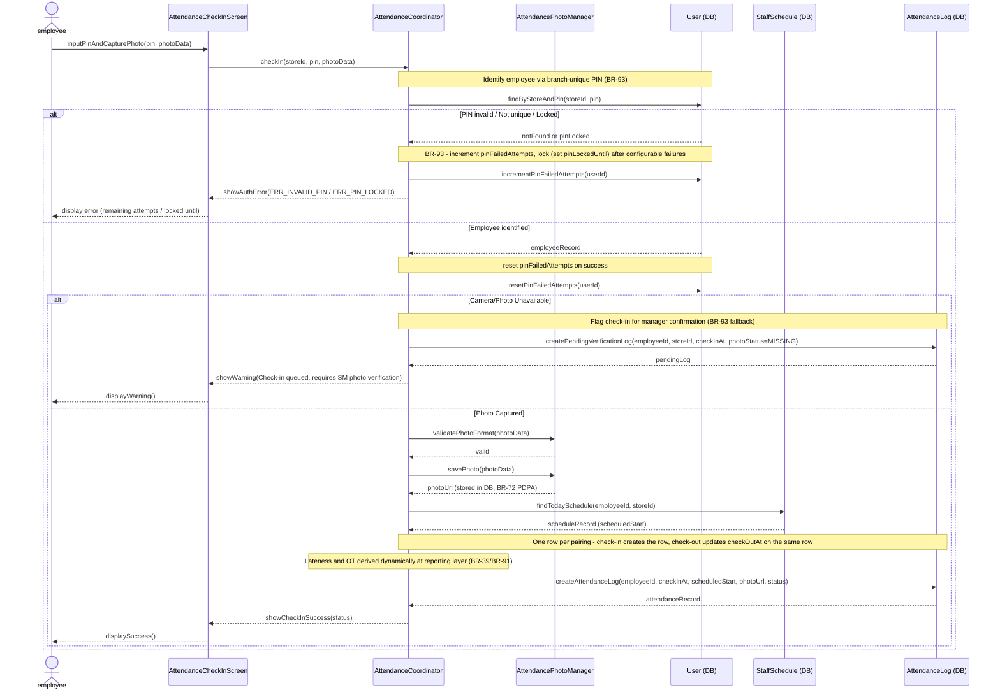
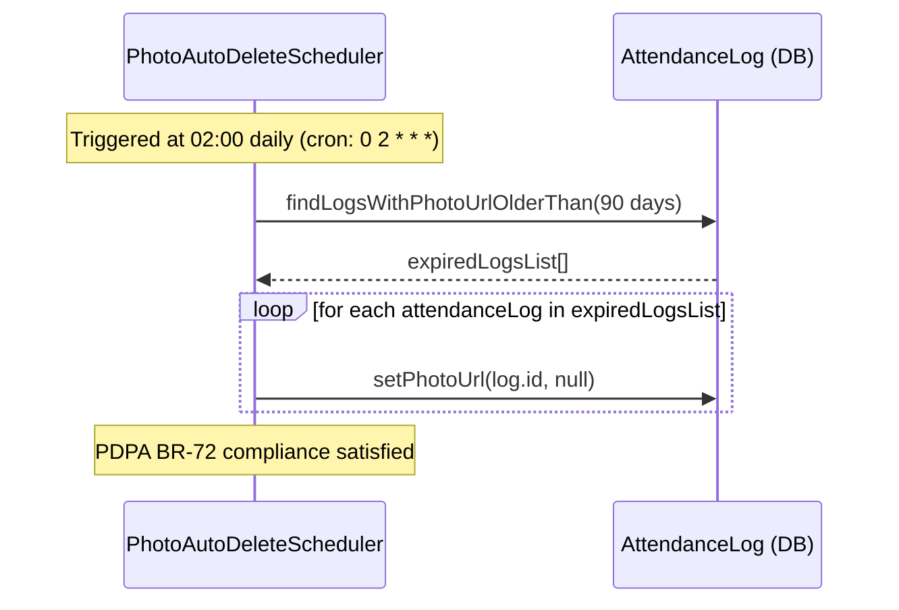
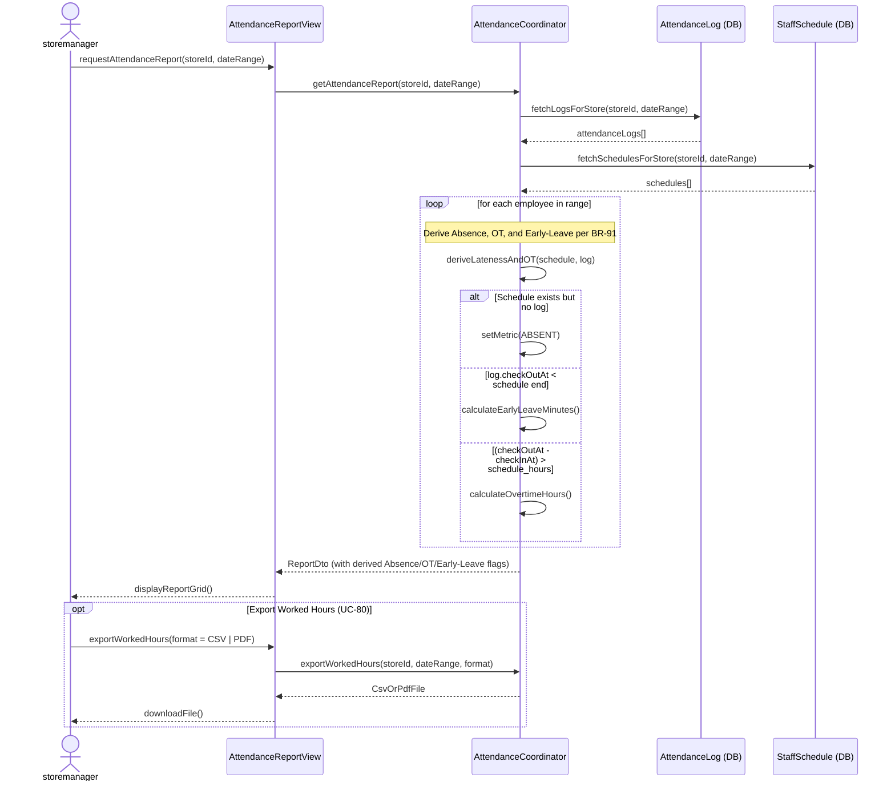

### **3.9 Staff Management**

*\[Provide the detailed design for Staff Management, covering UC-35→UC-39 (View/Create/Update/Delete Schedule, View Attendance Report), UC-66 (View Branch Staff List — Store Manager views own-branch roster), UC-67 (Attendance Check-in/out with PIN + Photo Capture, per BR-53/BR-93), and UC-80 (Export Worked Hours). Actors: storemanager (schedule CRUD + roster view + attendance oversight), cashier/barista (self check-in at branch). Key PDPA design: attendance photo URLs are stored in DB (`photoUrl`); the photo is purged by PhotoAutoDeleteScheduler — a daily 02:00 cron that nulls `photoUrl` after 90 days (BR-72).\]*

#### ***3.9.1 Class Diagram***

*\[Class diagram for Staff Management. COMET stereotypes: ScheduleCalendarView, CreateScheduleForm, AttendanceCheckInScreen, AttendanceReportView, BranchStaffListView («boundary»); ScheduleCoordinator, AttendanceCoordinator («control»); AttendancePhotoManager («application logic»); PhotoAutoDeleteScheduler («timer»); StaffSchedule, AttendanceLog, User («entity»).\]*

```mermaid
classDiagram
    class ScheduleCalendarView {
        <<boundary>>
        +weekView: CalendarGrid
        +storeId: UUID
        +displaySchedule()
    }
    class CreateScheduleForm {
        <<boundary>>
        +employeeId: UUID
        +date: Date
        +shiftType: ShiftType
        +startTime: Time
        +endTime: Time
        +posRegisterId: String
        +submitSchedule()
    }
    class AttendanceCheckInScreen {
        <<boundary>>
        +employeeId: UUID
        +pin: TextField
        +cameraCapture: CameraWidget
        +submitCheckIn()
        +submitCheckOut()
    }
    class AttendanceReportView {
        <<boundary>>
        +storeId: UUID
        +dateRange: DateRange
        +displayReport()
        +exportCsv()
        +exportPdf()
    }
    class BranchStaffListView {
        <<boundary>>
        +storeId: UUID
        +displayStaffRoster()
    }
    class ScheduleCoordinator {
        <<control>>
        +getSchedule(storeId, week): List~ScheduleDto~
        +getBranchStaffList(storeId): List~StaffRosterDto~
        +createSchedule(dto): StaffSchedule
        +updateSchedule(id, dto): StaffSchedule
        +deleteSchedule(id): void
        +validateScheduleNotInPast(shiftDate): Boolean
        +validateWorkingHoursConstraints(employeeId, shiftDate, startTime, endTime): Boolean
        +validateLabourBudget(storeId, shiftDate, additionalHours): BudgetValidationResult
        +assignCrossBranch(employeeId, targetStoreId, shiftDate, shiftType): StaffSchedule
        +notifyAffectedEmployees(schedule): void
    }
    class AttendanceCoordinator {
        <<control>>
        +checkIn(storeId, pin, photo): AttendanceLog
        +checkOut(attendanceId, pin): AttendanceLog
        +getAttendanceReport(storeId, range): ReportDto
        +exportWorkedHours(storeId, range, format): CsvOrPdfFile
        +validatePinUniquenessInBranch(storeId, pin): Boolean
        +deriveLatenessAndOT(scheduledShift, checkInAt, checkOutAt): AttendanceMetrics
    }
    class AttendancePhotoManager {
        <<application logic>>
        +savePhotoToFilesystem(photoData): String
        +getPhotoPath(attendanceId): String
        +validatePhotoFormat(data): Boolean
    }
    class PhotoAutoDeleteScheduler {
        <<timer>>
        +schedule: "0 2 * * *" (daily 02:00)
        +purgePhotoUrlsOlderThan(days: 90): void
    }
    class StaffSchedule {
        <<entity>>
        +id: UUID
        +storeId: UUID
        +userId: UUID
        +date: Date
        +shiftType: ShiftType
        +startTime: Time
        +endTime: Time
        +posRegisterId: String
    }
    note for StaffSchedule "posRegisterId is a String such as REG-01. Mandatory when role is CASHIER, optional for BARISTA or STORE_MANAGER."
    class AttendanceLog {
        <<entity>>
        +id: UUID
        +storeId: UUID
        +userId: UUID
        +scheduledDate: Date
        +scheduledStart: DateTime
        +checkInAt: DateTime
        +checkOutAt: DateTime
        +status: AttendanceStatus
        +photoUrl: String
    }
    note for AttendanceLog "One row per attendance pairing: check-in sets checkInAt (with status + photoUrl); the matching check-out updates checkOutAt on the SAME row — NOT a second event row."
    class User {
        <<entity>>
        +id: UUID
        +attendancePin: String
        +pinFailedAttempts: Integer
        +pinLockedUntil: DateTime
        +fullName: String
        +role: Role
    }

    ScheduleCalendarView ..> ScheduleCoordinator
    BranchStaffListView ..> ScheduleCoordinator
    CreateScheduleForm ..> ScheduleCoordinator
    AttendanceCheckInScreen ..> AttendanceCoordinator
    AttendanceReportView ..> AttendanceCoordinator
    AttendanceCoordinator --> AttendancePhotoManager
    AttendanceCoordinator --> AttendanceLog
    AttendanceCoordinator --> User
    ScheduleCoordinator --> StaffSchedule
    ScheduleCoordinator --> User
    PhotoAutoDeleteScheduler --> AttendanceLog
```

#### ***3.9.2 UC-36 Create Staff Schedule (with Cross-Branch and Hours Validation)***

*\[storemanager creates a schedule entry for a specific employee in the branch. System validates the employee belongs to the branch (or handles cross-branch assignment per BR-90 directly without target-branch host approval), validates working hour limits (BR-92), and detects scheduling conflicts (same employee, overlapping dates/shifts). `posRegisterId` (a String such as "REG-01") is mandatory when the shift role is CASHIER and optional for BARISTA / STORE_MANAGER.\]*

#### ***3.9.3 UC-37 Update / Delete Staff Schedule (BR-36 Future-Only Guard, BR-37 Delete-Notify)***

*\[storemanager edits or removes an existing schedule entry. **BR-36:** a schedule whose shift date is in the past cannot be modified — the coordinator runs a future-only guard (`validateScheduleNotInPast`) and rejects edits to past shifts. **BR-37:** deleting a schedule notifies every affected employee (the assigned employee, plus any cross-branch host) so they know the shift was cancelled.\]*

#### ***3.9.4 UC-66 View Branch Staff List***

*\[storemanager views the roster of staff assigned to their own branch (UC-66 = "View Branch Staff List"). The ScheduleCoordinator returns each employee's name, role, attendance PIN status, and `posRegisterId` for cashiers. This is a read-only roster view — it is distinct from the attendance check-in flow (now UC-67).\]*

#### ***3.9.5 UC-67 Attendance Check-In with Photo (BR-53 action, BR-93 PIN+Photo, PDPA Fallback)***

*\[Employee clocks in / out at the branch. **BR-53** defines the check-in/out action itself (the employee records arrival and departure at their assigned branch). **BR-93** governs the PIN + photo mechanism for that action: the PIN must be unique within the store (used to identify the employee), a camera snapshot is mandatory, and if the camera is unavailable the action is queued and flagged for Store Manager confirmation rather than recorded without a photo. After a configurable number of failed PIN entries the user is locked (BR-93) — tracked on the `User` entity via `pinFailedAttempts` / `pinLockedUntil`. The check-in writes a new `AttendanceLog` row (setting `checkInAt`, `scheduledStart`, `status`, `photoUrl`); the matching check-out updates `checkOutAt` on that **same** row — one row per attendance pairing. PDPA compliance: the photo is purged after 90 days by PhotoAutoDeleteScheduler (BR-72).\]*

#### ***3.9.6 PDPA Photo Auto-Deletion (PhotoAutoDeleteScheduler)***

*\[PhotoAutoDeleteScheduler runs every day at 02:00 (cron). It finds all attendance log rows whose `photoUrl` is non-null and whose check-in is older than 90 days, and sets `photoUrl` to null in the database (no separate `photo_purge_at` column is needed — age is derived from the row's check-in timestamp). This satisfies BR-72 (PDPA data minimization).\]*

#### ***3.9.7 UC-39/UC-80 View Attendance Report & Worked Hours (BR-91 Derivation)***

*\[storemanager views the branch attendance report and exports worked hours (UC-80) as **CSV or PDF** (per SRS UC-80 — Excel is not produced). The AttendanceCoordinator retrieves schedules and logs, and derives key attendance metrics (Absence, Overtime, and Early-Leave) dynamically in branch-local timezone as per BR-39 and BR-91. Outliers are flagged for review.\]*

