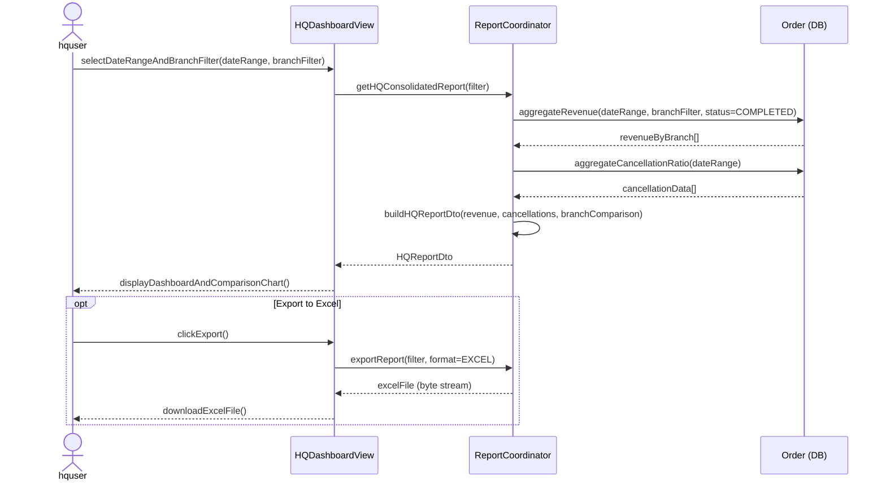
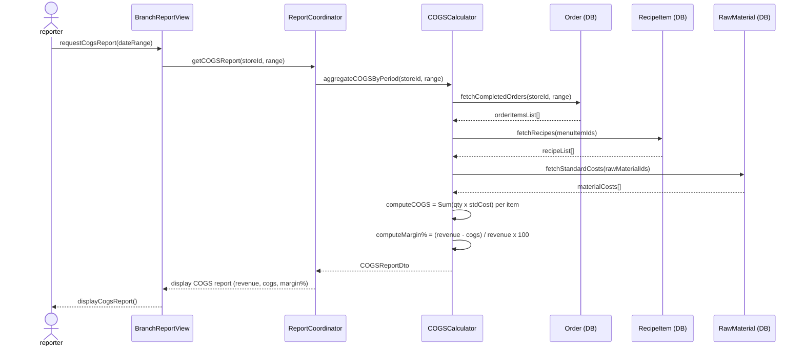
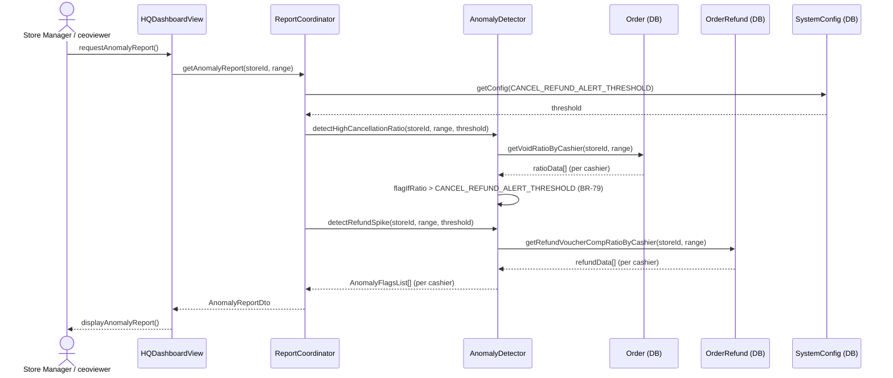
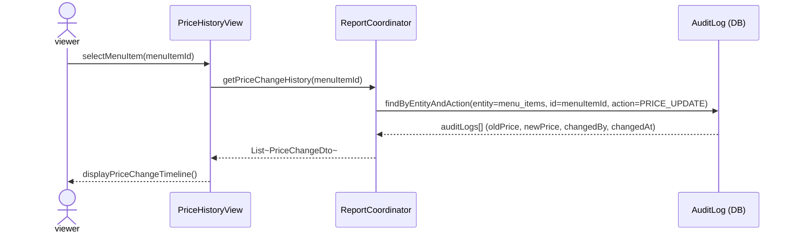

### **3.10 Reports & Analytics**

*\[Provide the detailed design for Reports & Analytics, covering UC-28→UC-29 (HQ Consolidated Revenue Dashboard), UC-40→UC-41 (Branch Sales Report, Export Store Reports), UC-76→UC-83 (COGS/Margin & Ingredient Shrinkage, Price & Voucher Change History, Loyalty Liability, Labour Hours vs Revenue, Anomaly Detection, daily Z-Report UC-81). Actors: ceoviewer/businessadmin/ssadmin (HQ reports), storemanager (branch-level reports). Data sources: Order, StockTransaction, AuditLog, ShiftSession tables (read-only).\]*

#### ***3.10.1 Class Diagram***

*\[Class diagram for Reports & Analytics. COMET stereotypes: HQDashboardView, BranchReportView, ZReportArchiveView, PriceHistoryView («boundary»); ReportCoordinator («control»); COGSCalculator, AnomalyDetector, LabourEfficiencyService, LoyaltyLiabilityService («application logic»); Order, StockTransaction, ShiftSession, AuditLog («entity»).\]*

```mermaid
classDiagram
    class HQDashboardView {
        <<boundary>>
        +dateRange: DateRange
        +branchFilter: UUID
        +displayConsolidatedRevenue()
        +displayBranchComparison()
        +exportReport()
    }
    class BranchReportView {
        <<boundary>>
        +storeId: UUID
        +dateRange: DateRange
        +displaySalesReport()
        +displayZReportArchive()
    }
    class ZReportArchiveView {
        <<boundary>>
        +storeId: UUID
        +businessDay: LocalDate
        +displayZReport()
    }
    class PriceHistoryView {
        <<boundary>>
        +menuItemId: UUID
        +displayPriceChanges()
    }
    class ReportCoordinator {
        <<control>>
        +getHQConsolidatedReport(filter): HQReportDto
        +getBranchSalesReport(storeId, range): BranchReportDto
        +getCOGSReport(storeId, range): COGSReportDto
        +getZReportArchive(storeId, range): List~ZReportDto~
        +getAnomalyReport(storeId, range): AnomalyReportDto
        +getLoyaltyLiabilityReport(): LoyaltyLiabilityDto
        +getLabourEfficiencyReport(storeId, range): LabourDto
        +getPriceChangeHistory(itemId): List~AuditLogDto~
    }
    class COGSCalculator {
        <<application logic>>
        +calculateCOGS(orderId): Decimal
        +calculateMargin(revenue, cogs): Decimal
        +aggregateCOGSByPeriod(storeId, range): COGSReportDto
    }
    class AnomalyDetector {
        <<application logic>>
        +detectHighCancellationRatio(storeId, range): List~AnomalyFlag~
        +detectStockDiscrepancy(storeId, range): List~AnomalyFlag~
        +detectRefundSpike(storeId, range): List~AnomalyFlag~
    }
    class LabourEfficiencyService {
        <<application logic>>
        +calculateWorkedHours(storeId, range): Map~User_Hours~
        +calculateRevenuePerStaffHour(storeId, range): Decimal
    }
    class LoyaltyLiabilityService {
        <<application logic>>
        +getTotalOutstandingPoints(): Integer
        +getMovementReconciliation(range): LoyaltyMovementDto
        +estimateLiabilityValue(points, conversionRate): Decimal
    }
    note for LoyaltyLiabilityService "BR-75 primary output is in POINTS: getTotalOutstandingPoints() = sum of outstanding balances, plus movement reconciliation (Opening + Issued - Redeemed - Expired = Closing). estimateLiabilityValue(...VND) is a SECONDARY/OPTIONAL estimate only, not the primary figure."
    class Order {
        <<entity>>
        +totalAmount: Decimal
        +status: OrderStatus
        +createdAt: DateTime
    }
    class StockTransaction {
        <<entity>>
        +transactionType: TxType
        +quantityChange: Decimal
        +createdAt: DateTime
    }
    class AuditLog {
        <<entity>>
        +actionType: ActionType
        +oldValueJson: JSON
        +newValueJson: JSON
        +createdAt: DateTime
    }
    class ShiftSession {
        <<entity>>
        +id: UUID
        +storeId: UUID
        +cashierId: UUID
        +status: ShiftStatus
        +openedAt: DateTime
        +closedAt: DateTime
    }

    HQDashboardView ..> ReportCoordinator
    BranchReportView ..> ReportCoordinator
    ZReportArchiveView ..> ReportCoordinator
    PriceHistoryView ..> ReportCoordinator
    ReportCoordinator --> COGSCalculator
    ReportCoordinator --> AnomalyDetector
    ReportCoordinator --> LabourEfficiencyService
    ReportCoordinator --> LoyaltyLiabilityService
    ReportCoordinator --> Order
    ReportCoordinator --> StockTransaction
    ReportCoordinator --> AuditLog
    ReportCoordinator --> ShiftSession
```

#### ***3.10.2 UC-28/29 HQ Consolidated Revenue Report***

*\[ceoviewer or businessadmin views revenue consolidated across all branches for a selected date range. Supports per-branch breakdown and date granularity (daily/weekly/monthly). Exportable to Excel format.\]*

#### ***3.10.3 UC-76 COGS/Margin & Ingredient Shrinkage Report***

*\[businessadmin or storemanager views Cost of Goods Sold by period. COGSCalculator multiplies each sold order item's recipe quantities by the raw material standard cost, summing across all completed orders in the period. The report also covers ingredient shrinkage (theoretical-vs-actual stock consumption).\]*

#### ***3.10.4 UC-82 Anomaly Detection Report***

*\[Store Manager (own branch) or ceoviewer (chain-wide) views per-cashier anomaly flags. Per SRS UC-82 the report scope is per-cashier void/refund/voucher/comp activity. The AnomalyDetector flags cashiers whose void/refund/voucher/comp ratio exceeds the configurable `CANCEL_REFUND_ALERT_THRESHOLD` (BR-79) — there is no hard-coded ">10%". Stock-discrepancy detection is a separate concern and is NOT part of the UC-82 cashier anomaly report.\]*

*\[Note: any stock-discrepancy detection (`detectStockDiscrepancy`) is a separate inventory concern, not part of UC-82's per-cashier void/refund/voucher/comp anomaly report.\]*

#### ***3.10.5 UC-77 Price & Voucher Change History***

*\[businessadmin or ceoviewer views the full history of price and voucher changes for a menu item / voucher. Data is sourced from the immutable AuditLog (append-only, no UPDATE/DELETE permitted per BR-80/BR-81).\]*

