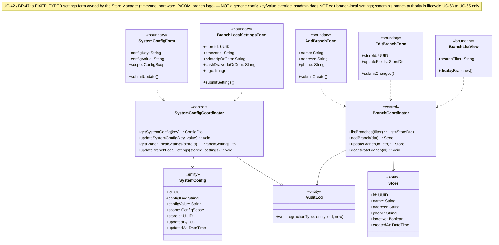
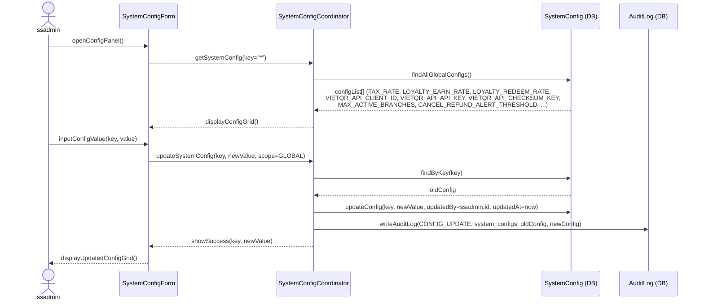
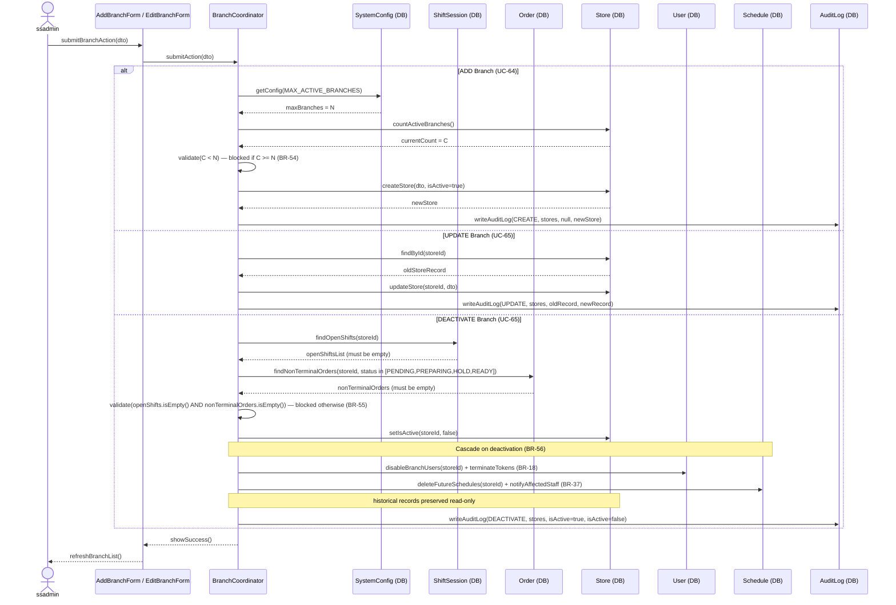

### **3.11 System Configuration & Branch Management**

*\[Provide the detailed design for System Configuration & Branch Management, covering UC-30 (Central System Config by ssadmin), UC-42 (Branch Local Settings by storemanager), and UC-63→UC-65 (Branch Lifecycle: View List / Add / Update-Deactivate by ssadmin). Key constraints: Adding a branch is blocked if MAX_ACTIVE_BRANCHES is reached (BR-54). Deactivating a branch is blocked while the branch has OPEN shift sessions or any non-terminal order (BR-55), and on deactivation it cascades per BR-56. All config changes are audit-logged.\]*

#### ***3.11.1 Class Diagram***

*\[Class diagram for Config & Branch Management. COMET stereotypes: SystemConfigForm, BranchLocalSettingsForm, AddBranchForm, EditBranchForm, BranchListView («boundary»); SystemConfigCoordinator, BranchCoordinator («control»); SystemConfig, Store, AuditLog («entity»).\]*

#### ***3.11.2 UC-30 Central System Configuration***

*\[ssadmin manages central system-wide configurations: tax rate, loyalty earn rate (points per VND), loyalty redemption rate (VND per point), VietQR API credentials, MAX_ACTIVE_BRANCHES, and other global parameters. Every change is audit-logged (BR-80). Config values are loaded fresh from DB on each request (no restart needed).\]*

#### ***3.11.3 UC-63/64/65 Branch Lifecycle Management***

*\[ssadmin views the branch list (UC-63), adds a branch (UC-64), or updates/deactivates a branch (UC-65). Adding a branch checks the MAX_ACTIVE_BRANCHES constraint (BR-54). Deactivating a branch is blocked while the branch has any OPEN shift session OR any non-terminal order (status PENDING/PREPARING/HOLD/READY) per BR-55. On successful deactivation the change cascades per BR-56 (disable branch users + terminate their tokens, delete future schedules + notify, preserve historical records read-only). All operations are audit-logged.\]*

